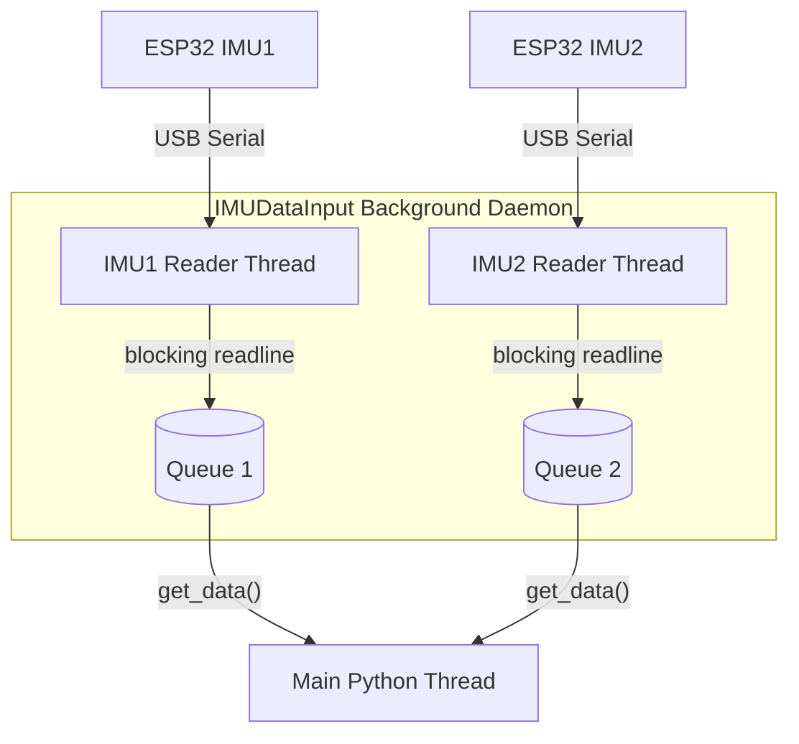

# Data Recording Pipeline

This document describes the design and implementation of the dual-IMU data recording pipeline, specifically detailing threading, hidden buffering, synchronization, and dynamic gesture centering.

---

## 1. System Architecture

The hardware setup consists of two independent LSM6DS3 Inertial Measurement Units (IMUs) connected to ESP32 microcontrollers. 
* **Sampling Rate:** The ESP32 firmware uses a hardware-timed microsecond comparison loop (`micros()`) to stream data over serial strictly at **$100\text{ Hz}$** ($10\text{ ms}$ sampling period).
* **Communication:** Data is streamed continuously via USB Serial at a baud rate of `115200`.
* **Sensor Roles:** 
  * `IMU1`: Placed on the wrist.
  * `IMU2`: Placed on the finger.

---

## 2. Multi-threaded Data Acquisition

To prevent OS-level serial buffer overflows and eliminate blocking I/O latency from the main execution thread, the data collection is asynchronous and multi-threaded:



* **`IMUDataInput` (`src/data_fusion_project/recording/input_data.py`):** Manages a background daemon thread (`_read_loop`) executing blocking serial reads. 
* **Buffering:** Parsed incoming packets are pushed to a thread-safe `queue.Queue()`. 
* **Decoupled Main Loop:** The main thread retrieves accumulated packets using non-blocking `get_data()` drains, separating serial I/O scheduling from the progress bar timers.

---

## 3. Recording Lifecycle and Boundary Handling

Because the two ESP32 microcontrollers run on independent hardware clocks and are started asynchronously, their first sample packets will never arrive at the exact same microsecond. In finite recordings, the overlapping segment where **both** sensors have valid data is mathematically guaranteed to be shorter than the overall session duration.

To ensure the overlapping region is long enough to fit a complete target window ($1.5\text{s}$ for gestures, $5.0\text{s}$ for calibration) without inventing or stretching data, we implement a **Hidden Buffer Mechanism**:

1. **Clear Queues:** The reader queues are cleared (`get_data()`) to purge stale historical samples.
2. **Pre-Buffer:** The script records silently for `PRE_BUFFER_S = 0.12` seconds (12 samples).
3. **Progress Bar:** The interactive `ui.progress_bar` is displayed for the target duration (e.g., $1.5\text{s}$ for gestures). The user performs the gesture during this window.
4. **Post-Buffer:** The script continues recording silently for `POST_BUFFER_S = 0.12` seconds (12 samples).
5. **Draining:** The main thread immediately drains both `IMUDataInput` queues, capturing a total raw segment of approximately $1.74\text{s}$ (174 samples) per sensor.

---

## 4. Temporal Alignment & Grid Resampling

Raw snapshots are aligned and resampled in [sync.py](../src/data_fusion_project/recording/sync.py) before window extraction:

```
Raw IMU1: [s1]------[s2]------[s3]------[s4]------[s5]
Raw IMU2:    [s1]------[s2]------[s3]------[s4]------[s5]

Resampled:   |---------|---------|---------|---------| (Strict 100 Hz Grid)
```

1. **`align_timestamps()`:** Computes the median offset between PC arrival timestamps (`pc_timestamp_us`) and the ESP32 microsecond clocks (`esp_timestamp_us`) to bring both sensors into a common relative timeline starting at $t_{sync} = 0$.
2. **`interpolate_and_merge()`:** Computes the overlap interval $[t_{start}, t_{end}]$ and resamples the sensor values onto a uniform $100\text{ Hz}$ grid ($10,000\text{ }\mu\text{s}$ period) using linear interpolation (`np.interp`). This yields a single DataFrame with prefixed columns (`IMU1_` and `IMU2_`).

---

## 5. Centroid-Based Gesture Centering and Boundary Preservation

Instead of cropping the CSV files on disk blindly to 150 samples, the recording pipeline preserves the **entire 1.74-second raw resampled segment** in the CSV file, and writes the **start index** of the centered 150-sample window to a companion `.txt` file with the same index (e.g. `00001.csv` and `00001.txt`).

### Centering Algorithm
1. **Compute Instantaneous Motion Energy ($E_i$):**
   $$E_i = |\|\mathbf{a}_{1,i}\|_2 - 1.0| + |\|\mathbf{a}_{2,i}\|_2 - 1.0| + 0.01 \cdot (\|\mathbf{g}_{1,i}\|_2 + \|\mathbf{g}_{2,i}\|_2)$$
   where $\mathbf{a}$ represents accelerometer readings (g-force deviation from static gravity $1.0g$) and $\mathbf{g}$ represents gyroscope readings (degrees per second).
2. **Calculate Centroid ($\mu$):**
   $$\mu = \frac{\sum_i i \cdot E_i}{\sum_i E_i}$$
3. **Index Selection:** The start index $s$ of the target window (size $W = 150$ samples) is chosen to center the window around the centroid $\mu$:
   $$s = \text{clip}\left(\text{round}\left(\mu - \frac{W}{2}\right), 0, L - W\right)$$
   where $L$ is the total length of the overlapping resampled grid.
4. **Discrepancy Validation:** We calculate the maximum nearest-neighbor microsecond discrepancy between the original sensor clocks inside the selected window. If it exceeds `MAX_SYNC_DIFF_US` ($10\text{ ms}$), the window is rejected.
5. **Start Index Output**: The start index $s$ is written as an integer string to `#####.txt`.

### Design Rationale: Stabilizing CNN Training and Testing
Preserving the full 1.74-second window on disk rather than cropping it immediately offers critical advantages for model development:
* **Translation Invariance (Jitter Augmentation)**: During real-time deployment, gestures do not arrive perfectly centered in a sliding window; they slide from right (latest sample) to left (earliest sample). If the CNN is trained *only* on perfectly centered 150-sample windows, it will fail to generalise to off-center real-time inputs. Keeping the raw 1.74s segment allows us to apply temporal jitter (e.g., slicing the window at $s \pm \text{jitter}$ samples) during dataloading, forcing the model to learn translation invariance.
* **Transition Context Preservation**: It keeps the pre-gesture and post-gesture stillness states intact on disk. This context is highly valuable for studying trigger latency, sensor noise, and threshold-based activation loops.
* **Stable Baseline Comparison**: The first training iteration can run on perfectly centered windows (slicing exactly at $s$), while testing and optimization phases can simulate sliding-window inference by sliding the 150-point slice across the boundary lines.

---

## 6. Continuous Overlapping Recording (`none` gesture)

For the continuous `none` (stillness) gesture, the script reads a continuous stream.
* A rolling buffer is monitored. Once the overlap exceeds $1.5\text{s}$ ($1500\text{ ms}$), a $1.5\text{s}$ window is extracted.
* The buffer is trimmed by `advance_us = RECORD_DURATION_S * (1 - OVERLAP_RATIO)` to implement a sliding window with $50\%$ overlap.

---

## 7. Fail-Fast Data Integrity

To ensure that only high-quality data is recorded, the pipeline aborts immediately on any anomalies:
* **Rate Jitter Check**: The sample count in the recording must fall within a strict deviation range (default: $\pm 30\%$ of the target rate).
* **Datapoint Strict Validation**: Prior to writing the synchronized DataFrame to a `.csv` file, the pipeline verifies that the sample has at least the target number of datapoints (150). Any mismatch immediately raises an error and aborts.
* **Sync Check**: If the nearest-neighbor discrepancy exceeds $10\text{ ms}$ inside the centered window, the session aborts.
* **Disconnect Monitoring**: The main thread monitors the states of `control_thread`, `imu1.running`, and `imu2.running`. If a thread terminates or a serial read raises an exception, the script immediately propagates the failure, logs an `ERROR`, and exits with `exit code 1`.
* **Offline Sample Auditing**: The [check_samples.py](../scripts/check_samples.py) script scans the data directory recursively. It enforces that each sample file has its companion `.txt` file and that slicing the CSV at the start index results in exactly 150 rows.

---

## 8. Periodic Re-calibration & Drift Auditing

To correct for sensor/gyroscope bias drift during long recording sessions, the pipeline forces a re-calibration pose periodically:
* **Threshold Flag (`MAX_SAMPLES_BEFORE_RECALIBRATION`):** Defines the maximum number of gesture samples recorded before requiring a new calibration file (default: `25` samples).
* **Plotting Flag (`PLOT_CALIBRATION_RECORDING`):** Boolean flag (default: `True`) deciding if a PNG plot of the calibration recording is saved alongside the CSV file.
* **Non-Overwriting Re-calibration Pose**: When the threshold is reached, the recording loop pauses automatically, saves the session's motion energy distribution, and prompts the user to perform a 5-second stillness calibration.
* **0-Indexed Sequential Naming**: All calibrations and motion energy distributions are numbered sequentially starting at `0`. The initial calibration is saved as `calibration_0.csv`.
* **Energy Distribution Plots**: 
  - `centered_energy_distribution_<number>.png`: Displays the mean and standard deviation of the centered 150-sample gesture windows in this block.
  - `overall_energy_distribution_<number>.png`: Displays the mean and standard deviation over the full 1.74-second raw segments, with vertical black dashed lines marking where the average start and end gesture bounds fall.
* **Calibration Quality Analysis**: The offline Jupyter Notebook `scripts/analyze_calibration_data.ipynb` audits stillness quality (detecting and flagging movement by analyzing standard deviation thresholds) and tracks zero-bias drift profiles across multiple calibrations within each recording session.

---

## 9. Open Questions for Model Training

### Alignment Precision vs. Jitter Augmentation
* **The Concern:** In real-time PowerPoint control, we only need the CNN model to output a positive classification over 2 or 3 sliding windows to trigger the slide change. Perfect boundary alignment inside the window is not strictly necessary for triggering events, but class discrimination is. There is a concern that if the CNN is trained on non-centered or highly jittered data, it might lose its discriminatory capabilities (e.g., getting better at predicting *that* a gesture happened, but confusing *which* gesture was performed).
* **The Research Question:** Does introducing temporal jitter during training decrease classification accuracy or confidence? If jitter augmentation significantly degrades model certainty or class separability, then storing raw overlaps and start-index companions is unnecessary compared to simply hard-cropping the central 150 samples.
* **How to Test This:** Using our preserved 1.74-second CSV files and companion `.txt` start indices, we can train two model variations:
  1. *Centered Model*: Trained strictly on the 150-sample windows sliced at $s$ (using the `.txt` start indices).
  2. *Jittered Model*: Trained on 150-sample windows sliced at $s \pm \text{jitter}$ (simulating translation shifts).
  We can then compare their validation confusion matrices and confidence scores to resolve whether translation invariance stabilizes or degrades class boundaries.

### Downstream Adaptation to Variable Session Buffers
* **Compatibility:** Our downstream processing workers (e.g., `dataset.py`, `check_samples.py`, and analysis notebooks) are fully decoupled from the overall recording length. Because they look up the start index from the companion `.txt` file and slice exactly `window_size` (150) samples, they naturally cope with different `pre_buffer_s` and `post_buffer_s` configurations across different recording sessions. This permits adjusting the buffers dynamically in the future without breaking any historical compatibility.

---

## 9. Open Questions for Real Time Inference

### Real-Time Calibration (Zero-Velocity Updates - ZUPT)
To keep the demo seamless without forcing the user to pause manually for re-calibration, the system should support background Zero-Velocity Updates (ZUPT):
* **Strategy Idea:** Because sensor bias drift is dynamic and non-linear, a single initial calibration is insufficient. When the user's hand is resting, the system should automatically update the gyroscope bias registers in real-time.
* **How it Works:** The system continuously monitors the standard deviation of gyroscope and accelerometer signals. When it detects a sustained still window (e.g., hand resting on the table for 2 seconds), it automatically recalculates the mean zero-bias and updates the calibration profile registers in the background.
* **Thresholds (Early Estimation):**
  - Gyroscope standard deviation: $< 3.0$ dps.
  - Accelerometer standard deviation: $< 0.025g$.
