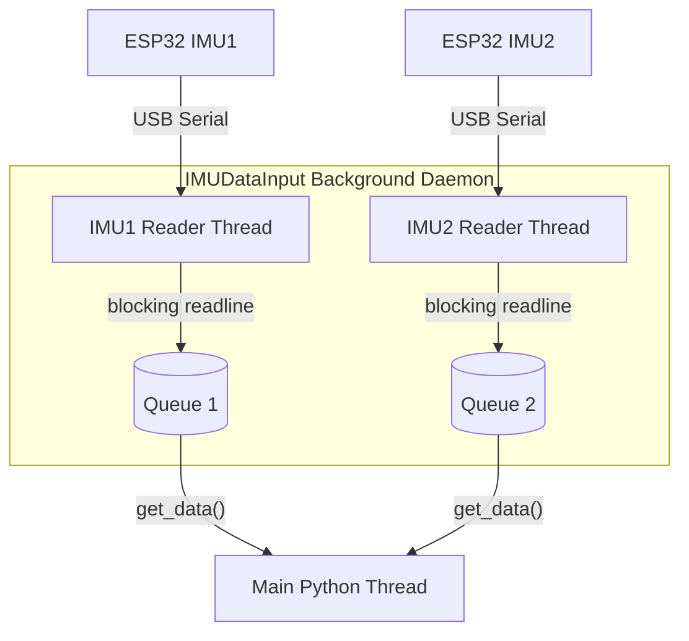

# Data Recording Pipeline

This document describes the design and implementation of the dual-IMU data recording pipeline, specifically detailing threading, hidden buffering, synchronization, and dynamic gesture centering.

---

## 1. System Architecture

The hardware setup consists of two independent LSM6DS3 Inertial Measurement Units (IMUs) connected to ESP32 microcontrollers. 
* **Sampling Rate:** The ESP32 firmware uses a hardware-timed microsecond comparison loop (`micros()`) to stream data over serial strictly at **$100\text{ Hz}$** ($10\text{ ms}$ sampling period).
* **Communication:** Data is streamed continuously via USB Serial at a baud rate of `115200`.
* **Sensor Roles:** 
  * `IMU1`: Placed on the wrist.
  * `IMU2`: Placed on the finger.

---

## 2. Multi-threaded Data Acquisition

To prevent OS-level serial buffer overflows and eliminate blocking I/O latency from the main execution thread, the data collection is asynchronous and multi-threaded:



* **`IMUDataInput` (`code/input_data.py`):** Manages a background daemon thread (`_read_loop`) executing blocking serial reads. 
* **Buffering:** Parsed incoming packets are pushed to a thread-safe `queue.Queue()`. 
* **Decoupled Main Loop:** The main thread retrieves accumulated packets using non-blocking `get_data()` drains, separating serial I/O scheduling from the progress bar timers.

---

## 3. Recording Lifecycle and Boundary Handling

Because the two ESP32 microcontrollers run on independent hardware clocks and are started asynchronously, their first sample packets will never arrive at the exact same microsecond. In finite recordings, the overlapping segment where **both** sensors have valid data is mathematically guaranteed to be shorter than the overall session duration.

To ensure the overlapping region is long enough to fit a complete target window ($1.5\text{s}$ for gestures, $5.0\text{s}$ for calibration) without inventing or stretching data, we implement a **Hidden Buffer Mechanism**:

1. **Clear Queues:** The reader queues are cleared (`get_data()`) to purge stale historical samples.
2. **Pre-Buffer:** The script records silently for `PRE_BUFFER_S = 0.05` seconds (5 samples).
3. **Progress Bar:** The interactive `ui.progress_bar` is displayed for the target duration (e.g., $1.5\text{s}$ for gestures). The user performs the gesture during this window.
4. **Post-Buffer:** The script continues recording silently for `POST_BUFFER_S = 0.05` seconds (5 samples).
5. **Draining:** The main thread immediately drains both `IMUDataInput` queues, capturing a total raw segment of approximately $1.6\text{s}$ (160 samples) per sensor.

---

## 4. Temporal Alignment & Grid Resampling

Raw snapshots are aligned and resampled in [sync.py](file:///Users/jantischner/Library/CloudStorage/OneDrive-Personal/TH_OHM_B.Sc.Inf/Th-Ohm_B.Sc.Inf_Sem6/DatFus_Sem6_Axenie/DataFusionProject/code/sync.py) before window extraction:

```
Raw IMU1: [s1]------[s2]------[s3]------[s4]------[s5]
Raw IMU2:    [s1]------[s2]------[s3]------[s4]------[s5]

Resampled:   |---------|---------|---------|---------| (Strict 100 Hz Grid)
```

1. **`align_timestamps()`:** Computes the median offset between PC arrival timestamps (`pc_timestamp_us`) and the ESP32 microsecond clocks (`esp_timestamp_us`) to bring both sensors into a common relative timeline starting at $t_{sync} = 0$.
2. **`interpolate_and_merge()`:** Computes the overlap interval $[t_{start}, t_{end}]$ and resamples the sensor values onto a uniform $100\text{ Hz}$ grid ($10,000\text{ }\mu\text{s}$ period) using linear interpolation (`np.interp`). This yields a single DataFrame with prefixed columns (`IMU1_` and `IMU2_`).

---

## 5. Centroid-Based Gesture Centering

Instead of cropping the center of the recording blindly, we dynamically center the window around the physical gesture using a center-of-gravity (centroid) algorithm:

1. **Compute Instantaneous Motion Energy ($E_i$):**
   $$E_i = |\|\mathbf{a}_{1,i}\|_2 - 1.0| + |\|\mathbf{a}_{2,i}\|_2 - 1.0| + 0.01 \cdot (\|\mathbf{g}_{1,i}\|_2 + \|\mathbf{g}_{2,i}\|_2)$$
   where $\mathbf{a}$ represents accelerometer readings (g-force deviation from static gravity $1.0g$) and $\mathbf{g}$ represents gyroscope readings (degrees per second).
2. **Calculate Centroid ($\mu$):**
   $$\mu = \frac{\sum_i i \cdot E_i}{\sum_i E_i}$$
3. **Index Selection:** The start index $s$ of the target window (size $W = 150$ samples) is chosen to center the window around the centroid $\mu$:
   $$s = \text{clip}\left(\text{round}\left(\mu - \frac{W}{2}\right), 0, L - W\right)$$
   where $L$ is the total length of the overlapping resampled grid.
4. **Nearest-Neighbor Validation:** We calculate the maximum nearest-neighbor microsecond discrepancy between the original sensor clocks inside the selected window. If it exceeds `MAX_SYNC_DIFF_US` ($10\text{ ms}$), the window is rejected.

---

## 6. Continuous Overlapping Recording (`none` gesture)

For the continuous `none` (stillness) gesture, the script reads a continuous stream.
* A rolling buffer is monitored. Once the overlap exceeds $1.5\text{s}$ ($1500\text{ ms}$), a $1.5\text{s}$ window is extracted.
* The buffer is trimmed by `advance_us = RECORD_DURATION_S * (1 - OVERLAP_RATIO)` to implement a sliding window with $50\%$ overlap.

---

## 7. Fail-Fast Data Integrity

To ensure that only high-quality data is recorded, the pipeline aborts immediately on any anomalies:
* **Rate Jitter Check:** The sample count in the $1.6\text{s}$ recording must fall within a strict deviation range (default: $\pm 30\%$ of the target rate).
* **Datapoint Strict Validation:** Prior to writing the synchronized DataFrame to a `.csv` file, the pipeline verifies that the sample has exactly the target number of datapoints (150 for gestures, 500 for calibration). Any mismatch immediately raises an error and aborts.
* **Sync Check:** If the nearest-neighbor discrepancy exceeds $10\text{ ms}$ inside the centered window, the session aborts.
* **Disconnect Monitoring:** The main thread monitors the states of `control_thread`, `imu1.running`, and `imu2.running`. If a thread terminates or a serial read raises an exception, the script immediately propagates the failure, logs an `ERROR`, and exits with `exit code 1`.
* **Offline Sample Auditing:** The [check_samples.py](file:///Users/jantischner/Library/CloudStorage/OneDrive-Personal/TH_OHM_B.Sc.Inf/Th-Ohm_B.Sc.Inf_Sem6/DatFus_Sem6_Axenie/DataFusionProject/scripts/check_samples.py) script scans the data directory recursively to verify that all finalized gesture CSVs contain exactly 150 rows, flagging any too short or too long samples.
