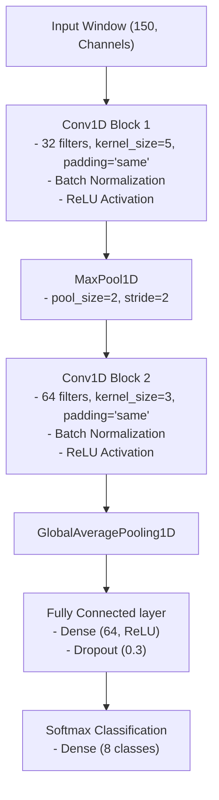

# Implementation Plan: Early Fusion Single-Branch Conv1D CNN

This document details the architecture design, layers, and engineering justifications for the **Early Fusion Single-Branch Conv1D CNN** candidate.

## 1. Network Architecture Diagram

---

## 2. Detailed Layer Specifications

| Layer # | Layer Type | Specifications | Output Shape | Parameters / Activation |
|---|---|---|---|---|
| **0** | **Input** | Dynamic channel count `(150, C)` | `(None, 150, C)` | Shape-agnostic input binding |
| **1** | **Conv1D** | 32 filters, kernel=5, padding="same" | `(None, 150, 32)` | ReLU activation |
| **2** | **Batch Normalization** | Normalizes activations along channels | `(None, 150, 32)` | Stabilizes gradient flow |
| **3** | **MaxPool1D** | pool_size=2, stride=2 | `(None, 75, 32)` | Temporal downsampling |
| **4** | **Conv1D** | 64 filters, kernel=3, padding="same" | `(None, 75, 64)` | ReLU activation |
| **5** | **Batch Normalization** | Normalizes activations along channels | `(None, 75, 64)` | Stabilizes gradient flow |
| **6** | **GlobalAveragePooling1D** | Average pooling along time axis | `(None, 64)` | Parameter footprint reduction |
| **7** | **Dense (FC)** | 64 hidden units | `(None, 64)` | ReLU activation |
| **8** | **Dropout** | Dropout rate = 30% | `(None, 64)` | Regularization |
| **9** | **Dense (Softmax)** | 8 outputs (one per gesture class) | `(None, 8)` | Softmax activation |

---

## 3. Design Justifications & Precedents

### A. Early Fusion Concept
In this setup, all raw and calculated features are stacked immediately into a single `(150, C)` tensor. 
* **Justification:** Early fusion minimizes complexity. By passing all signals jointly into the first Conv1D layer, the model's kernels can learn joint correlations across channels in early layers.
* **Low-Power Microcontroller Deployability:** This single-branch architecture is extremely lightweight, keeping the memory and computational footprints minimal. This makes it the easiest model to compile and run in real-time on host machines or lower-spec embedded hardware.

### B. Global Average Pooling (GAP) vs. Flattening
* **Justification:** Standard flattening of Layer 5 would result in `75 * 64 = 4800` weights connecting to the Dense layer, introducing over 300,000 parameters. For our relatively small session dataset, this would lead to immediate overfitting. Replacing it with `GlobalAveragePooling1D` averages the activations along the time steps, reducing the output to a flat vector of size `64` regardless of window length. This drastically reduces parameters, prevents overfitting, and makes the model length-agnostic.

### C. Downward Kernel Sizes (5 to 3)
* **Justification:** The first layer uses a larger kernel size of `5` (50 ms at 100 Hz) to capture coarser temporal gestures (like sweeps). The second layer uses a smaller kernel size of `3` (30 ms) to combine these features into fine-grained local signatures.

### D. Regularization
* **Justification:** Batch Normalization stabilizes training when dealing with varying amplitude ranges between different IMU devices. Adding `30% Dropout` before classification forces the classifier to generalize over session variations.
