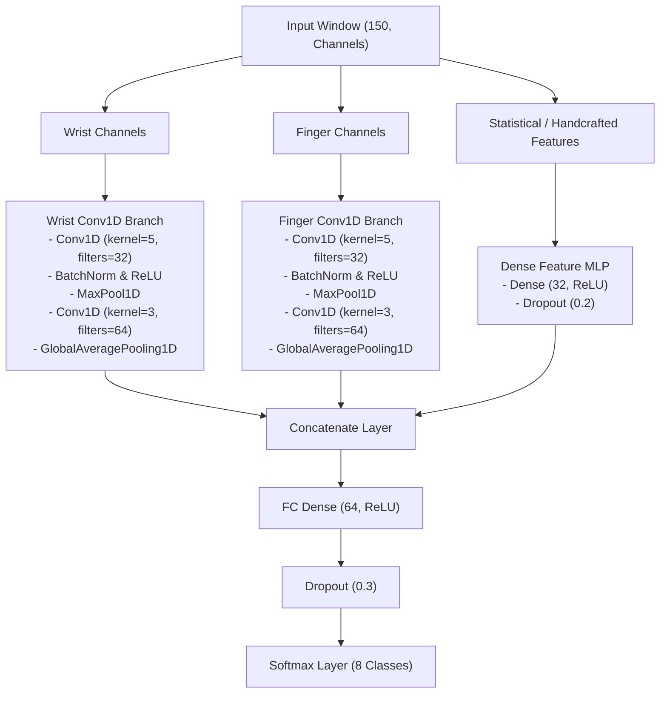

# Gesture Separability Analysis and Real-Time Feature Engineering

This document outlines statistical methodologies to estimate gesture separability from recorded training data and defines real-time feature engineering strategies to optimize CNN classification performance.

---

## 1. Estimating Gesture Separability (Pre-Training)

Before training a CNN, we can estimate how well gestures will differentiate from one another and from `none` using statistical and information-theoretic metrics on the raw training windows.

### A. Distance Metrics & Silhouette Analysis on DTW
Since gestures are time-series sequences that can vary in speed, standard Euclidean distance is highly sensitive to slight temporal shifts. 
* **Methodology**: Compute pairwise **Dynamic Time Warping (DTW)** distances between all samples. 
* **Separability Evaluation**: For any two gesture classes $C_A$ and $C_B$, compute the **Fisher Criterion / Silhouette Score**:
  $$S(C_A, C_B) = \frac{\mu_{inter} - \mu_{intra}}{\sigma_{intra}}$$
  where $\mu_{inter}$ is the mean distance between samples of different classes, and $\mu_{intra}$ is the mean distance between samples of the same class. A high ratio indicates that the two gestures are highly distinct and easily separable.
* **Why**: Low inter-class distance warns you beforehand that the CNN is highly likely to confuse those two gestures.

### B. Intra-class Variance (Gesture Consistency)
* **What to calculate**: The average Dynamic Time Warping (DTW) distance between all pairs of samples within a single gesture category.
* **Why**: High intra-class variance means you perform the same gesture very differently each time, which will make it harder for the CNN to learn a stable representation.

### C. Confusion Mapping via KNN/SVM on Flat Windows
An excellent proxy for CNN classifier capabilities is to fit a lightweight statistical model on flattened window vectors.
* **Methodology**:
  1. Flatten each window of shape $(T=150, C=14)$ into a single vector of size $2100$.
  2. Perform Dimensionality Reduction (e.g., PCA to 50 components, followed by t-SNE or UMAP to 2D).
  3. Train a simple $K$-Nearest Neighbors ($K=3$) or linear Support Vector Machine (SVM) classifier using Leave-One-Session-Out Cross-Validation.
* **Evaluation**: Plot the resulting **confusion matrix**. If two gestures (e.g. `fist` and `none`) mix up in the KNN predictions, the CNN is likely to struggle on them as well unless temporal filters are highly optimized.

### C. Jensen-Shannon (JS) Divergence from `none` (Idle)
To ensure gestures can be distinguished from random idle movement (`none`):
* **Methodology**: Compute the distribution of statistical features (e.g. peak energy, variance of gyroscope signals) for the `none` class and the target gesture class.
* **Evaluation**: Compute the **JS Divergence** (symmetrized version of Kullback-Leibler divergence):
  $$D_{JS}(P \parallel Q) = \frac{1}{2} D_{KL}(P \parallel M) + \frac{1}{2} D_{KL}(Q \parallel M)$$
  where $M = \frac{1}{2}(P + Q)$. Gestures with low JS divergence from the `none` distribution are at risk of triggering false positives during idle movement.

---

## 2. Real-Time Pre-Computed Features

Feeding raw sensor data ($a_x, a_y, a_z, g_x, g_y, g_z$) directly into a CNN is possible, but pre-calculating physical invariants and kinematic features dramatically reduces the required network complexity, speeds up convergence, and increases robustness to sensor orientation deviations.

### A. Kinematic Invariants (Magnitudes)
* **Accelerometer Magnitude ($a_{mag}$)**:
  $$a_{mag} = \sqrt{a_x^2 + a_y^2 + a_z^2}$$
  * *Benefit*: Independent of sensor orientation. Under static conditions (no motion), $a_{mag} \approx 1.0g$. Any deviation ($|a_{mag} - 1.0| > \epsilon$) indicates linear acceleration, which is a perfect trigger for separating active gestures from `none`.
* **Gyroscope Magnitude ($g_{mag}$)**:
  $$g_{mag} = \sqrt{g_x^2 + g_y^2 + g_z^2}$$
  * *Benefit*: Captures net angular velocity. Distinguishes rotational movements (like `circle_cw`) from purely linear movements (like `jerk_down`).

### B. Gravity-Free Linear Acceleration ($a_{linear}$)
The raw accelerometer measures both physical acceleration and the static gravity vector ($1.0g$).
* **Methodology**: Use the calculated pitch ($\theta$) and roll ($\phi$) from your sensor fusion filter (Kalman/Complementary) to project gravity out:
  $$\mathbf{a}_{linear} = \mathbf{a}_{raw} - \mathbf{g}_{rotated}$$
* **Benefit**: Isolates the true user-generated translation force. Essential for separating directional gestures (like `swipe_left` vs `swipe_right`) from simple posture rotations.

### C. First-Order Time Derivatives (Jerk & Angular Acceleration)
* **Linear Jerk ($J_t$)**:
  $$J_t = \frac{\mathbf{a}_t - \mathbf{a}_{t-1}}{\Delta t}$$
* **Angular Acceleration ($\alpha_t$)**:
  $$\alpha_t = \frac{\mathbf{g}_t - \mathbf{g}_{t-1}}{\Delta t}$$
* **Benefit**: Jerk is highly discriminative for "snappy" vs. "smooth" gestures. For example, `jerk_up` has an extremely high transient jerk peak, whereas `circle_cw` has a low, continuous jerk profile.

### D. Inter-IMU Differential Features (Finger vs. Wrist)
* **Relative Acceleration ($\Delta a$) & Relative Rotation ($\Delta g$)**:
  $$\Delta a = \mathbf{a}_{finger} - \mathbf{a}_{wrist}, \quad \Delta g = \mathbf{g}_{finger} - \mathbf{g}_{wrist}$$
* **Benefit**: Distinguishes **arm gestures** from **hand gestures**.
  * During a `swipe_right`, the whole arm moves as a rigid body: $\Delta a \approx 0$ and $\Delta g \approx 0$.
  * During a `fist` or finger gesture, only the finger moves relative to the wrist: $\Delta a \gg 0$.

### E. Short-Term Window Integrals (Relative Yaw)
While absolute Yaw cannot be anchored without a magnetometer, relative yaw change ($\Delta \psi$) over the short gesture window ($1.5\text{ s}$) is highly accurate and drift-free.
* **Methodology**: Integrate the z-gyroscope channel over the active window:
  $$\Delta \psi = \sum_{t \in W} g_{z,t} \cdot \Delta t$$
* **Benefit**: Provides clear directional mapping in the horizontal plane (distinguishing clock rotations and horizontal sweeps).

---

## 3. Model Training Discussion: Alignment vs. Translation Jitter

When designing the CNN training pipeline, we must investigate a core trade-off enabled by our new 1.74s raw boundary data:

### The Hypothesis
* **Centered-Only Training**: By using the `.txt` start indices to extract perfectly centered gestures, the CNN maps the gesture's peak acceleration/velocity to the exact middle of the 150-sample sequence. This maximizes peak class boundary separation and reduces class confusion during offline validation.
* **The Real-Time Mismatch**: During continuous real-time sliding-window inference, the gesture slides dynamically across the input window. A model trained *only* on centered data might fail to trigger because the peak is shifted to the edges.
* **The Augmentation Concern:** If we apply temporal jitter (e.g., slicing training inputs at $s \pm \text{jitter}$ samples) to force translation invariance, does the model lose its class-discrimination capability? There is a risk that by making the model robust to temporal shift, the decision boundary between classes (such as `swipe_right` vs `circle_cw`) degrades—meaning the model gets better at predicting *that* a gesture happened, but less certain about *which* gesture it was.

### Evaluation Workflow
Using the raw boundaries saved in our CSVs, we should systematically evaluate:
1. **Model A (No Jitter)**: Train on centered windows (sliced exactly at the companion `.txt` index).
2. **Model B (Jittered)**: Train with a random offset shift (e.g., $s \pm 10$ samples) introduced during batch generation.
3. **Comparison**: Compare both models' validation confusion matrices, precision/recall per class, and classification confidence distributions. If Model B shows a significant increase in inter-class confusion, it will confirm the risk, suggesting we should favor a low-latency stillness trigger loop (which centers the real-time frame before feeding it to Model A) rather than relying on translation invariant training.

---

## 4. Data Quality Auditing (What to Look For)

To analyze the metrics described in Section 1 and judge dataset quality before training, use the following visual and numerical checks:

### A. Dynamic Time Warping (DTW) Distance Heatmaps
* **Visualization:** Plot a pairwise distance matrix heatmap of all recorded gesture windows. Group samples by class along both axes.
* **Good Signs (Green Flags):**
  * **Diagonal Block Structure:** Clear, dark square blocks along the diagonal showing low DTW distances within the same class ($D_{intra} \to 0$).
  * **Clean Inter-Class Margins:** Highly contrasting light regions off-diagonal, indicating high distance between different classes ($D_{inter} \gg D_{intra}$).
  * **Fisher Separability Ratio:** $S(C_A, C_B) \ge 1.5$.
* **Bad Signs (Red Flags):**
  * **Inter-Class Smearing:** Faint block boundaries (e.g., `swipe_left` and `swipe_right` showing low pairwise distance), warning that the trajectory profiles are too similar.
  * **Fisher Separability Ratio:** $S(C_A, C_B) < 1.0$, indicating overlapping clusters.

### B. Trajectory Consistency & Shaded Bands
* **Visualization:** Plot the mean time-series curve for each sensor channel with a $\pm 1$ standard deviation shaded band.
* **Good Signs:** Narrow, compact standard deviation bands. This indicates high user consistency (performing the gesture at a similar speed and path each time).
* **Bad Signs:** Wide, ballooning bands, or bimodal peaks. This suggests high intra-class variance, meaning the gesture is performed in inconsistent tempos or directions.

### C. Dimensionality Reduction (PCA, UMAP, t-SNE)
* **Visualization:** Project the flattened $150 \times 12$ windows down to 2D using UMAP or t-SNE and plot them color-coded by class.
* **Good Signs:** Compact, well-separated island clusters with clear decision boundaries.
* **Bad Signs:** A single massive blob in the center, or gesture classes heavily overlapping with the `none` (idle) class cluster.

### D. Jensen-Shannon (JS) Divergence from `none`
* **Visualization:** Plot overlapping histograms of motion energy peaks for `none` versus active gestures.
* **Good Signs:** $D_{JS} \ge 0.8$. Complete separation between stillness noise and the gesture envelope.
* **Bad Signs:** $D_{JS} < 0.4$. This indicates the gesture is too subtle or contains too much stillness, making real-time trigger detection highly prone to false positives.

---

## 5. Translating Audits to Engineering Decisions

Once the dataset is audited, use the metrics to drive engineering choices:

| Audit Finding | Pipeline Level | Operational Action |
|---------------|----------------|--------------------|
| **Low Separability** ($S(C_A, C_B) < 1.0$) between directionals | **Feature Engineering** | Compute first-order time derivatives (jerk) and integrate Z-gyroscope (relative yaw) to isolate direction vectors. |
| **High Intra-class Variance** (inconsistent speed) | **Preprocessing / Augmentation** | Apply **Time Warping Augmentation** (rescaling the time-axis by $\pm 20\%$) to teach rate invariance. |
| **Low JS Divergence** ($D_{JS} < 0.4$) for subtle gestures | **Real-Time Pipeline** | Implement a two-stage classification: (1) high-sensitivity energy trigger, (2) multi-class CNN inference gating. |
| **Real-time Latency Mismatch** | **Model Training** | Set `jitter_range` in `PipelineConfig` to randomly shift slices, training the model to recognize off-center boundaries. |

---

## 6. Feature Selection Matrix

To feed the CNN model, we structure features into a multi-channel tensor of shape `(Batch, Time=150, Channels)`:

| Feature Channel Group | Math Formulation | Purpose |
|----------------------|------------------|---------|
| **Raw Signals** (12 channels) | $a_x, a_y, a_z, g_x, g_y, g_z$ (IMU1 & IMU2) | Baseline motion dynamics. |
| **Kinematic Invariants** (4 channels) | $a_{mag} = \sqrt{\sum a_i^2}$, $g_{mag} = \sqrt{\sum g_i^2}$ | Orientation-invariant magnitudes. Excellent for segment bounds and triggering. |
| **Linear Acceleration** (6 channels) | $\mathbf{a}_{linear} = \mathbf{a}_{raw} - \mathbf{g}_{rotated}$ | Removes static gravity vectors using Kalman orientation (roll/pitch). |
| **Differential Dynamics** (6 channels) | $\Delta a = a_{finger} - a_{wrist}$, $\Delta g = g_{finger} - g_{wrist}$ | Separates arm movement (rigid rotation) from isolated finger gestures. |
| **Relative Yaw** (2 channels) | $\Delta \psi = \sum g_z \cdot \Delta t$ | Resolves left/right and clockwise/counter-clockwise trajectories. |

---

## 7. CNN Model Architecture Design: Late Fusion Multi-Branch CNN

Since we are fusing two distinct physical nodes (Wrist vs. Finger) and handcrafted statistical features, a **Late Fusion Multi-Branch Conv1D CNN** is the optimal setup:

### Key Architectural Choices:
1. **Parallel Temporal Branches (Late Fusion):**
   * Keeping the Wrist and Finger networks separate allows each branch to build local spatial features independently before merging. Arm gestures are dominated by wrist dynamics, whereas hand gestures are dominated by finger-to-wrist deltas.
2. **Conv1D for Temporal Learning:**
   * 1D convolutions extract shift-invariant local features along the timeline. This helps handle slight temporal misalignments during real-time sliding window inference.
3. **Global Average Pooling (GAP) vs. Flattening:**
   * Replacing flat outputs with `GlobalAveragePooling1D` reduces the parameter footprint drastically, preventing overfitting on small training sets.
4. **Regularization:**
   * Batch Normalization is applied after each Conv1D layer to stabilize training.
   * Dropout ($30\%$) is added before the final classifier to ensure generalization.
5. **Loss & Optimization:**
   * **Loss:** `categorical_crossentropy` (with one-hot label encoding).
   * **Optimizer:** `Adam(learning_rate=0.001)` paired with a learning rate decay schedule (`ReduceLROnPlateau`).