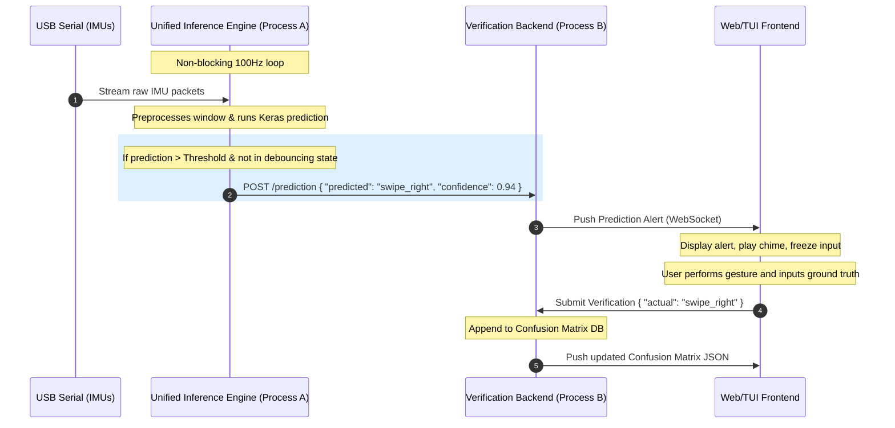

# Architecture & Design: Real-Time Inference & Verification Engine

This document details the architectural design and implementation strategies for running live inference across three distinct gesture-recognition models and constructing a real-world confusion matrix via human-in-the-loop verification.

---

## 1. Architectural Model Comparison

Each of our three model architectures has distinct structural characteristics, input formats, and pre-processing dependencies:

| Dimension / Model | Early Fusion 1D-CNN | Late Fusion Multi-Branch 1D-CNN | Self-Attention Temporal Transformer |
|---|---|---|---|
| **Input Shape** | Single Tensor: `(None, 150, C)` | Multiple Tensors: `[(None, 150, C_wrist), (None, 150, C_finger), (None, F)]` | Single Tensor: `(None, 150, C)` |
| **Feature Slicing** | Dynamic channels grouped into a single spatial-temporal block. | Slices channels dynamically into Wrist (IMU1) and Finger (IMU2) subgroups. | Single block linear projection to $d_{model}$ latent dimension. |
| **Window Statistics** | None (purely temporal). | Computes window-wide scalars (cross-correlation, variance, etc.) for MLP input. | None. |
| **Filtering Needs** | General calibration/noise reduction. | General calibration/noise reduction. | Strict Butterworth 2nd-order lowpass filters (8Hz acc, 12Hz gyro) and smoothed magnitude envelopes. |

---

## 2. Decision: Unified vs. Individual Inference Engines

> [!TIP]
> **Architecture Decision: Unified, Metadata-Driven Inference Engine**
> 
> Rather than building three separate inference engines, we should build a **single, unified `GestureInferenceEngine`** class. The model-specific behaviors are dynamically configured by reading the `model_metadata.json` generated during training.

### How a Unified Inference Engine Works:
1. **Metadata Loading:** The engine loads the Keras model (`model.keras`) alongside its metadata (`model_metadata.json`).
2. **Preprocessing Pipeline Initialization:** The engine extracts the `pipeline_config` (containing calibration coefficients, Butterworth filter settings, and feature toggles) and initializes the corresponding real-time signal processing functions.
3. **Dynamic Channel Routing:** The engine uses the `channels`, `wrist_channels`, and `finger_channels` fields in the metadata to slice and order the live preprocessed features. This ensures the output tensor's shape and feature order exactly match what the model was trained on, preventing training-inference mismatch.
4. **Multi-Input Packaging:** If the metadata contains a split flag (e.g. `wrist_channels` and `finger_channels`), the preprocessor splits the data window and computes MLP statistical features, returning a list of inputs. Otherwise, it returns a single `(150, C)` tensor.

### Engineering Advantages:
* **Zero Code Duplication:** Hardware access, asynchronous sample buffer, and calibration are implemented once.
* **Elimination of Feature Mismatch:** Using the *exact* `pipeline_config` from training metadata guarantees features are computed identically in real-time.
* **Optuna Compatibility:** Since features are selected dynamically during training via Optuna, the inference engine remains robust and doesn't need updates when channels are added or removed.

---

## 3. Decision: Decoupled API-based Backend vs. Wrapper UI

> [!IMPORTANT]
> **Design Decision: Decoupled, Event-Driven API Backend**
> 
> We should design the confusion matrix verification engine as a **decoupled, API-like backend** (e.g. using a lightweight WebSocket or HTTP server) that the live inference engine streams predictions to.

### Comparison Matrix

| Criteria | Option A: Decoupled API-like Backend (Recommended) | Option B: Monolithic Wrapper |
|---|---|---|
| **Real-time Performance** | **Excellent.** The inference engine runs in its own process, processing serial data at 100Hz without being blocked by user input. | **Poor.** Prompting the user (e.g. terminal `input()`) blocks the thread, causing serial buffers to overflow and drop packets. |
| **Separation of Concerns** | **High.** The UI code is separated from hardware drivers (serial, IMU) and heavy ML runtime libraries (Keras, Tensorflow). | **Low.** The script mixes serial port management, Keras runtimes, and user feedback logic in a single thread. |
| **UI Flexibility** | **Excellent.** The backend can serve a gorgeous, interactive HTML5/JS dashboard showing real-time curves and the confusion matrix updating live. | **Low.** Limited to basic command-line prompting or simple GUI frameworks. |
| **Hardware Independence** | **High.** The recorder doesn't care where the predictions come from. It can record predictions from a python script, or later from a microcontroller. | **Low.** Bound to Python's Keras runtime on the host PC. |

### Proposed Data Flow Diagram

---

## 4. Proposed Interaction & Verification Workflow

To verify **200 live gestures** efficiently, we need a streamlined interface that minimizes user effort.

### Step-by-Step User Experience:
1. **Setup:** The user starts the Verification Backend (`python verification_server.py`) and opens the Web UI.
2. **Launch Inference:** The user starts the inference script targeting a specific model, e.g. `python run_inference.py --model-dir models/late_fusion_cnn_test/training_session_16_20260630_170809/`.
3. **Execution Phase:**
   * The web page shows the target gesture to perform (e.g., "**Perform gesture 1/200: SWIPE LEFT**").
   * The user performs the gesture.
   * The inference engine detects the gesture and triggers a prediction event.
   * The Web UI flashes: **"Detected: SWIPE LEFT (Conf: 98%)"**.
   * **Quick Verdict:** 
     * If the prediction was **correct**, the user presses the `SPACEBAR` (defaulting to "correct"). The system moves to the next gesture.
     * If the prediction was **incorrect**, the user presses the key mapped to the actual gesture performed, or clicks the correct gesture button.
4. **Live Visualization:** The confusion matrix updates dynamically on the screen as the test runs, showing overall accuracy and highlighting confusion zones.
5. **Session Output:** At the end of the 200 gestures, the system exports a clean `real_world_evaluation.json` and a plotted `real_world_confusion_matrix.png` directly into the model's training session folder.
