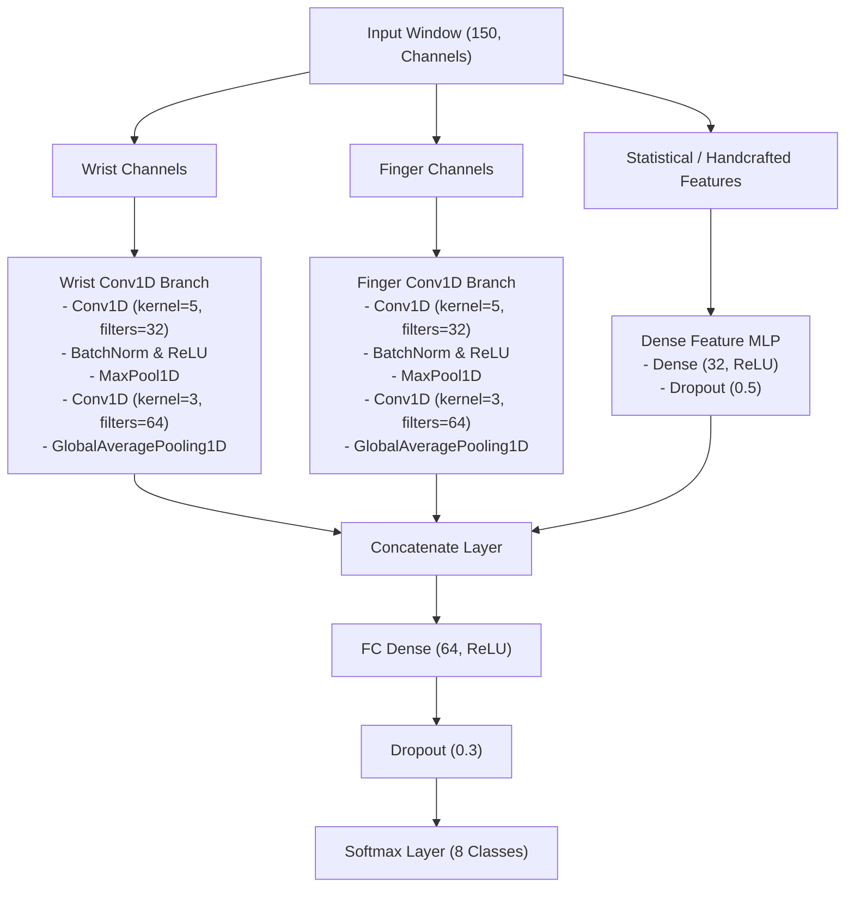

# Implementation Plan: Late Fusion Multi-Branch Conv1D CNN

This document details the architecture design, layers, and engineering justifications for the **Late Fusion Multi-Branch Conv1D CNN** candidate.

## 1. Network Architecture Diagram



---

## 2. Detailed Layer Specifications

### A. Temporal Branches (Wrist & Finger)
Each of the two parallel Conv1D branches is constructed as follows:

| Layer Type | Specifications | Output Shape | Activation / Purpose |
|---|---|---|---|
| **Input Branch** | Dynamic sliced channels `(150, C_sub)` | `(None, 150, C_sub)` | Input binding |
| **Conv1D** | 32 filters, kernel=5, padding="same" | `(None, 150, 32)` | ReLU |
| **Batch Normalization** | Normalizes activations along channels | `(None, 150, 32)` | Stability |
| **MaxPool1D** | pool_size=2, stride=2 | `(None, 75, 32)` | Downsampling |
| **Conv1D** | 64 filters, kernel=3, padding="same" | `(None, 75, 64)` | ReLU |
| **Batch Normalization** | Normalizes activations along channels | `(None, 75, 64)` | Stability |
| **GlobalAveragePooling1D** | Average pooling along time axis | `(None, 64)` | Temporal extraction |

### B. Statistical Summary Branch (MLP)
For scalar features that summarize the entire window (e.g. cross-correlation coefficients and statistics):

| Layer Type | Specifications | Output Shape | Activation / Purpose |
|---|---|---|---|
| **Input Branch** | Flat scalar features `(F,)` | `(None, F)` | Summary input |
| **Dense** | 32 hidden units | `(None, 32)` | ReLU |
| **Dropout** | Dropout rate = 50% | `(None, 32)` | Regularization |

### C. Late Fusion & Classifier Layers

| Layer Type | Specifications | Output Shape | Activation / Purpose |
|---|---|---|---|
| **Concatenate** | Merges `[Branch1, Branch2, Branch3]` outputs | `(None, 160)` | Late Fusion (64 + 64 + 32) |
| **Dense** | 64 hidden units | `(None, 64)` | ReLU |
| **Dropout** | Dropout rate = 30% | `(None, 64)` | Regularization |
| **Dense (Softmax)** | 8 outputs (one per gesture class) | `(None, 8)` | Softmax activation |

---

## 3. Design Justifications & Precedents

### A. Late Fusion Concept
* **Justification:** Human Activity Recognition (HAR) research shows that separating sensor clusters in early layers performs significantly better than early fusion. The wrist and finger sensors capture different scales of motion (arm translation vs. hand posture). Decoupling their layers allows the filters of Branch 1 to optimize for wrist dynamics, while Branch 2 specializes in fine finger trajectories.

### B. MLP Statistical Branch
* **Justification:** Some features (like cross-correlation or window statistics) are scalar values rather than sequential time-series waveforms. We cannot feed these scalars directly into Conv1D layers. This separate Dense MLP branch embeds these scalar metrics into a `32`-dimensional space before fusing them with the temporal features.
* **Regularization:** The MLP branch uses a high `50% Dropout` rate to prevent the classifier from over-relying on simple statistics (which leads to overfitting on the training user) and forcing it to prioritize the temporal motion shapes.

### C. Dynamic Binding Strategy
* **Justification:** Instead of hardcoding channels, the model uses dynamic column index maps:
  ```python
  wrist_indices = [i for i, name in enumerate(dataset.channel_names) if "IMU1" in name]
  finger_indices = [i for i, name in enumerate(dataset.channel_names) if "IMU2" in name]
  ```
  This ensures that if we configure our features to exclude specific channels, the routing remains correct without requiring a rewrite of the model architecture code.
