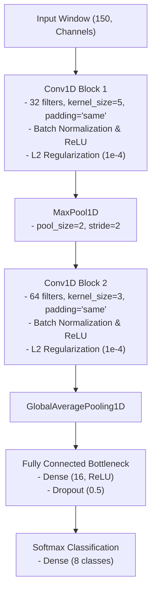

# Implementation Plan: Early Fusion Single-Branch Conv1D CNN

This document details the architecture design, layers, and engineering justifications for the **Early Fusion Single-Branch Conv1D CNN** candidate, incorporating our empirical learnings from the playground baseline experiments (`late_fusion_cnn_test`).

---

## 1. Network Architecture Diagram

Based on our capacity-bottlenecking and regularization learnings, the single-branch model is restructured to prioritize generalization and deployability on edge devices.



---

## 2. Detailed Layer Specifications

We offer two capacity configurations depending on the target edge constraints: the **Standard Bottleneck** layout (derived from Experiment D, our best performer) and the **Compact Single-Layer** layout (derived from Experiment E).

### Configuration 1: Standard Bottlenecked Single-Branch (Recommended)
This configuration preserves multi-scale feature extraction but restricts classification capacity to force generalization.

| Layer # | Layer Type | Specifications | Output Shape | Parameters / Activation |
|---|---|---|---|---|
| **0** | **Input** | Dynamic channel count `(150, C)` | `(None, 150, C)` | Shape-agnostic input binding |
| **1** | **Conv1D** | 32 filters, kernel=5, padding="same", `kernel_regularizer=l2(1e-4)` | `(None, 150, 32)` | ReLU activation |
| **2** | **Batch Normalization** | Normalizes activations along channels | `(None, 150, 32)` | Stabilizes gradient flow |
| **3** | **MaxPool1D** | pool_size=2, stride=2 | `(None, 75, 32)` | Temporal downsampling |
| **4** | **Conv1D** | 64 filters, kernel=3, padding="same", `kernel_regularizer=l2(1e-4)` | `(None, 75, 64)` | ReLU activation |
| **5** | **Batch Normalization** | Normalizes activations along channels | `(None, 75, 64)` | Stabilizes gradient flow |
| **6** | **GlobalAveragePooling1D** | Average pooling along time axis | `(None, 64)` | Parameter footprint reduction |
| **7** | **Dense (FC)** | **16 hidden units** (reduced from 64) | `(None, 16)` | ReLU activation |
| **8** | **Dropout** | **Dropout rate = 50%** (increased from 30%) | `(None, 16)` | Overfitting mitigation |
| **9** | **Dense (Softmax)** | 8 outputs (one per gesture class) | `(None, 8)` | Softmax activation |

### Configuration 2: Compact Single-Layer Single-Branch
Designed for ultra-low resource targets (estimated parameters < 3,000). It simplifies convolutional blocks to physical constraints.

| Layer # | Layer Type | Specifications | Output Shape | Parameters / Activation |
|---|---|---|---|---|
| **0** | **Input** | Dynamic channel count `(150, C)` | `(None, 150, C)` | Shape-agnostic input binding |
| **1** | **Conv1D** | 16 filters, kernel=5, padding="same", `kernel_regularizer=l2(1e-4)` | `(None, 150, 16)` | ReLU activation |
| **2** | **Batch Normalization** | Normalizes activations along channels | `(None, 150, 16)` | Stabilizes gradient flow |
| **3** | **GlobalAveragePooling1D** | Average pooling along time axis | `(None, 16)` | Parameter footprint reduction |
| **4** | **Dense (FC)** | **16 hidden units** | `(None, 16)` | ReLU activation |
| **5** | **Dropout** | **Dropout rate = 50%** | `(None, 16)` | Overfitting mitigation |
| **6** | **Dense (Softmax)** | 8 outputs (one per gesture class) | `(None, 8)` | Softmax activation |

---

## 3. Design Justifications & Baseline Learnings

### A. Early Fusion Concept
In this setup, all raw and calculated features are stacked immediately into a single `(150, C)` tensor.
* **Justification:** Early fusion minimizes complexity. By passing all signals jointly into the first Conv1D layer, the model's kernels can learn joint correlations across channels in early layers.
* **Low-Power Microcontroller Deployability:** This single-branch architecture is extremely lightweight, keeping the memory and computational footprints minimal. This makes it the easiest model to compile and run in real-time on host machines or lower-spec embedded hardware.

### B. Global Average Pooling (GAP) vs. Flattening
* **Justification:** Replacing standard flattening with `GlobalAveragePooling1D` averages the activations along the time steps. This drastically reduces the parameter footprint, preventing overfitting on small training sets, and makes the model sequence-length-agnostic.

### C. Downward Kernel Sizes (5 to 3)
* **Justification:** The first layer uses a larger kernel size of `5` (50 ms at 100 Hz) to capture coarser temporal gestures (like sweeps). The second layer uses a smaller kernel size of `3` (30 ms) to combine these features into fine-grained local signatures.

### D. Classifier Capacity Bottlenecking (Major Learning)
* **Justification:** In baseline experiments, high-capacity models (`64` dense units) quickly memorized session-specific noise, causing the validation loss to diverge after epoch 8. By reducing classification dense units from 64 to **16** and increasing dropout to **50%**, we introduce a structural bottleneck. This makes it mathematically impossible for the dense head to memorize specific high-frequency baseline shifts, forcing it to make decisions based on generalized, scale-invariant spatial-temporal patterns. This resulted in a **negative generalization gap** (test performance higher than training, with stable validation progress up to epoch 42).

### E. Regularization Details
* **Batch Normalization:** Stabilizes training when dealing with varying amplitude ranges between different IMU devices.
* **L2 Weight Regularization (`l2(1e-4)`):** Applied to the kernels of all Conv1D layers. This keeps weight coefficients small and smooth, preventing filters from memorizing high-frequency sensor noise while avoiding underfitting.

### F. Output Classification Layer (Explicit 8-Class Setup)
* **Justification:** The final Dense Softmax layer outputs a probability distribution over 8 classes (the 7 active gestures plus the `none`/idle class). Since continuous real-time PowerPoint control requires a near-zero false-positive rate, we must explicitly model the features of non-gesture idle movements (like mouse usage or random arm shifts). A thresholded 7-class system lacks boundaries for noise, meaning random motion would confidently extrapolate to high-probability active gestures. Modelling `none` as an explicit class secures the decision boundaries of the active gestures.

### G. Input Feature Configuration (Post-Audit Synthesis)
* **Justification:** Based on the feature filter analysis and data quality audit, we classify our features into three tiers:
  * **Pruned (Dismissed):** We completely discard 6 derivative features (such as `IMU1_linear_jerkX/Z` and `IMU1/2_angular_accelerationY/Z`) because they satisfy `RF Gini < 0.002` and `Mutual Information < 0.5`, indicating they only introduce high-frequency noise without adding any discriminatory information.
  * **Mandatory (Kept):** We permanently bind 11 high-yield features (including `IMU1_accX/Z`, `IMU2_accX/Y/Z`, `IMU2_gyrX`, `diff_accX/Z`, `IMU1_pitch`, and `IMU1_gyr_mag`) because they satisfy `Mutual Information > 0.9` and `RF Gini > 0.02`, carrying major motion shape information.
  * **Dynamic Selection via Optuna:** The remaining 21 helper features are selected dynamically during training using a Bayesian Optuna search wrapper. The search wrapper evaluates different candidate feature combinations directly on the Single-Branch Conv1D CNN architecture over multiple training trials, selecting the configuration that maximizes the Joint Utility Score. This lets the pipeline automatically optimize inputs specifically for the Single-Branch model.

---

## 4. Training Pipeline & Hyperparameters

Developers must implement the training loop in code using the following configurations:

* **Optimizer:** Adam with an initial learning rate of `0.001`.
* **Loss Function:** `categorical_crossentropy` (with one-hot label encoding).
* **Epoch Budget:** `70` epochs (with callbacks activated to allow full convergence).
* **Batch Size:** `32`.
* **Callbacks:**
  * **Early Stopping (`EarlyStopping`):** Monitor `val_loss`, patience = `20` epochs, `restore_best_weights=True` to retrieve weights from the epoch with the lowest validation loss.
  * **Learning Rate Decay (`ReduceLROnPlateau`):** Monitor `val_loss`, patience = `10` epochs, learning rate reduction `factor=0.5`, minimum learning rate clamped at `min_lr=1e-6`.
* **Bayesian Optimization wrapper (Optuna):** Runs hyperparameter and dynamic feature sweeps over a set number of trials (e.g., 30-50 trials, with a trial-specific epoch limit of 10-15). The search selects optimal features using the **Joint Utility Score**:
  $$\text{Utility} = \text{Validation F1} - (0.001 \times \text{Latency ms}) - (10^{-6} \times \text{Parameter Count})$$
  This utility function penalizes model size and inference latency, directing the search toward simpler, less overfitted models.

---

## 5. Data Splitting & Leakage Prevention

To ensure honest model evaluation, the training pipeline supports index-based splitting methods. Developers must understand and configure splits as follows:

1. **Stratified Split (`stratified`):** Splits indices randomly while maintaining class balance ratios.
   * *Pitfall:* Sliding windows overlap heavily. Randomly splitting overlapping windows between Train, Val, and Test subsets leads to **severe information leakage**, yielding a deceptive 99% accuracy on paper but failing in real life.
2. **Chronological Split (`chronological`):** Splits indices sequentially per class (e.g., 70% Train / 10% Val / 20% Test) to isolate test data in time.
   * *Pitfall:* While it prevents temporal overlap leakage, it still leaks session-specific characteristics (sensor mounting, baseline drift) if Train and Test data come from the same physical session.
3. **Leave-Session-Out (`leave-session-out`):** Groups indices by session, holding out whole sessions for Test/Val.
   * *Pitfall:* Under the initial V3 dataset, sessions only contained recordings of a *single gesture class*. अल्फाबेटically permuting and partitioning sessions (70/10/20) mathematically guaranteed that entire classes were completely excluded from splits (e.g., val set containing only `none` and `fist`). Since `fist` was OOD for train, validation loss spiked at Epoch 1, triggering premature early stopping.
   * *Resolution (Balanced Leave-Session-Out Split):* Developers must run evaluations using a multi-session setup (e.g. V4 dataset) containing validation and test sessions where **all classes are represented**, and where the sensors were physically repositioned between sessions. This isolates mounting and fatigue variances without introducing class exclusion or validation early stopping failure.

---

## 6. Data Augmentation (Regularization)

To mitigate overfitting on small, single-subject datasets, two dynamic, on-the-fly augmentation techniques must be implemented during batch loading:

1. **3D Random Rotation (Spatial Regularization):**
   * *Mechanism:* Applies random 3D rotations to the raw accelerometer and gyroscope vector coordinates ($X, Y, Z$) using **Rodrigues' rotation formula**.
   * *Justification:* Simulates variations in sensor mounting angles and wrist/finger alignments, teaching the network rotation-invariant representations instead of absolute coordinate biases.
   * *Configuration:* Parameterized via `--augment-rotation <degrees>` (recommend `15` to `25` degrees).
2. **Temporal Jittering / Shift (Temporal Regularization):**
   * *Mechanism:* Dynamically offsets the start index of the sliding window during dataset loading by a random offset.
   * *Justification:* Prevents the network from relying on absolute gesture alignments or assuming the movement always starts in the exact center of the window.
   * *Configuration:* Parameterized via `--jitter-range <samples>` (recommend `20` to `25` samples).

---

## 7. Real-Time Inference Integration

The real-time sliding window inference script must consume the trained model package under the following constraints:

* **Sliding Window:** Size = `150` samples (1.5 seconds at a constant `100 Hz` sampling rate).
* **Normalization:** Load the serialized standardization scalers (`scaler.pkl` or `StandardScaler`) generated during training, applying scaling parameters per-channel online.
* **Startup Calibration:** Implement a static calibration step. At startup, the user holds their hand still for `6.0` seconds. The script calculates the static accelerometer and gyroscope offsets and subtracts these baseline biases from the stream to minimize domain shift before inputs enter the model.
* **Thresholding & Cooldown:** Gestures are dispatched only if the output Softmax probability exceeds a strict threshold (default `0.95` or `0.85` depending on noise environment). To prevent double execution of slides, a post-trigger cooldown lock (default `1.5` seconds) must be enforced.

---

## 8. Experiment Directory & Saving Structure

Every training session for this model must be saved in accordance with the project's experiment directory structure:

```
models/
└── early_fusion_single_branch_1d_cnn/               # Model identifier folder
    └── training_session_<index>_<timestamp>/        # Sequential session (e.g., training_session_0_20260629_020000)
        ├── model.keras                              # Saved trained Keras model weights and architecture
        ├── model.weights.h5                         # Serialized weights file
        ├── scaler_x.joblib                          # Serialized StandardScaler instance
        ├── model_metadata.json                      # JSON file containing training run audit properties
        ├── confusion_matrix.png                     # Validation split confusion matrix plot
        └── learning_curves.png                      # Training/validation loss and accuracy curves
```

* **Sequential Indexing**: The training script must dynamically query existing directories under `models/early_fusion_single_branch_1d_cnn/` to determine the next available sequential integer `<index>` (starting at `0` for the first run).
* **Metadata Logging**: The `model_metadata.json` file must capture system info, hyperparameters, training dataset stats, and per-class precision, recall, and F1-score evaluation metrics.
