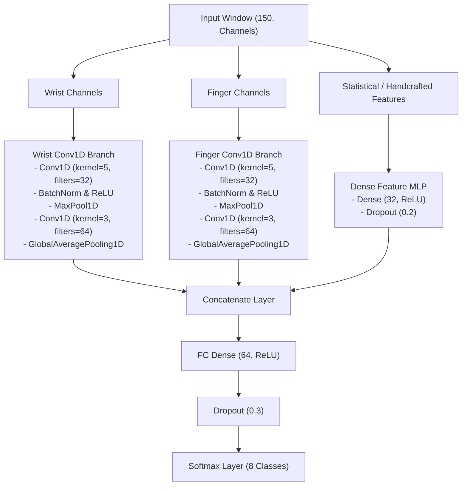

## CNN Model Architecture Design: Late Fusion Multi-Branch CNN

Since we are fusing two distinct physical nodes (Wrist vs. Finger) and handcrafted statistical features, a **Late Fusion Multi-Branch Conv1D CNN** is the optimal setup:

### Key Architectural Choices:

1. **Parallel Temporal Branches (Late Fusion):**
   * Keeping the Wrist and Finger networks separate allows each branch to build local spatial features independently before merging. Arm gestures are dominated by wrist dynamics, whereas hand gestures are dominated by finger-to-wrist deltas.
2. **Conv1D for Temporal Learning:**
   * 1D convolutions extract shift-invariant local features along the timeline. This helps handle slight temporal misalignments during real-time sliding window inference.
3. **Global Average Pooling (GAP) vs. Flattening:**
   * Replacing flat outputs with `GlobalAveragePooling1D` reduces the parameter footprint drastically, preventing overfitting on small training sets.
4. **Regularization:**
   * Batch Normalization is applied after each Conv1D layer to stabilize training.
   * Dropout ($30\%$) is added before the final classifier to ensure generalization.
5. **Loss & Optimization:**
   * **Loss:** `categorical_crossentropy` (with one-hot label encoding).
   * **Optimizer:** `Adam(learning_rate=0.001)` paired with a learning rate decay schedule (`ReduceLROnPlateau`).