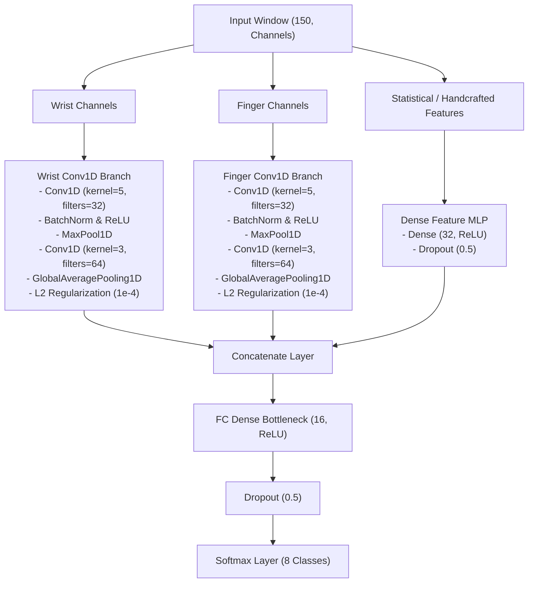

# Implementation Plan: Late Fusion Multi-Branch Conv1D CNN

This document details the architectural design, layer specifications, preprocessing pipelines, mathematical formulations, and engineering justifications for the **Late Fusion Multi-Branch Conv1D CNN** gesture classification candidate. It incorporates all empirical insights gained from our playground experiments (`late_fusion_cnn_test`) documented in [playground_model_experiments.md](playground_model_experiments.md).

---

## 1. Network Architecture Diagram

The Late Fusion Multi-Branch CNN routes inputs into three distinct pipelines: a Wrist Conv1D branch, a Finger Conv1D branch, and an MLP branch for handcrafted statistical features. Their output representations are concatenated (fused late) and classified via a capacity-bottlenecked head.



---

## 2. Detailed Layer Specifications

Depending on deployment resource budgets, developers can implement either the **Standard Bottleneck** configuration (Configuration 1) or the **Compact Multi-Branch** configuration (Configuration 2).

### Configuration 1: Standard Bottlenecked Multi-Branch (Recommended)
This configuration preserves the multi-scale temporal encoders but squeezes the classification dense head down from 64 to 16 units to bottleneck memorization.

#### A. Temporal Branches (Wrist & Finger)
Each of the two parallel Conv1D branches (Wrist and Finger) is constructed as follows:

| Layer Type | Specifications | Output Shape | Activation / Purpose |
| :--- | :--- | :--- | :--- |
| **Input Branch** | Dynamic sliced channels `(150, C_sub)` | `(None, 150, C_sub)` | Input binding |
| **Conv1D** | 32 filters, kernel=5, padding="same", `kernel_regularizer=l2(1e-4)` | `(None, 150, 32)` | ReLU |
| **Batch Normalization** | Normalizes activations along channels | `(None, 150, 32)` | Stabilizes gradient flow |
| **MaxPool1D** | pool_size=2, stride=2 | `(None, 75, 32)` | Downsampling |
| **Conv1D** | 64 filters, kernel=3, padding="same", `kernel_regularizer=l2(1e-4)` | `(None, 75, 64)` | ReLU |
| **Batch Normalization** | Normalizes activations along channels | `(None, 75, 64)` | Stabilizes gradient flow |
| **GlobalAveragePooling1D**| Average pooling along time axis | `(None, 64)` | Temporal extraction |

#### B. Statistical Summary Branch (MLP)
For scalar features that summarize the entire window (e.g., cross-correlation coefficients):

| Layer Type | Specifications | Output Shape | Activation / Purpose |
| :--- | :--- | :--- | :--- |
| **Input Branch** | Flat scalar features `(F,)` | `(None, F)` | Summary input |
| **Dense** | 32 hidden units | `(None, 32)` | ReLU |
| **Dropout** | Dropout rate = 50% | `(None, 32)` | Regularization |

#### C. Late Fusion & Classifier Layers

| Layer Type | Specifications | Output Shape | Activation / Purpose |
| :--- | :--- | :--- | :--- |
| **Concatenate** | Merges `[Branch1, Branch2, Branch3]` outputs | `(None, 160)` | Late Fusion (64 + 64 + 32) |
| **Dense** | **16 hidden units** (bottlenecked from 64) | `(None, 16)` | ReLU |
| **Dropout** | **Dropout rate = 50%** (increased from 30%) | `(None, 16)` | Regularization |
| **Dense (Softmax)** | 8 outputs (one per gesture class) | `(None, 8)` | Softmax activation |

---

### Configuration 2: Compact Multi-Branch
Designed for ultra-low resource targets, reducing the parameter footprint by 89.3% relative to the baseline (estimated parameters ~ 2,744) while maintaining baseline-level performance.

#### A. Temporal Branches (Wrist & Finger)
Each of the two parallel Conv1D branches is simplified to a single convolutional layer:

| Layer Type | Specifications | Output Shape | Activation / Purpose |
| :--- | :--- | :--- | :--- |
| **Input Branch** | Dynamic sliced channels `(150, C_sub)` | `(None, 150, C_sub)` | Input binding |
| **Conv1D** | 16 filters, kernel=5, padding="same", `kernel_regularizer=l2(1e-4)` | `(None, 150, 16)` | ReLU |
| **Batch Normalization** | Normalizes activations along channels | `(None, 150, 16)` | Stabilizes gradient flow |
| **GlobalAveragePooling1D**| Average pooling along time axis | `(None, 16)` | Temporal extraction |

#### B. Late Fusion & Classifier Layers

| Layer Type | Specifications | Output Shape | Activation / Purpose |
| :--- | :--- | :--- | :--- |
| **Concatenate** | Merges `[Wrist, Finger]` outputs | `(None, 32)` | Late Fusion (16 + 16) |
| **Dense** | **16 hidden units** | `(None, 16)` | ReLU |
| **Dropout** | **Dropout rate = 50%** | `(None, 16)` | Regularization |
| **Dense (Softmax)** | 8 outputs (one per gesture class) | `(None, 8)` | Softmax activation |

---

## 3. Design Justifications & Baseline Learnings

### A. The Late Fusion Concept
* **Justification:** Decoupling sensor nodes in early layers prevents early weight co-adaptation, where features from one sensor cluster's dominant amplitude overpower the gradients of the other. The wrist and finger IMUs capture movements at different physical scales (global arm sweep vs. local finger posture deltas). Separating them into distinct Conv1D encoders lets each branch specialize its filters before fusion.

### B. Spatial-Kinematic Decoupling (Post-Audit Synthesis)
* **Justification:** Random Forest Gini ranking in [feature_filter_analysis_results.json](../../data_analysis/data_analysis_data_v2/feature_filter_analysis_results.json) revealed that inter-IMU difference features (`diff_accZ`, `diff_accY`) hold over **30%** of the decision boundary splitting weight. This confirms that arm translation (wrist IMU1) and hand posture (finger relative to wrist) are kinematically decoupled. The late fusion multi-branch model is uniquely suited for this: Branch 1 is fed wrist-only dynamics (arm sweeps), Branch 2 processes finger-relative differences, and the MLP receives short-term relative yaw.

### C. Dense Feature MLP Branch
* **Justification:** Some features (like cross-correlation or window statistics) are scalar values rather than sequential time-series waveforms. This separate Dense MLP branch embeds these scalar metrics into a `32`-dimensional space before fusing them with the temporal features.
* **Regularization:** The MLP branch uses a high `50% Dropout` rate to prevent the classifier from over-relying on simple statistics (which leads to overfitting on the training user) and forcing it to prioritize the temporal motion shapes.

### D. Dynamic Column Slicing
* **Justification:** Instead of hardcoding input channel positions in the array, the model uses dynamic column index maps:
  ```python
  wrist_indices = [i for i, name in enumerate(dataset.channel_names) if "IMU1" in name]
  finger_indices = [i for i, name in enumerate(dataset.channel_names) if "IMU2" in name]
  ```
  This ensures that if we configure our features to exclude specific channels, the routing remains correct without requiring a rewrite of the model architecture code.

### E. Classifier Capacity Bottlenecking (Playground Experiment D & 7 Learnings)
* **Justification:** In baseline experiments, high-capacity models (`64` dense units) quickly memorized session-specific coordinate offsets and baseline sensor orientations, causing validation loss to diverge after epoch 8. With a patience of 20 epochs, the early stopping callback terminated training at **epoch 28** (restoring weights from the best epoch, **epoch 8**). By reducing classification dense units to **16** and increasing dropout to **50%**, we introduce a structural bottleneck.
* **Logic:** This bottleneck prevents the dense head from memorizing high-frequency session noise. This design resulted in a **negative generalization gap** (test performance higher than training, with the lowest validation loss achieved at **epoch 42** and training terminating at **epoch 62** due to early stopping patience).
* **Empirical Validation (Experiment 7):** When we evaluated a compact architecture (16 filters, 16 dense units) on the corrected Leave-Session-Out split, it achieved **99.40% test accuracy** and a **99.50% Macro F1-score** with only **2,744 parameters** (an 89.3% parameter reduction). The best validation loss was **0.0217** (achieved at epoch 70, with the model completing all 70 epochs without triggering early stopping). This demonstrates that compact model constraints maintain accuracy while providing excellent generalization.

### F. Explicit 8-Class Modeling (Idle/None Class Inclusion)
* **Justification:** Real-time PowerPoint slide control requires a near-zero false-positive rate. Rather than thresholding a 7-class active gesture model, we model the `none`/idle state as an explicit 8th class. This secures the decision boundaries of active gestures against random daily movements (e.g., mouse usage, typing, resting hand positions).
* **Mathematical & Physical Rationale:** 
  1. **Softmax Sum-to-One Saturation:** The Softmax activation function forces predicted probabilities to sum to 1.0. Under static rest (pure background noise), a 7-class model *must* distribute $100\%$ probability across the active gestures, forcing the prediction to skew towards a high-probability active label.
  2. **Confident Extrapolation on Noise (OOD):** Deep neural networks tend to make highly confident predictions on Out-of-Distribution (OOD) input. Without an explicit `none` class, random movements (e.g., hand scratching) project into high-confidence regions of active gesture manifolds, causing false triggers. Option A (Explicit 8-class) establishes explicit latent boundaries, forcing background noise to map cleanly to `none`.

---

## 4. Preprocessing & Augmentation Pipelines

Developers must implement the following mathematical transformations and signal processing stages in the training and inference pipelines to ensure clean and synchronized inputs:

### A. Digital Signal Filtering (Butterworth Configuration)
Raw IMU readings are noisy and subject to physiological micro-tremors (15–50 Hz). Before feature extraction, all signals must be pre-filtered using digital Butterworth filters (2nd order):
*   **Low-Pass Filter (Jitter Suppression):** Clamped at a cutoff of **8.0 Hz** for accelerometers and **12.0 Hz** for gyroscopes. This preserves voluntary human movement (0.5 to 8.0 Hz) while stripping high-frequency noise.
*   **High-Pass Filter (DC/Drift Removal):** Cutoff frequency set to **0.5 Hz** to remove the constant gravity vector and gyroscope temperature bias drift.

### B. Phase Alignment & Group Delay Mitigation
*   **Offline Training (Zero-Phase Filtering):** Implement bidirectional filtering (`scipy.signal.sosfiltfilt`) to run the Butterworth filter forward and backward. This eliminates phase shift, ensuring perfect synchronization between Wrist and Finger IMU channels during training.
*   **Real-Time Inference (Causal Filtering):** At runtime, the stream cannot look into the future, and causal filters introduce a **group delay** (approximately 20–40 ms). To bridge this mismatch, training must include **random temporal jittering** (using the `jitter_range` parameter). Training the network on shifted windows forces it to become invariant to the causal phase delay introduced in production.

### C. Static Calibration (Sensor Offset Removal)
At system startup, the user holds their hand still for `6.0` seconds (600 samples). The pipeline computes the mean sensor readings and subtracts these baseline biases from all subsequent samples:
$$\tilde{x}_t = x_t - \bar{x}_{calib}, \quad \text{where } \bar{x}_{calib} = \frac{1}{600}\sum_{i=1}^{600} x_i$$
This active zeroing translates raw values into relative dynamic deltas, neutralizing the coordinate shift caused by arm-strap and finger-strap re-taping.

### D. Dynamic Calibration Mapping (Thermal Drift Correction)
To mitigate long-term sensor bias drift (thermal or sensor placement changes), the dataset logs multiple static calibrations inside `recording_session.json` under `"recalibrations"`. The dataset processing loader must dynamically map each gesture sequence to its **closest prior calibration index** rather than using a single session-wide startup baseline.

### E. Dynamic 3D Random Rotation Augmentation
To prevent the model from memorizing absolute sensor coordinates, raw $X, Y, Z$ vectors are rotated on-the-fly during training. For a given vector $v = [v_x, v_y, v_z]^T$:
1. Sample a random unit rotation axis $k = [k_x, k_y, k_z]^T$ uniformly on a sphere.
2. Sample a random rotation angle $\theta$ from the uniform distribution $[-\theta_{max}, \theta_{max}]$, where $\theta_{max}$ is configured by `--augment-rotation` (recommend `25` degrees).
3. Apply **Rodrigues' rotation formula** to compute the rotated vector $v_{rot}$:
   $$v_{rot} = v \cos \theta + (k \times v) \sin \theta + k(k \cdot v)(1 - \cos \theta)$$

### F. Temporal Jittering (Shift)
During batch loading, raw training windows are dynamically shifted along the timeline by a random offset $s \in [-J, J]$, where $J$ is configured by `--jitter-range` (recommend `20` to `25` samples). This prevents the CNN from relying on absolute gesture alignments.

### G. Input Standardization
Each channel is standardized using the mean $\mu$ and standard deviation $\sigma$ computed from the training split:
$$x_{std} = \frac{x - \mu}{\sigma}$$
Developers must serialize these scaling parameters during training and load them for online real-time normalization.
---

## 5. Training Pipeline & Hyperparameters

Developers must implement the training loop in code using the following configurations:

* **Optimizer:** Adam with an initial learning rate of `0.001`.
* **Loss Function:** `categorical_crossentropy` (with one-hot label encoding).
* **Epoch Budget:** `70` epochs.
* **Batch Size:** `32`.
* **Callbacks:**
  * **Early Stopping (`EarlyStopping`):** Monitor `val_loss`, patience = `20` epochs, `restore_best_weights=True` to retrieve weights from the epoch with the lowest validation loss.
  * **Learning Rate Decay (`ReduceLROnPlateau`):** Monitor `val_loss`, patience = `10` epochs, learning rate reduction `factor=0.5`, minimum learning rate clamped at `min_lr=1e-6`.
* **Bayesian Optimization wrapper (Optuna):** Runs hyperparameter and dynamic feature sweeps over a set number of trials (e.g., 30-50 trials, with a trial-specific epoch limit of 10-15). The search selects optimal features using the **Joint Utility Score**:
  $$\text{Utility} = \text{Validation F1} - (0.001 \times \text{Latency ms}) - (10^{-6} \times \text{Parameter Count})$$
  This utility function penalizes model size and inference latency, directing the search toward simpler, less overfitted models.

---

## 6. Data Splitting & Leakage Prevention

To ensure honest model evaluation, the training pipeline supports index-based splitting methods. Developers must understand and configure splits as follows:

1. **Stratified Split (`stratified`):** Splits indices randomly while maintaining class balance ratios.
   * *Pitfall:* Sliding windows overlap heavily. Randomly splitting overlapping windows between Train, Val, and Test subsets leads to **severe information leakage**, yielding a deceptive 99% accuracy on paper but failing in real life.
2. **Chronological Split (`chronological`):** Splits indices sequentially per class (e.g., 70% Train / 10% Val / 20% Test) to isolate test data in time.
   * *Pitfall:* While it prevents temporal overlap leakage, it still leaks session-specific characteristics (sensor mounting, baseline drift) if Train and Test data come from the same physical session.
3. **Leave-Session-Out (`leave-session-out`):** Groups indices by session, holding out whole sessions for Test/Val.
   * *Pitfall:* Under the initial V3 dataset, sessions only contained recordings of a *single gesture class*. Alphabetically permuting and partitioning sessions (70/10/20) mathematically guaranteed that entire classes were completely excluded from splits (e.g., val set containing only `none` and `fist`). Since `fist` was OOD for train, validation loss spiked at Epoch 1. With a patience of 20 epochs, the early stopping callback terminated training at **Epoch 21**, restoring the random initial weights of **Epoch 1**.
   * *Resolution (Balanced Leave-Session-Out Split):* Developers must run evaluations using a multi-session setup (e.g., V4 dataset) containing validation and test sessions where **all classes are represented**, and where the sensors were physically repositioned between sessions. Under this setup, the baseline model achieved **99.00% test accuracy** and a **99.18% Macro F1-score** (Best Val Loss: **0.0153**, restored at epoch 53 out of 70). This isolates mounting and fatigue variances without introducing class exclusion or validation early stopping failure.
4. **Subject-Dependent Overfitting (Remaining Limitation):**
   * *Analysis:* Because our current dataset is recorded from a **single subject**, the convolutional encoders are highly optimized for that specific user's kinematics. Developers must note that to achieve generalizability to new users, the model must be trained on a multi-subject dataset and evaluated using **Leave-One-Subject-Out (LOSO) cross-validation**.

---

## 7. Real-Time Inference Integration

The real-time sliding window inference script must consume the trained model package under the following constraints:

* **Sliding Window:** Size = `150` samples (1.5 seconds at a constant `100 Hz` sampling rate).
* **Normalization:** Apply the standardized scaling online using the loaded scaler parameters.
* **Calibration:** Subtract the baseline offsets computed during startup.
* **Thresholding & Cooldown:** Gestures are dispatched only if the output Softmax probability exceeds a strict threshold (default `0.95` or `0.85` depending on noise environment). To prevent double execution of slides, a post-trigger cooldown lock (default `1.5` seconds) must be enforced.

---

## 8. Experiment Directory & Saving Structure

Every training session for this model must be saved in accordance with the project's experiment directory structure:

```
models/
└── late_fusion_multi_branch_1d_cnn/                 # Model identifier folder
    └── training_session_<index>_<timestamp>/        # Sequential session (e.g., training_session_0_20260629_020000)
        ├── model.keras                              # Saved trained Keras model weights and architecture
        ├── model.weights.h5                         # Serialized weights file
        ├── scaler_x_finger.joblib                   # Serialized finger branch StandardScaler
        ├── scaler_x_wrist.joblib                    # Serialized wrist branch StandardScaler
        ├── model_metadata.json                      # JSON file containing training run audit properties
        ├── confusion_matrix.png                     # Validation split confusion matrix plot
        └── learning_curves.png                      # Training/validation loss and accuracy curves
```

* **Sequential Indexing**: The training script must dynamically query existing directories under `models/late_fusion_multi_branch_1d_cnn/` to determine the next available sequential integer `<index>` (starting at `0` for the first run). Alternatively, an optional custom naming scheme (`training_session_<name>`) can be used as defined in [model_training_pipeline.md](../model_training_pipeline.md).
* **Multi-Branch Scaler Serializers**: Because Wrist and Finger signals have completely different amplitude distributions and physical metrics, they must be scaled independently. Developers must save two separate serialized files: `scaler_x_wrist.joblib` for the wrist branch and `scaler_x_finger.joblib` for the finger branch.
* **Metadata Logging**: The `model_metadata.json` file must strictly comply with the schema specified in [model_training_pipeline.md](../model_training_pipeline.md#metadata-schema-model_metadatajson). Because this model routes features into parallel pipelines, the `wrist_channels` and `finger_channels` arrays must list the exact feature names routed to each respective branch. All selected active features must be mapped inside the `channels` list, and their selection status recorded inside `feature_toggles`.

---

## 9. Pre-Training Data Quality Audits

Before training, developers should use the following statistical and information-theoretic metrics on training data to estimate gesture separability and identify classification risks:

1. **Distance Metrics & Silhouette Analysis (DTW):** Compute pairwise **Dynamic Time Warping (DTW)** distances between all sample sequences. For any two gesture classes $C_A$ and $C_B$, compute the **Fisher Separability Ratio**:
   $$S(C_A, C_B) = \frac{\mu_{inter} - \mu_{intra}}{\sigma_{intra}}$$
   Where $\mu_{inter}$ is the mean DTW distance between different classes, and $\mu_{intra}$ is the mean distance within the same class. A score of $S \ge 1.5$ indicates strong separability, whereas $S < 1.0$ indicates potential overlap and class confusion.
2. **Jensen-Shannon (JS) Divergence:** Compute the JS divergence of signal distributions (e.g., peak gyroscope energy) between active gestures and the `none` class:
   $$D_{JS}(P \parallel Q) = \frac{1}{2} D_{KL}(P \parallel M) + \frac{1}{2} D_{KL}(Q \parallel M), \quad \text{where } M = \frac{1}{2}(P + Q)$$
   Target a JS divergence of $D_{JS} \ge 0.8$ from the `none` class to ensure voluntary gestures are highly distinct from resting sensor noise.
3. **Dimensionality Reduction & Projection:** Flatten each 150-sample sequence into a single vector and project it using UMAP or t-SNE down to a 2D space. Verify that active gesture classes form isolated island clusters rather than overlapping with background idle points.
4. **Shallow KNN/SVM Baselines:** Fit a lightweight 3-NN or linear SVM classifier on the dataset using Leave-One-Session-Out cross-validation. A poor baseline score (e.g. 39.6% accuracy due to coordinate drift) mathematically justifies the need for deep temporal architectures (CNN/Transformer) to capture invariant motion kinetics.
