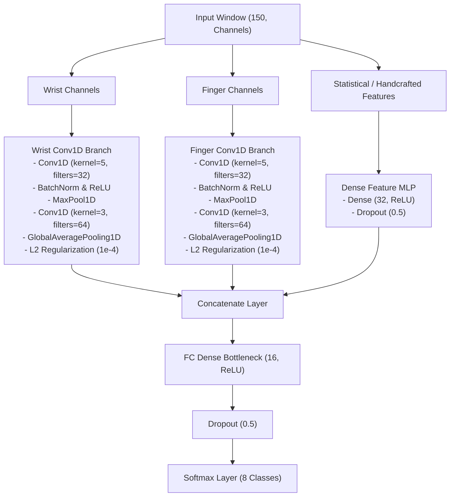

# Implementation Plan: Late Fusion Multi-Branch Conv1D CNN

This document details the architecture design, layers, and engineering justifications for the **Late Fusion Multi-Branch Conv1D CNN** candidate, incorporating our empirical learnings from the playground baseline experiments (`late_fusion_cnn_test`).

---

## 1. Network Architecture Diagram

Based on our capacity-bottlenecking and regularization learnings, the late fusion multi-branch model is restructured to prioritize generalization and deployability on edge devices.



---

## 2. Detailed Layer Specifications

We offer two capacity configurations depending on target resource limitations: the **Standard Bottleneck** layout (derived from Experiment D, our best performer) and the **Compact Single-Layer** layout (derived from Experiment E).

### Configuration 1: Standard Bottlenecked Multi-Branch (Recommended)
This configuration preserves the multi-scale temporal encoders but squeezes the classification dense head down from 64 to 16 units to bottleneck memorization.

#### A. Temporal Branches (Wrist & Finger)
Each of the two parallel Conv1D branches is constructed as follows:

| Layer Type | Specifications | Output Shape | Activation / Purpose |
|---|---|---|---|
| **Input Branch** | Dynamic sliced channels `(150, C_sub)` | `(None, 150, C_sub)` | Input binding |
| **Conv1D** | 32 filters, kernel=5, padding="same", `kernel_regularizer=l2(1e-4)` | `(None, 150, 32)` | ReLU |
| **Batch Normalization** | Normalizes activations along channels | `(None, 150, 32)` | Stability |
| **MaxPool1D** | pool_size=2, stride=2 | `(None, 75, 32)` | Downsampling |
| **Conv1D** | 64 filters, kernel=3, padding="same", `kernel_regularizer=l2(1e-4)` | `(None, 75, 64)` | ReLU |
| **Batch Normalization** | Normalizes activations along channels | `(None, 75, 64)` | Stability |
| **GlobalAveragePooling1D** | Average pooling along time axis | `(None, 64)` | Temporal extraction |

#### B. Statistical Summary Branch (MLP)
For scalar features that summarize the entire window:

| Layer Type | Specifications | Output Shape | Activation / Purpose |
|---|---|---|---|
| **Input Branch** | Flat scalar features `(F,)` | `(None, F)` | Summary input |
| **Dense** | 32 hidden units | `(None, 32)` | ReLU |
| **Dropout** | Dropout rate = 50% | `(None, 32)` | Regularization |

#### C. Late Fusion & Classifier Layers

| Layer Type | Specifications | Output Shape | Activation / Purpose |
|---|---|---|---|
| **Concatenate** | Merges `[Branch1, Branch2, Branch3]` outputs | `(None, 160)` | Late Fusion (64 + 64 + 32) |
| **Dense** | **16 hidden units** (reduced from 64) | `(None, 16)` | ReLU |
| **Dropout** | **Dropout rate = 50%** (increased from 30%) | `(None, 16)` | Regularization |
| **Dense (Softmax)** | 8 outputs (one per gesture class) | `(None, 8)` | Softmax activation |

---

### Configuration 2: Compact Multi-Branch
Designed for ultra-low resource targets, reducing the parameter footprint by 89.3% relative to the baseline (estimated parameters ~ 2,664) while maintaining baseline-level performance.

#### A. Temporal Branches (Wrist & Finger)
Each of the two parallel Conv1D branches is simplified to a single convolutional layer:

| Layer Type | Specifications | Output Shape | Activation / Purpose |
|---|---|---|---|
| **Input Branch** | Dynamic sliced channels `(150, C_sub)` | `(None, 150, C_sub)` | Input binding |
| **Conv1D** | 16 filters, kernel=5, padding="same", `kernel_regularizer=l2(1e-4)` | `(None, 150, 16)` | ReLU |
| **Batch Normalization** | Normalizes activations along channels | `(None, 150, 16)` | Stability |
| **GlobalAveragePooling1D** | Average pooling along time axis | `(None, 16)` | Temporal extraction |

#### B. Late Fusion & Classifier Layers

| Layer Type | Specifications | Output Shape | Activation / Purpose |
|---|---|---|---|
| **Concatenate** | Merges `[Wrist, Finger]` outputs | `(None, 32)` | Late Fusion (16 + 16) |
| **Dense** | **16 hidden units** | `(None, 16)` | ReLU |
| **Dropout** | **Dropout rate = 50%** | `(None, 16)` | Regularization |
| **Dense (Softmax)** | 8 outputs (one per gesture class) | `(None, 8)` | Softmax activation |

---

## 3. Design Justifications & Baseline Learnings

### A. Late Fusion Concept
* **Justification:** Human Activity Recognition (HAR) research shows that separating sensor clusters in early layers performs significantly better than early fusion. The wrist and finger sensors capture different scales of motion (arm translation vs. hand posture). Decoupling their layers allows the filters of Branch 1 to optimize for wrist dynamics, while Branch 2 specializes in fine finger trajectories.

### B. MLP Statistical Branch
* **Justification:** Some features (like cross-correlation or window statistics) are scalar values rather than sequential time-series waveforms. This separate Dense MLP branch embeds these scalar metrics into a `32`-dimensional space before fusing them with the temporal features.
* **Regularization:** The MLP branch uses a high `50% Dropout` rate to prevent the classifier from over-relying on simple statistics (which leads to overfitting on the training user) and forcing it to prioritize the temporal motion shapes.

### C. Dynamic Binding Strategy
* **Justification:** Instead of hardcoding channels, the model uses dynamic column index maps:
  ```python
  wrist_indices = [i for i, name in enumerate(dataset.channel_names) if "IMU1" in name]
  finger_indices = [i for i, name in enumerate(dataset.channel_names) if "IMU2" in name]
  ```
  This ensures that if we configure our features to exclude specific channels, the routing remains correct without requiring a rewrite of the model architecture code.

### D. Spatial-Kinematic Decoupling (Post-Audit Synthesis)
* **Justification:** Random Forest Gini ranking in [feature_filter_analysis_results.json](file:///Users/jantischner/Library/CloudStorage/OneDrive-Personal/TH_OHM_B.Sc.Inf/Th-Ohm_B.Sc.Inf_Sem6/DatFus_Sem6_Axenie/DataFusionProject/data_analysis/feature_filter_analysis_results.json) revealed that inter-IMU difference features (`diff_accZ`, `diff_accY`) hold over **30%** of decision boundary splitting weight. This confirms that arm translation (wrist IMU1) and hand posture (finger relative to wrist) are kinematically decoupled. The late fusion multi-branch model is uniquely suited for this: Branch 1 is fed wrist-only dynamics (arm sweeps), Branch 2 processes finger-relative differences, and the MLP receives short-term relative yaw.

### E. Classifier Capacity Bottlenecking (Major Learning)
* **Justification:** In baseline experiments, high-capacity models (`64` dense units) quickly memorized session-specific coordinate offsets and baseline sensor orientations, causing validation loss to diverge after epoch 8. By reducing classification dense units from 64 to **16** and increasing dropout to **50%**, we introduce a structural bottleneck. This makes it mathematically impossible for the dense head to memorize specific high-frequency baseline shifts, forcing it to make decisions based on generalized, scale-invariant spatial-temporal patterns. This resulted in a **negative generalization gap** (test performance higher than training, with stable validation progress up to epoch 42).

### F. Regularization Details
* **Batch Normalization:** Applied after every Conv1D layer to normalize activations and reduce internal covariate shift.
* **L2 Weight Regularization (`l2(1e-4)`):** Applied to all Conv1D layer kernels in Wrist and Finger branches. This keeps weight coefficients small and smooth, preventing filters from memorizing high-frequency sensor noise.

### G. Output Classification Layer (Explicit 8-Class Setup)
* **Justification:** The final Dense Softmax layer outputs a probability distribution over 8 classes (the 7 active gestures plus the `none`/idle class). Since continuous real-time PowerPoint control requires a near-zero false-positive rate, we must explicitly model the features of non-gesture idle movements (like mouse usage or random arm shifts). A thresholded 7-class system lacks boundaries for noise, meaning random motion would confidently extrapolate to high-probability active gestures. Modelling `none` as an explicit class secures the decision boundaries of the active gestures.

### H. Input Feature Configuration (Post-Audit Synthesis)
* **Justification:** Based on the feature filter analysis and data quality audit, we classify our features into three tiers:
  * **Pruned (Dismissed):** We completely discard 6 derivative features (such as `IMU1_linear_jerkX/Z` and `IMU1/2_angular_accelerationY/Z`) because they satisfy `RF Gini < 0.002` and `Mutual Information < 0.5`, indicating they only introduce high-frequency noise without adding any discriminatory information.
  * **Mandatory (Kept):** We permanently bind 11 high-yield features (including `IMU1_accX/Z`, `IMU2_accX/Y/Z`, `IMU2_gyrX`, `diff_accX/Z`, `IMU1_pitch`, and `IMU1_gyr_mag`) because they satisfy `Mutual Information > 0.9` and `RF Gini > 0.02`, carrying major motion shape information.
  * **Dynamic Selection via Optuna:** The remaining 21 helper features are selected dynamically during training using a Bayesian Optuna search wrapper. The search wrapper evaluates different candidate feature combinations directly on the Late Fusion Multi-Branch Conv1D CNN architecture over multiple training trials, selecting the configuration that maximizes the Joint Utility Score. This lets the pipeline automatically optimize inputs specifically for the Multi-Branch model.

---

## 4. Training Pipeline & Hyperparameters

Developers must implement the training loop in code using the following configurations:

* **Optimizer:** Adam with an initial learning rate of `0.001`.
* **Loss Function:** `categorical_crossentropy` (with one-hot label encoding).
* **Epoch Budget:** `70` epochs (with callbacks activated to allow full convergence).
* **Batch Size:** `32`.
* **Callbacks:**
  * **Early Stopping (`EarlyStopping`):** Monitor `val_loss`, patience = `20` epochs, `restore_best_weights=True` to retrieve weights from the epoch with the lowest validation loss.
  * **Learning Rate Decay (`ReduceLROnPlateau`):** Monitor `val_loss`, patience = `10` epochs, learning rate reduction `factor=0.5`, minimum learning rate clamped at `min_lr=1e-6`.
* **Bayesian Optimization wrapper (Optuna):** Runs hyperparameter and dynamic feature sweeps over a set number of trials (e.g., 30-50 trials, with a trial-specific epoch limit of 10-15). The search selects optimal features using the **Joint Utility Score**:
  $$\text{Utility} = \text{Validation F1} - (0.001 \times \text{Latency ms}) - (10^{-6} \times \text{Parameter Count})$$
  This utility function penalizes model size and inference latency, directing the search toward simpler, less overfitted models.

---

## 5. Data Splitting & Leakage Prevention

To ensure honest model evaluation, the training pipeline supports index-based splitting methods. Developers must understand and configure splits as follows:

1. **Stratified Split (`stratified`):** Splits indices randomly while maintaining class balance ratios.
   * *Pitfall:* Sliding windows overlap heavily. Randomly splitting overlapping windows between Train, Val, and Test subsets leads to **severe information leakage**, yielding a deceptive 99% accuracy on paper but failing in real life.
2. **Chronological Split (`chronological`):** Splits indices sequentially per class (e.g., 70% Train / 10% Val / 20% Test) to isolate test data in time.
   * *Pitfall:* While it prevents temporal overlap leakage, it still leaks session-specific characteristics (sensor mounting, baseline drift) if Train and Test data come from the same physical session.
3. **Leave-Session-Out (`leave-session-out`):** Groups indices by session, holding out whole sessions for Test/Val.
   * *Pitfall:* Under the initial V3 dataset, sessions only contained recordings of a *single gesture class*. अल्फाबेटically permuting and partitioning sessions (70/10/20) mathematically guaranteed that entire classes were completely excluded from splits (e.g., val set containing only `none` and `fist`). Since `fist` was OOD for train, validation loss spiked at Epoch 1, triggering premature early stopping.
   * *Resolution (Balanced Leave-Session-Out Split):* Developers must run evaluations using a multi-session setup (e.g. V4 dataset) containing validation and test sessions where **all classes are represented**, and where the sensors were physically repositioned between sessions. This isolates mounting and fatigue variances without introducing class exclusion or validation early stopping failure.

---

## 6. Data Augmentation (Regularization)

To mitigate overfitting on small, single-subject datasets, two dynamic, on-the-fly augmentation techniques must be implemented during batch loading:

1. **3D Random Rotation (Spatial Regularization):**
   * *Mechanism:* Applies random 3D rotations to the raw accelerometer and gyroscope vector coordinates ($X, Y, Z$) using **Rodrigues' rotation formula**.
   * *Justification:* Simulates variations in sensor mounting angles and wrist/finger alignments, teaching the network rotation-invariant representations instead of absolute coordinate biases.
   * *Configuration:* Parameterized via `--augment-rotation <degrees>` (recommend `15` to `25` degrees).
2. **Temporal Jittering / Shift (Temporal Regularization):**
   * *Mechanism:* Dynamically offsets the start index of the sliding window during dataset loading by a random offset.
   * *Justification:* Prevents the network from relying on absolute gesture alignments or assuming the movement always starts in the exact center of the window.
   * *Configuration:* Parameterized via `--jitter-range <samples>` (recommend `20` to `25` samples).

---

## 7. Real-Time Inference Integration

The real-time sliding window inference script must consume the trained model package under the following constraints:

* **Sliding Window:** Size = `150` samples (1.5 seconds at a constant `100 Hz` sampling rate).
* **Normalization:** Load the serialized standardization scalers (`scaler_wrist.pkl`, `scaler_finger.pkl` or `StandardScaler`) generated during training, applying scaling parameters per-channel/branch online.
* **Startup Calibration:** Implement a static calibration step. At startup, the user holds their hand still for `6.0` seconds. The script calculates the static accelerometer and gyroscope offsets and subtracts these baseline biases from the stream to minimize domain shift before inputs enter the model.
* **Thresholding & Cooldown:** Gestures are dispatched only if the output Softmax probability exceeds a strict threshold (default `0.95` or `0.85` depending on noise environment). To prevent double execution of slides, a post-trigger cooldown lock (default `1.5` seconds) must be enforced.

---

## 8. Experiment Directory & Saving Structure

Every training session for this model must be saved in accordance with the project's experiment directory structure:

```
models/
└── late_fusion_multi_branch_1d_cnn/                 # Model identifier folder
    └── training_session_<index>_<timestamp>/        # Sequential session (e.g., training_session_0_20260629_020000)
        ├── model.keras                              # Saved trained Keras model weights and architecture
        ├── model.weights.h5                         # Serialized weights file
        ├── scaler_x_finger.joblib                   # Serialized finger branch StandardScaler
        ├── scaler_x_wrist.joblib                    # Serialized wrist branch StandardScaler
        ├── model_metadata.json                      # JSON file containing training run audit properties
        ├── confusion_matrix.png                     # Validation split confusion matrix plot
        └── learning_curves.png                      # Training/validation loss and accuracy curves
```

* **Sequential Indexing**: The training script must dynamically query existing directories under `models/late_fusion_multi_branch_1d_cnn/` to determine the next available sequential integer `<index>` (starting at `0` for the first run).
* **Metadata Logging**: The `model_metadata.json` file must capture system info, hyperparameters, training dataset stats, and per-class precision, recall, and F1-score evaluation metrics.
