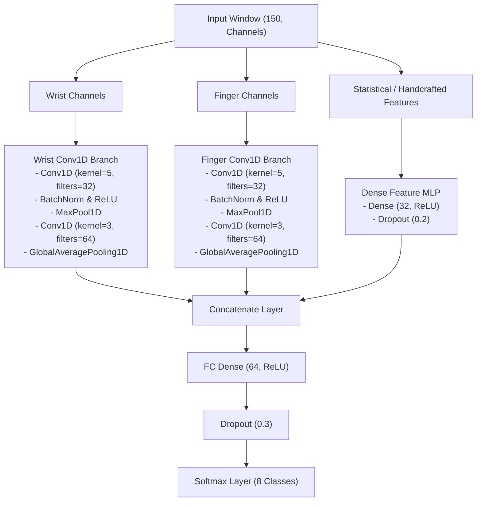

# Test Model (Late Fusion Multi-Branch CNN)

---

## Purpose & Scope

The model `late_fusion_cnn_test` acts as our baseline playground model. It is used to test all our core ideas, perform initial live inference runs, and answer our primary feasibility questions:

* **Early Feasibility Testing:**
  * Validate our basic idea: is it even possible to distinguish between our 8 target gesture classes using dual-IMU sensor fusion?
* **Identifying Downstream Challenges:**
  * Uncover potential issues early in the development lifecycle, including:
    * **Palm Orientation:** How hand/palm orientation in relation to the ground affects the accelerometer and gyroscope readings.
    * **Data Quality:** Assessing noise, sensor drift, and alignment issues.
    * **Real-Time Capabilities:** Evaluating sliding-window inference latency and gesture triggering responsiveness.
    * **Hardware Requirements:** Estimating the CPU/RAM requirements for runtimes on low-resource edge hosts.
* **Data Quality & Pipeline Audit:**
  * Evaluate if we have collected enough high-quality training data, and verify if our recording, preprocessing, and synchronization procedures are sound.

---

## Architecture Design: Late Fusion Multi-Branch CNN

Because we are fusing two distinct physical nodes (Wrist vs. Finger) and handcrafted statistical features and (at least according to our research) it is a fairly standard and proven architecture for this kind of application we decided to use a **Late Fusion Multi-Branch Conv1D CNN** as a initial baseline architecture:




### Key Architectural Choices:

1. **Parallel Temporal Branches (Late Fusion):**
   * Keeping the Wrist and Finger networks separate allows each branch to build local spatial features independently before merging. Arm gestures are dominated by wrist dynamics, whereas hand gestures are dominated by finger-to-wrist deltas.
2. **Conv1D for Temporal Learning:**
   * 1D convolutions extract shift-invariant local features along the timeline. This helps handle slight temporal misalignments during real-time sliding window inference.
3. **Global Average Pooling (GAP) vs. Flattening:**
   * Replacing flat outputs with `GlobalAveragePooling1D` reduces the parameter footprint drastically, preventing overfitting on small training sets.
4. **Regularization:**
   * Batch Normalization is applied after each Conv1D layer to stabilize training.
   * L2 kernel regularization (`l2(1e-4)`) is applied to all Conv1D layers in the Wrist and Finger branches to keep weights small and smooth.
   * Dropout ($50\%$) is added before the final classifier to ensure generalization.
5. **Loss & Optimization:**
   * **Loss:** `categorical_crossentropy` (with one-hot label encoding).
   * **Optimizer:** `Adam(learning_rate=0.001)` paired with a learning rate decay schedule (`ReduceLROnPlateau`).

---

## Model Implementation Details & Source Files

* **Model Definition:** [model.py](file:///Users/jantischner/Library/CloudStorage/OneDrive-Personal/TH_OHM_B.Sc.Inf/Th-Ohm_B.Sc.Inf_Sem6/DatFus_Sem6_Axenie/DataFusionProject/src/data_fusion_project/training/late_fusion_multi_branch_cnn_test/model.py)
  * **What it does:** Builds the multi-branch Conv1D baseline network using the Keras Functional API. It separates input windows into distinct branches (Wrist Conv1D, Finger Conv1D, and MLP for handcrafted statistical features), extracts spatial-temporal representations independently, concatenates them, and feeds the output into classification layers.
  * **Key Functions:**
    * `build_multi_branch_cnn()`: Instantiates, parameters-configures, and compiles the model.
    * `parse_channel_indices()`: Maps the model's target input channel lists to index offsets within the raw preprocessed sensor streams.
* **Core Training Logic:** [train.py](file:///Users/jantischner/Library/CloudStorage/OneDrive-Personal/TH_OHM_B.Sc.Inf/Th-Ohm_B.Sc.Inf_Sem6/DatFus_Sem6_Axenie/DataFusionProject/src/data_fusion_project/training/late_fusion_multi_branch_cnn_test/train.py)
  * **What it does:** Implements the training loop, validation logic (Leave-Session-Out split), and the Optuna optimization hyperparameter trials. It computes the **Joint Utility Score** used by Optuna:
    $$\text{Utility} = \text{Validation F1} - (0.001 \times \text{Latency ms}) - (10^{-6} \times \text{Parameter Count})$$
  * **Key Outputs:** Serialization of final trained model weights (`.weights.h5`), training metadata (`model_metadata.json`), and standard scalers (`scaler_wrist.pkl`, `scaler_finger.pkl`).
* **CLI Training Script:** [train_test_cnn.py](file:///Users/jantischner/Library/CloudStorage/OneDrive-Personal/TH_OHM_B.Sc.Inf/Th-Ohm_B.Sc.Inf_Sem6/DatFus_Sem6_Axenie/DataFusionProject/scripts/train_test_cnn.py)
  * **What it does:** Provides the user-facing command-line entrypoint for standard baseline training or Bayesian feature/hyperparameter sweeps.
  * **Primary Options:**
    * `--epochs INT`: Number of training epochs (default: `10`).
    * `--batch-size INT`: Batch size for training (default: `32`).
    * `--learning-rate FLOAT`: Initial learning rate for the Adam optimizer (default: `0.001`).
    * `--model-name STR`: Output folder name created inside `models/` (default: `late_fusion_cnn_test`).
    * `--optimize`: Flag to enable Optuna search optimization.
    * `--optuna-trials INT`: Number of optimization search runs (default: `20`).
    * `--optuna-epochs INT`: Training epochs executed per trial (default: `5`).
* **Live Inference Script:** [run_realtime_inference_test.py](file:///Users/jantischner/Library/CloudStorage/OneDrive-Personal/TH_OHM_B.Sc.Inf/Th-Ohm_B.Sc.Inf_Sem6/DatFus_Sem6_Axenie/DataFusionProject/scripts/run_realtime_inference_test.py)
  * **What it does:** Manages live stream readers from two serial ports, aligns and standardizes them in sliding windows, feeds them to the classifier model, and maps classified gestures to PowerPoint shortcut events.
  * **Primary Options:**
    * `--model-dir PATH`: Directory containing the model run. Automatically resolves to the latest session (e.g. `training_session_16_...`) if pointed to a base model directory.
    * `--threshold FLOAT`: Gesture probability threshold (from `0.0` to `1.0`) required to trigger shortcut actions (default: `0.85`).
    * `--cooldown FLOAT`: Time lock (seconds) following a trigger to prevent double execution (default: `1.5`).
    * `--simulate`: Starts two mock high-frequency IMU threads with synchronized monotonic wall-clock clocks to test headless code execution without hardware.
    * `--dry-run`: Intercepts key injections; prints PowerPoint shortcuts to the console rather than sending virtual keys.
    * `--timeout INT`: Maximum duration (seconds) to run the inference loop before exiting cleanly.

---

## Training Pipeline Integration & Usage

The training pipeline integrates:
1. **Bayesian Dynamic Feature Selection (Optuna):** Optimizes the feature subset to maximize performance (F1-score) while minimizing parameter counts and edge latency.
2. **Dynamic Retrofitting:** Saves model checkpoints along with a serialized `model_metadata.json` containing the flat `"feature_toggles"` map.

### Usage Commands:

#### **Standard Baseline Training:**
* Train the model on the default feature set:
  ```bash
  python scripts/train_test_cnn.py --model-name late_fusion_cnn_test
  ```
* If  `--epochs` is not specified, it will default to `10` epochs used for the final retraining (after the optional feature selection). To ensure the final selected model trains to full convergence and utilizes `EarlyStopping` / `ReduceLROnPlateau` successfully, we recomment to append at least `--epochs 50`:
  ```bash
  python scripts/train_test_cnn.py --epochs 50 --model-name late_fusion_cnn_test
  ```

#### **Dynamic Feature Sweep & Optimization:**
* Run a Bayesian Optuna search sweep to discover the optimal feature layout using the `--optimize` flag:
  ```bash
  python scripts/train_test_cnn.py --optimize --optuna-trials 30 --optuna-epochs 10 --augment-rotation 15 --epochs 50 --model-name late_fusion_cnn_test
  ```
*   **WITHOUT `--optimize` (Baseline Mode):**
   *   The script skips the optimization phase and immediately trains a single model for the number of epochs specified by `--epochs` (default: 10) using a static feature set containing all Mandatory and Optional features, without performing feature selection.
*   **WITH `--optimize` (Bayesian Feature Selection Mode):**
   *   The script launches a **Bayesian dynamic feature selection sweep** powered by Optuna.
   *   It executes the number of trial iterations specified by `--optuna-trials` (e.g., 30 trials). In each trial, it samples different subsets of the 21 optional dynamic features, trains a trial candidate model for `--optuna-epochs` (e.g., 10 epochs), and computes the **Joint Utility Score**.
   *   Once the search is complete, it extracts the optimal feature toggle layout and automatically triggers a **final retraining run** on those optimal features using the epoch budget specified by `--epochs`.


---

## Real-Time Inference System

The real-time system executes in the following sequence:
1. **Sensor Connection:** Automatically connects to the dual-IMU serial ports (specified in `config/devices.yml`). Alternatively, starts high-frequency simulated streams when `--simulate` is set.
2. **Static Calibration:** Prompts the user to press `[Enter]` and hold still for 6.0 seconds. Computes the baseline offset and aligns sensor timestamps.
3. **Sliding Window Slicing:** Asynchronously collects data, extracts windows dynamically matching the model's expected shape, performs normalization, and computes inference.
4. **Action Dispatcher:** Translates classified gestures into keyboard shortcuts using [powerpoint_control.yml](file:///Users/jantischner/Library/CloudStorage/OneDrive-Personal/TH_OHM_B.Sc.Inf/Th-Ohm_B.Sc.Inf_Sem6/DatFus_Sem6_Axenie/DataFusionProject/config/powerpoint_control.yml) and presses the keys on the active window.

### Usage Commands:

* **Live Mode (Physical Rigs):**
  ```bash
  python scripts/run_realtime_inference_test.py --model-dir models/late_fusion_cnn_test --threshold 0.95
  ```

* **Simulated Dry-Run (No Hardware Needed):**
  Useful for quick offline verification and pipeline logic checks:
  ```bash
  python scripts/run_realtime_inference_test.py --model-dir models/late_fusion_cnn_test --threshold 0.95 --dry-run --simulate --timeout 20
  ```

---

## Trained Model Package File Structure

Each training run creates a directory under `models/late_fusion_cnn_test/training_session_<index>_<timestamp>/` containing the following files:

*   `model.keras`: The compiled Keras model file containing the network architecture and training configurations.
*   `model.weights.h5`: The serialized weights containing the learned parameter coefficients of the Conv1D and Dense layers.
*   `scaler_x_wrist.joblib` / `scaler_x_finger.joblib`: Serialized `StandardScaler` instances used to normalize input channels online before feeding them to the corresponding network branch.
*   `confusion_matrix.png`: A plot visualizing prediction accuracy and recall per class on the test set.
*   `learning_curves.png`: A plot showing training vs. validation loss and accuracy progress across epochs.
*   `model_metadata.json`: The metadata file containing parameters, metrics, active features, and pipeline configurations.

---

## Model Metadata Structure (model_metadata.json)

The `model_metadata.json` is a comprehensive descriptor file generated during training that serves as the single source of truth for the real-time inference script. It is structured into the following key blocks:

### 1. Run & Architecture Identification
*   `timestamp` (string): The timestamp identifier (`YYYYMMDD_HHMMSS`) of the training run.
*   `model_name` (string): The registered name of the architecture class.
*   `training_duration_s` (float): The total execution time of the training epochs in seconds.
*   `epochs_trained` (int): Number of epochs completed before training terminated.
*   `classes` (list of strings): The ordered list of classified gesture names (determines the output neuron index).

### 2. Feature & Input Shape Configurations
*   `feature_toggles` (object): Key-value map of all 37 possible mathematical features to boolean flags. Enabled features (`true`) are actively computed; disabled features (`false`) are ignored. The disabled features are not used at all - we identified those during our feature analysis.
*   `channels` (list of strings): The ordered list of all active features in the flat concatenated dataset.
*   `wrist_channels` (list of strings): Active feature channels directed into the Wrist branch. Used by the inference script to slice the sliding window's Wrist input array dynamically.
*   `finger_channels` (list of strings): Active feature channels directed into the Finger branch. Used by the inference script to slice the sliding window's Finger input array dynamically.

### 3. Hyperparameters & Splits
*   `training_parameters` (object): Includes the learning rate, batch size, split strategy (`chronological` or `leave-session-out`), test fraction, and random seed.
*   `split_info` (object): Logs the exact recording sessions used for training (`train_sessions`) vs. testing (`test_sessions`), ensuring validation isolation.

### 4. Performance Metrics
*   `performance` (object): Tracks the validation and training accuracy/loss at the best epoch, along with the macro validation F1-score.
*   `evaluation` (object): Full post-training metrics breakdown, including precision, recall, F1-score, and support sample counts per individual class.

### 5. Data Preprocessing Pipeline Configuration
Represents the exact preprocessing pipeline configuration used to transform raw sensor readings during training:
*   `sample_rate_hz` (float): The expected sensor sampling rate (100 Hz).
*   `window_size` (int): Number of samples per sliding window (150 samples = 1.5s).
*   `calibration` (object): Calibration offset policies (e.g. whether gyroscope bias is removed and accelerometer readings are normalized to gravity Gs).
*   `filters` (object): High-pass and low-pass filtering parameters (e.g. Butterworth filter cutoff frequencies).
*   `orientation` (object): Sensor fusion complementary filter alpha coefficients (determines the weighting of accelerometer tilt vs. gyroscope integration).
*   `features` (object): Configures the **feature generation / extraction phase**. It specifies which derived mathematical channels (e.g., magnitudes, sensor differences, linear jerks, angular accelerations, and relative yaw) are computed and loaded from the raw IMU readings when compiling the dataset baseline. Any feature family disabled here (`false`) is not generated at all, while enabled families (`true`) are loaded into the baseline pool where they can then be selected or pruned by `feature_toggles`.

---

## Feature Selection Categories & Inspection

To inspect how the 37 possible features are grouped and parsed during the Bayesian dynamic selection sweep:

### 1. Mandatory (Kept) Features (Selected from the get-go; NOT tested)
These are key baseline signals that pack high information density and are **always enabled** (set to `true` in `feature_toggles`) regardless of Optuna optimization outcomes:
*   **Active Features:** `IMU1_accX`, `IMU1_accZ`, `IMU1_gyrX`, `IMU1_pitch`, `IMU2_accX`, `IMU2_accY`, `IMU2_accZ`, `IMU2_gyrX`, `diff_accX`, `diff_accZ`, `IMU1_gyr_mag`.
*   **Verification:** In any `model_metadata.json`, these keys are always present and set to `true`.

### 2. Pruned (Dismissed) Features (Pruned from the get-go; NOT tested)
These features hold no measurable discriminatory value (low Gini Importance and low Mutual Information) and are **always disabled** (set to `false` in `feature_toggles` and never evaluated during trials):
*   **Inactive Features:** `IMU1_linear_jerkX`, `IMU1_linear_jerkZ`, `IMU2_linear_jerkZ`, `IMU1_angular_accelerationY`, `IMU1_angular_accelerationZ`, `IMU2_angular_accelerationY`.
*   **Verification:** In any `model_metadata.json`, these keys are always present and set to `false`.

### 3. Dynamic (Tested) Features (Trial search space)
These are candidate features whose inclusion is dynamically optimized by Optuna to maximize classification utility and minimize parameter sizes:
*   **Search Space:** `IMU1_accY`, `IMU1_gyrY`, `IMU1_gyrZ`, `IMU1_acc_mag`, `IMU1_roll`, `IMU1_relative_yaw`, `IMU1_linear_jerkY`, `IMU1_angular_accelerationX`, `IMU2_gyrY`, `IMU2_gyrZ`, `IMU2_gyr_mag`, `IMU2_acc_mag`, `IMU2_relative_yaw`, `IMU2_linear_jerkX`, `IMU2_linear_jerkY`, `IMU2_angular_accelerationX`, `IMU2_angular_accelerationZ`, `diff_accY`, `diff_gyrX`, `diff_gyrY`, `diff_gyrZ`.
*   **Verification:** 
    *   **To see what was tested:** Refer to the CLI search stdout log or the Optuna study trials output.
    *   **To see what was selected in the final model:** Inspect `feature_toggles` inside the target directory's `model_metadata.json`. If a dynamic feature's toggle value is `true`, Optuna included it in the final optimal configuration. If `false`, it was pruned during the search.

---

## Model Training Optimizations

The training pipeline integrates several optimization and regularization techniques to prevent overfitting, stabilize training, and enhance generalization:

### 1. Keras Training Callbacks
*   **Early Stopping (`EarlyStopping`):**
    *   *Monitor:* `val_loss` (validation set loss).
    *   *Patience:* `20` epochs. If the validation loss fails to decrease for 20 consecutive epochs, training terminates early to prevent overfitting.
    *   *Weights Restoration:* `restore_best_weights=True` ensures the model restores and saves the weights from the epoch that achieved the absolute lowest validation loss (rather than the final epoch's weights).
   * Activated by default.
*   **Dynamic Learning Rate Decay (`ReduceLROnPlateau`):**
    *   *Monitor:* `val_loss`.
    *   *Patience:* `10` epochs. If the validation loss stagnates for 10 epochs, the learning rate is halved (`factor=0.5`).
    *   *Limits:* Lower bound clamped at `min_lr=1e-6` to avoid learning rate decay to zero.
    * Activated by default.

### 2. Regularization Layers
*   **Batch Normalization (`BatchNormalization`):** Applied immediately after every 1D Convolution block. This normalizes layer activations, reduces internal covariate shift, acts as a mild regularizer, and enables faster convergence.
    * Activated by default.
*   **Dropout Regularization:**
    *   `20%` dropout applied to the MLP branch (for statistical handcrafted features).
    *   `30%` dropout applied to the concatenated representation right before the final Softmax classification layer to prevent co-adaptation of weights.
    * Activated by default.

### 3. Spatial Data Augmentation (Regularization)
*   **3D Random Rotation Augmentation:**
    *   *Method:* Applies random 3D rotations to the raw accelerometer and gyroscope vector coordinates ($X, Y, Z$) using **Rodrigues' rotation formula**.
    *   *Purpose:* Acts as a spatial regularizer, simulating variations in sensor mounting or arm angles. This teaches the network rotation-invariant representations, drastically improving real-world testing robustness.
    *   *Activation:* **Opt-in / Configurable**. Unlike callbacks and layers which are enabled by default, spatial augmentation is disabled by default (`0.0` degrees). To activate it, pass the `--augment-rotation` command-line flag with the maximum rotation angle limit (in degrees):
      ```bash
      python scripts/train_test_cnn.py --augment-rotation 15 --epochs 30
      ```
    * Not activated by default. Must pass `--augment-rotation <degrees>` (e.g. `--augment-rotation 15`) to activate it.

---

## Mitigating Overfitting on Small Datasets

During the data quality audit we found, that linear classifiers are not powerful enough for our use-case - we need to utilize deep learning. But because our dataset is relatively small, high-capacity deep learning models (like this late fusion cnn) are prone to overfitting (by memorizing training noise), causing validation metrics to stall or diverge. To optimize the training pipeline against overfitting, we apply the following strategies:

### Data Augmentation (Regularization)
Data augmentation artificially increases our dataset size and diversity by modifying samples on the fly:
*   **3D Spatial Rotation:** 
   * Passing the `--augment-rotation <degrees>` CLI argument (e.g. `--augment-rotation 15` or `--augment-rotation 30`) rotates sample coordinates using random 3D rotation matrices, forcing the model to learn invariant geometric shapes instead of raw sensor coordinate values. 
   * Rather than creating static pre-rotated duplicates on disk (which risks validation data leakage and model memorization), this is done **dynamically on-the-fly** during each epoch load. Across 50 epochs, the network will see 50 unique orientations of the same gesture sample without using additional memory or disk storage.
*   **Temporal Jittering (Shift):** 
   * The preprocessing pipeline supports random temporal shifts along the recorded window's timeline. This prevents the CNN from relying on absolute gesture start times. This can be activated by passing the `--jitter-range <samples>` argument (e.g. `--jitter-range 20` to apply a random shift of up to $\pm 20$ datapoints insode of each sample during loading). 
   * During training dataset generation, when --jitter-range is set to e.g. 20, our data processing pipeline pulls a window shifted by a random offset between -20 and +20 samples. Because it does this dynamically on every epoch loading call, it functions as a continuous, infinite slider augmentation without introducing data leakage (since the dataset splits remain isolated by session).

### Early Stopping
By enabling `EarlyStopping` by default we ensure that the model never trains for a fixed number of epochs without validation monitoring - instead  the model will train until the validation loss stops improving, cutting off the run before overfitting begins.

### Optuna Penalizes Model Size
Our Bayesian optimization utility function includes a parameter count penalty:
$$\text{Utility} = \text{Validation F1} - (0.001 \times \text{Latency}) - (10^{-6} \times \text{Parameter Count})$$
By running with `--optimize`, Optuna naturally favors smaller feature spaces and smaller compiled network sizes, effectively guiding the search toward simpler, less overfitted models.

### Regularization Parameters
*   **Dropout (Activation Regularization):** 
    *   *Mechanism:* Randomly drops out unit activations (disabling neuron outputs) during training, forcing the network to learn redundant, distributed paths and preventing neuron co-adaptation.
    *   We set the final classification head dropout to a comparativeley high `0.5` in [model.py](file:///Users/jantischner/Library/CloudStorage/OneDrive-Personal/TH_OHM_B.Sc.Inf/Th-Ohm_B.Sc.Inf_Sem6/DatFus_Sem6_Axenie/DataFusionProject/src/data_fusion_project/training/late_fusion_multi_branch_cnn_test/model.py#L427).
*   **L2 Weight Regularization (Parameter Weight Decay):** 
    *   *Mechanism:* Adds a squared weight penalty to the loss function, forcing the layer weight coefficients to remain small. This results in smoother mathematical decision curves, preventing the filters from memorizing high-frequency sensor noise.
    *   We applied a moderate `kernel_regularizer=keras.regularizers.l2(1e-4)` to the Conv1D kernels in the Wrist and Finger branches, because over-regularization can lead to underfitting.

### What we could still do: Lower the Model Capacity (Scale Down Architecture)
A smaller model has a lower capacity to memorize data:
*   **Reduce Filters:** In [model.py](file:///Users/jantischner/Library/CloudStorage/OneDrive-Personal/TH_OHM_B.Sc.Inf/Th-Ohm_B.Sc.Inf_Sem6/DatFus_Sem6_Axenie/DataFusionProject/src/data_fusion_project/training/late_fusion_multi_branch_cnn_test/model.py), reduce the Conv1D filters. Instead of the default `32 -> 64` configuration, scale down to `16 -> 32` or even a single Conv1D layer with `16` filters.
*   **Reduce Dense Neurons:** Scale down the classification dense layer from `64` neurons to `32` or `16`.
