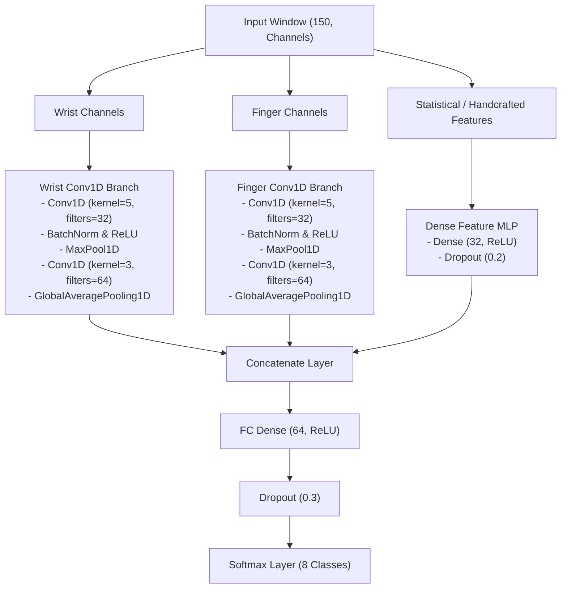
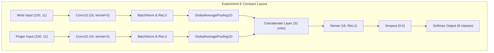
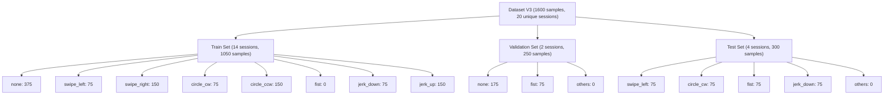

# Test Model (Late Fusion Multi-Branch CNN)

---

## Purpose & Scope

The model `late_fusion_cnn_test` acts as our baseline playground model. It is used to test all our core ideas, perform initial live inference runs, and answer our primary feasibility questions:

* **Early Feasibility Testing:**
  * Validate our basic idea: is it even possible to distinguish between our 8 target gesture classes using dual-IMU sensor fusion?
* **Identifying Downstream Challenges:**
  * Uncover potential issues early in the development lifecycle, including:
    * **Palm Orientation:** How hand/palm orientation in relation to the ground affects the accelerometer and gyroscope readings.
    * **Data Quality:** Assessing noise, sensor drift, and alignment issues.
    * **Real-Time Capabilities:** Evaluating sliding-window inference latency and gesture triggering responsiveness.
    * **Hardware Requirements:** Estimating the CPU/RAM requirements for runtimes on low-resource edge hosts.
* **Data Quality & Pipeline Audit:**
  * Evaluate if we have collected enough high-quality training data, and verify if our recording, preprocessing, and synchronization procedures are sound.

---

## Architecture Design: Late Fusion Multi-Branch CNN

Because we are fusing two distinct physical nodes (Wrist vs. Finger) and handcrafted statistical features and (at least according to our research) it is a fairly standard and proven architecture for this kind of application we decided to use a **Late Fusion Multi-Branch Conv1D CNN** as a baseline architecture for our initial tests.

### Key Architectural Choices:

1. **Parallel Temporal Branches (Late Fusion):**
   * Keeping the Wrist and Finger networks separate allows each branch to build local spatial features independently before merging. Arm gestures are dominated by wrist dynamics, whereas hand gestures are dominated by finger-to-wrist deltas.
2. **Conv1D for Temporal Learning:**
   * 1D convolutions extract shift-invariant local features along the timeline. This helps handle slight temporal misalignments during real-time sliding window inference.
3. **Global Average Pooling (GAP) vs. Flattening:**
   * Replacing flat outputs with `GlobalAveragePooling1D` reduces the parameter footprint drastically, preventing overfitting on small training sets.
4. **Regularization:**
   * Batch Normalization is applied after each Conv1D layer to stabilize training.
   * L2 kernel regularization (`l2(1e-4)`) is applied to all Conv1D layers in the Wrist and Finger branches to keep weights small and smooth.
   * Dropout ($50\%$) is added before the final classifier to ensure generalization.
5. **Loss & Optimization:**
   * **Loss:** `categorical_crossentropy` (with one-hot label encoding).
   * **Optimizer:** `Adam(learning_rate=0.001)` paired with a learning rate decay schedule (`ReduceLROnPlateau`).

### Testing Architectures

#### **1. Baseline Model Architecture (`conv_filters = [32, 64]`, `dense_units = 64`)**
*   **Total Parameters:** 24,968
*   **Wrist/Finger Branch Layout:**
    *   `Conv1D(filters=32, kernel_size=5, padding="same")` $\rightarrow$ `BatchNorm` $\rightarrow$ `ReLU`
    *   `MaxPool1D(pool_size=2)`
    *   `Conv1D(filters=64, kernel_size=3, padding="same")` $\rightarrow$ `BatchNorm` $\rightarrow$ `ReLU`
    *   `GlobalAveragePooling1D`
*   **Classification Head Layout:**
    *   `Concatenate` $\rightarrow$ `Dense(64, activation="relu")` $\rightarrow$ `Dropout(0.5)` $\rightarrow$ `Dense(8, activation="softmax")`
*   **Overfitting Vulnerability:** High capacity in both the convolutional encoders and the dense classification head allows the network to memorize absolute coordinate offsets and baseline sensor orientation shifts unique to individual sessions.



#### **2. Experiment B Architecture (`conv_filters = [16]`, `dense_units = 64`)**
*   **Total Parameters:** 4,472
*   **Wrist/Finger Branch Layout:**
    *   `Conv1D(filters=16, kernel_size=5, padding="same")` $\rightarrow$ `BatchNorm` $\rightarrow$ `ReLU`
    *   `GlobalAveragePooling1D`
*   **Classification Head Layout:**
    *   `Concatenate` $\rightarrow$ `Dense(64, activation="relu")` $\rightarrow$ `Dropout(0.5)` $\rightarrow$ `Dense(8, activation="softmax")`
*   **Design Intent:** Targets **feature branch simplification**. By reducing the convolutional block to a single layer with 16 filters, the model is physically constrained from extracting complex, multi-scale temporal signal shapes. It forces the encoders to focus only on low-frequency, primary kinematic accelerations and rotations.

#### **3. Experiment D Architecture (`conv_filters = [32, 64]`, `dense_units = 16`)**
*   **Total Parameters:** 18,808
*   **Wrist/Finger Branch Layout:**
    *   `Conv1D(filters=32, kernel_size=5, padding="same")` $\rightarrow$ `BatchNorm` $\rightarrow$ `ReLU`
    *   `MaxPool1D(pool_size=2)`
    *   `Conv1D(filters=64, kernel_size=3, padding="same")` $\rightarrow$ `BatchNorm` $\rightarrow$ `ReLU`
    *   `GlobalAveragePooling1D`
*   **Classification Head Layout:**
    *   `Concatenate` $\rightarrow$ `Dense(16, activation="relu")` $\rightarrow$ `Dropout(0.5)` $\rightarrow$ `Dense(8, activation="softmax")`
*   **Design Intent (Our Best Performer):** Targets **classifier capacity bottlenecking**. While preserving the full multi-scale convolutional feature extractor of the baseline, it squeezes the classification dense head down from 64 to 16 units. Combined with $50\%$ dropout, this structural bottleneck makes it mathematically impossible for the dense head to memorize specific high-frequency training noises or session baseline profiles, forcing the network to make decisions based purely on generalized, scale-invariant spatial-temporal patterns.

#### **4. Experiment E (Compact) Architecture (`conv_filters = [16]`, `dense_units = 16`)**
*   **Total Parameters:** 2,664
*   **Wrist/Finger Branch Layout:**
    *   `Conv1D(filters=16, kernel_size=5, padding="same")` $\rightarrow$ `BatchNorm` $\rightarrow$ `ReLU`
    *   `GlobalAveragePooling1D`
*   **Classification Head Layout:**
    *   `Concatenate` $\rightarrow$ `Dense(16, activation="relu")` $\rightarrow$ `Dropout(0.5)` $\rightarrow$ `Dense(8, activation="softmax")`
*   **Design Intent:** The **ultra-constrained layout**. It combines both feature branch simplification and classifier bottlenecking. It reduces the parameter footprint by **$89.3\%$** compared to the baseline. Although it has a very tiny memory footprint, the high regularization from structural bottlenecks keeps its performance on-par with the baseline while showing no signs of validation loss divergence.



---

## Model Implementation Details & Source Files

* **Model Definition:** [model.py](file:///Users/jantischner/Library/CloudStorage/OneDrive-Personal/TH_OHM_B.Sc.Inf/Th-Ohm_B.Sc.Inf_Sem6/DatFus_Sem6_Axenie/DataFusionProject/src/data_fusion_project/training/late_fusion_multi_branch_cnn_test/model.py)
  * **What it does:** Builds the multi-branch Conv1D baseline network using the Keras Functional API. It separates input windows into distinct branches (Wrist Conv1D, Finger Conv1D, and MLP for handcrafted statistical features), extracts spatial-temporal representations independently, concatenates them, and feeds the output into classification layers.
  * **Key Functions:**
    * `build_multi_branch_cnn()`: Instantiates, parameters-configures, and compiles the model.
    * `parse_channel_indices()`: Maps the model's target input channel lists to index offsets within the raw preprocessed sensor streams.
* **Core Training Logic:** [train.py](file:///Users/jantischner/Library/CloudStorage/OneDrive-Personal/TH_OHM_B.Sc.Inf/Th-Ohm_B.Sc.Inf_Sem6/DatFus_Sem6_Axenie/DataFusionProject/src/data_fusion_project/training/late_fusion_multi_branch_cnn_test/train.py)
  * **What it does:** Implements the training loop, validation logic (Leave-Session-Out split), and the Optuna optimization hyperparameter trials. It computes the **Joint Utility Score** used by Optuna:
    $$\text{Utility} = \text{Validation F1} - (0.001 \times \text{Latency ms}) - (10^{-6} \times \text{Parameter Count})$$
  * **Key Outputs:** Serialization of final trained model weights (`.weights.h5`), training metadata (`model_metadata.json`), and standard scalers (`scaler_wrist.pkl`, `scaler_finger.pkl`).
* **CLI Training Script:** [train_test_cnn.py](file:///Users/jantischner/Library/CloudStorage/OneDrive-Personal/TH_OHM_B.Sc.Inf/Th-Ohm_B.Sc.Inf_Sem6/DatFus_Sem6_Axenie/DataFusionProject/scripts/train_test_cnn.py)
  * **What it does:** Provides the user-facing command-line entrypoint for standard baseline training or Bayesian feature/hyperparameter sweeps.
  * **Primary Options:**
    * `--epochs INT`: Number of training epochs (default: `10`).
    * `--batch-size INT`: Batch size for training (default: `32`).
    * `--learning-rate FLOAT`: Initial learning rate for the Adam optimizer (default: `0.001`).
    * `--model-name STR`: Output folder name created inside `models/` (default: `late_fusion_cnn_test`).
    * `--optimize`: Flag to enable Optuna search optimization.
    * `--optuna-trials INT`: Number of optimization search runs (default: `20`).
    * `--optuna-epochs INT`: Training epochs executed per trial (default: `5`).
* **Live Inference Script:** [run_realtime_inference_test.py](file:///Users/jantischner/Library/CloudStorage/OneDrive-Personal/TH_OHM_B.Sc.Inf/Th-Ohm_B.Sc.Inf_Sem6/DatFus_Sem6_Axenie/DataFusionProject/scripts/run_realtime_inference_test.py)
  * **What it does:** Manages live stream readers from two serial ports, aligns and standardizes them in sliding windows, feeds them to the classifier model, and maps classified gestures to PowerPoint shortcut events.
  * **Primary Options:**
    * `--model-dir PATH`: Directory containing the model run. Automatically resolves to the latest session (e.g. `training_session_16_...`) if pointed to a base model directory.
    * `--threshold FLOAT`: Gesture probability threshold (from `0.0` to `1.0`) required to trigger shortcut actions (default: `0.85`).
    * `--cooldown FLOAT`: Time lock (seconds) following a trigger to prevent double execution (default: `1.5`).
    * `--simulate`: Starts two mock high-frequency IMU threads with synchronized monotonic wall-clock clocks to test headless code execution without hardware.
    * `--dry-run`: Intercepts key injections; prints PowerPoint shortcuts to the console rather than sending virtual keys.
    * `--timeout INT`: Maximum duration (seconds) to run the inference loop before exiting cleanly.

---

## Training Pipeline Integration & Usage

The training pipeline integrates:

1. **Bayesian Dynamic Feature Selection (Optuna):** Optimizes the feature subset to maximize performance (F1-score) while minimizing parameter counts and edge latency.
  *   The script executes the number of trial iterations specified by `--optuna-trials` (e.g., 30 trials). In each trial, it samples different subsets of the 21 optional dynamic features, trains a trial candidate model for `--optuna-epochs` (e.g., 10 epochs), and computes the **Joint Utility Score**.
  *   Once the search is complete, it extracts the optimal feature toggle layout and automatically triggers a **final retraining run** on those optimal features using the epoch budget specified by `--epochs`.
2. **Dynamic Retrofitting:** Saves model checkpoints along with a serialized `model_metadata.json` containing the flat `"feature_toggles"` map.

---

## Trained Model Package File Structure

Each training run creates a directory under `models/late_fusion_cnn_test/training_session_<index>_<timestamp>/` containing the following files:

*   `model.keras`: The compiled Keras model file containing the network architecture and training configurations.
*   `model.weights.h5`: The serialized weights containing the learned parameter coefficients of the Conv1D and Dense layers.
*   `scaler_x_wrist.joblib` / `scaler_x_finger.joblib`: Serialized `StandardScaler` instances used to normalize input channels online before feeding them to the corresponding network branch.
*   `confusion_matrix.png`: A plot visualizing prediction accuracy and recall per class on the test set.
*   `learning_curves.png`: A plot showing training vs. validation loss and accuracy progress across epochs.
*   `model_metadata.json`: The metadata file containing parameters, metrics, active features, and pipeline configurations.

---

## Model Metadata Structure (model_metadata.json)

The `model_metadata.json` is a comprehensive descriptor file generated during training that serves as the single source of truth for the real-time inference script and model audits. It is structured into the following key blocks:

### 1. Run & Architecture Identification
*   `timestamp` (string): The timestamp identifier (`YYYYMMDD_HHMMSS`) of the training run.
*   `model_name` (string): The registered name of the architecture class.
*   `training_duration_s` (float): The total execution time of the training epochs in seconds.
*   `epochs_trained` (int): Number of epochs completed before training terminated.
*   `early_stopped` (boolean): `true` if training was aborted early by the `EarlyStopping` callback (i.e. before reaching the maximum epoch limit), `false` otherwise.
*   `classes` (list of strings): The ordered list of classified gesture names (determines the output neuron index).

### 2. Feature & Input Shape Configurations
*   `feature_toggles` (object): Key-value map of all 37 possible mathematical features to boolean flags. Enabled features (`true`) are actively computed; disabled features (`false`) are ignored.
*   `features_selection` (object): Lists of active and inactive features for direct auditing:
    *   `default_selected_features` (list of strings): Features that are selected/active for this specific model configuration.
    *   `default_deselected_features` (list of strings): Features that are deselected/inactive.
*   `channels` (list of strings): The ordered list of all active features in the flat concatenated dataset.
*   `wrist_channels` (list of strings): Active feature channels directed into the Wrist branch. Used by the inference script to slice the sliding window's Wrist input array dynamically.
*   `finger_channels` (list of strings): Active feature channels directed into the Finger branch. Used by the inference script to slice the sliding window's Finger input array dynamically.

### 3. Model Structure & Component Size Details
*   `model_structure` (object): Dynamic layer-by-layer layout summary of the compiled Keras network:
    *   `total_parameters` (int): Total parameter count of the model (sum of weights and biases).
    *   `layers` (list of objects): Each layer contains:
        *   `layer_name` (string): Unique identifier name of the layer in the Keras graph.
        *   `class_name` (string): The Keras class type (e.g. `Conv1D`, `BatchNormalization`, `Dense`, `Dropout`).
        *   `output_shape` (list of dimensions/nulls): Slicing resolution (e.g. `[null, 150, 16]`).
        *   `parameter_count` (int): Number of weights/biases learned in this specific layer.

### 4. Hyperparameters & Splits
*   `training_parameters` (object): Includes the learning rate, batch size, split strategy (`chronological`, `leave-session-out`, or `stratified`), test fraction, and random seed.
*   `split_info` (object): Records both session groupings and real data sizes:
    *   `strategy` (string): Selected splitting method.
    *   `total_samples` (int): Total size of the processed dataset.
    *   `train_size_abs` / `val_size_abs` / `test_size_abs` (ints): Absolute counts of windows allocated to each disjoint split.
    *   `train_fraction_real` / `val_fraction_real` / `test_fraction_real` (floats): Real decimal percentages of windows allocated.
    *   `train_sessions` / `val_sessions` / `test_sessions` (lists of strings): Lists of recording session IDs assigned to each split.

### 5. Performance Metrics
*   `performance` (object): Tracks the validation and training accuracy/loss at the best epoch, along with the macro validation F1-score.
*   `evaluation` (object): Full post-training metrics breakdown, including precision, recall, F1-score, and support sample counts per individual class.

### 6. Data Preprocessing Pipeline Configuration
Represents the exact preprocessing pipeline configuration used to transform raw sensor readings during training:
*   `sample_rate_hz` (float): The expected sensor sampling rate (100 Hz).
*   `window_size` (int): Number of samples per sliding window (150 samples = 1.5s).
*   `calibration` (object): Calibration offset policies.
*   `filters` (object): High-pass and low-pass filtering parameters.
*   `orientation` (object): Sensor fusion alpha coefficients.
*   `features` (object): Configures the **feature generation / extraction phase**.

---

### JSON Schema Blueprint (`model_metadata.json`)

Here is an example layout demonstrating the exact structure of a generated metadata package:

```json
{
  "timestamp": "training_session_size_test_conv16_dense16",
  "model_name": "late_fusion_cnn_test",
  "training_duration_s": 26.2945,
  "epochs_trained": 62,
  "early_stopped": true,
  "classes": [
    "none",
    "swipe_left",
    "swipe_right",
    "circle_cw",
    "circle_ccw",
    "fist",
    "jerk_down",
    "jerk_up"
  ],
  "channels": [
    "IMU1_accX",
    "IMU1_accZ"
  ],
  "wrist_channels": [
    "IMU1_accX",
    "IMU1_accZ"
  ],
  "finger_channels": [],
  "feature_names": [],
  "feature_toggles": {
    "IMU1_accX": true,
    "IMU1_accZ": true,
    "IMU1_accY": false
  },
  "features_selection": {
    "default_selected_features": [
      "IMU1_accX",
      "IMU1_accZ"
    ],
    "default_deselected_features": [
      "IMU1_accY"
    ]
  },
  "model_structure": {
    "total_parameters": 2584,
    "layers": [
      {
        "layer_name": "wrist_input",
        "class_name": "InputLayer",
        "output_shape": [
          null,
          150,
          11
        ],
        "parameter_count": 0
      },
      {
        "layer_name": "wrist_conv1",
        "class_name": "Conv1D",
        "output_shape": [
          null,
          150,
          16
        ],
        "parameter_count": 896
      }
    ]
  },
  "training_parameters": {
    "epochs": 70,
    "batch_size": 32,
    "learning_rate": 0.001,
    "split_type": "chronological",
    "test_fraction": 0.27,
    "val_fraction": 0.15,
    "seed": 42
  },
  "split_info": {
    "strategy": "chronological",
    "total_samples": 1950,
    "train_size_abs": 1132,
    "val_size_abs": 292,
    "test_size_abs": 526,
    "train_fraction_real": 0.5805,
    "val_fraction_real": 0.1497,
    "test_fraction_real": 0.2697,
    "train_sessions": [
      "session_1782600797"
    ],
    "val_sessions": [
      "session_1782830502"
    ],
    "test_sessions": [
      "session_1782830502"
    ]
  },
  "performance": {
    "best_epoch": 42,
    "train_accuracy": 0.8942,
    "train_loss": 0.2901,
    "val_accuracy": 0.9406,
    "val_loss": 0.2177,
    "val_f1_score": 0.9686
  },
  "evaluation": {
    "accuracy": 0.9626,
    "macro_avg": {
      "precision": 0.9532,
      "recall": 0.9864,
      "f1-score": 0.9686,
      "support": 428.0
    }
  },
  "pipeline_config": {
    "sample_rate_hz": 100.0,
    "window_size": 150,
    "pad_mode": "edge"
  }
}
```

---

## Feature Selection Categories & Inspection

To inspect how the 37 possible features are grouped and parsed during the Bayesian dynamic selection sweep:

### 1. Mandatory (Kept) Features (Selected from the get-go; NOT tested)
These are key baseline signals that pack high information density and are **always enabled** (set to `true` in `feature_toggles`) regardless of Optuna optimization outcomes:
*   **Active Features:** `IMU1_accX`, `IMU1_accZ`, `IMU1_gyrX`, `IMU1_pitch`, `IMU2_accX`, `IMU2_accY`, `IMU2_accZ`, `IMU2_gyrX`, `diff_accX`, `diff_accZ`, `IMU1_gyr_mag`.
*   **Verification:** In any `model_metadata.json`, these keys are always present and set to `true`.

### 2. Pruned (Dismissed) Features (Pruned from the get-go; NOT tested)
These features hold no measurable discriminatory value (low Gini Importance and low Mutual Information) and are **always disabled** (set to `false` in `feature_toggles` and never evaluated during trials):
*   **Inactive Features:** `IMU1_linear_jerkX`, `IMU1_linear_jerkZ`, `IMU2_linear_jerkZ`, `IMU1_angular_accelerationY`, `IMU1_angular_accelerationZ`, `IMU2_angular_accelerationY`.
*   **Verification:** In any `model_metadata.json`, these keys are always present and set to `false`.

### 3. Dynamic (Tested) Features (Trial search space)
These are candidate features whose inclusion is dynamically optimized by Optuna to maximize classification utility and minimize parameter sizes:
*   **Search Space:** `IMU1_accY`, `IMU1_gyrY`, `IMU1_gyrZ`, `IMU1_acc_mag`, `IMU1_roll`, `IMU1_relative_yaw`, `IMU1_linear_jerkY`, `IMU1_angular_accelerationX`, `IMU2_gyrY`, `IMU2_gyrZ`, `IMU2_gyr_mag`, `IMU2_acc_mag`, `IMU2_relative_yaw`, `IMU2_linear_jerkX`, `IMU2_linear_jerkY`, `IMU2_angular_accelerationX`, `IMU2_angular_accelerationZ`, `diff_accY`, `diff_gyrX`, `diff_gyrY`, `diff_gyrZ`.
*   **Verification:** 
    *   **To see what was tested:** Refer to the CLI search stdout log or the Optuna study trials output.
    *   **To see what was selected in the final model:** Inspect `feature_toggles` inside the target directory's `model_metadata.json`. If a dynamic feature's toggle value is `true`, Optuna included it in the final optimal configuration. If `false`, it was pruned during the search.

---

## Model Training Optimizations

The training pipeline integrates several optimization and regularization techniques to prevent overfitting, stabilize training, and enhance generalization:

### 1. Keras Training Callbacks
*   **Early Stopping (`EarlyStopping`):**
    *   *Monitor:* `val_loss` (validation set loss).
    *   *Patience:* `20` epochs. If the validation loss fails to decrease for 20 consecutive epochs, training terminates early to prevent overfitting.
    *   *Weights Restoration:* `restore_best_weights=True` ensures the model restores and saves the weights from the epoch that achieved the absolute lowest validation loss (rather than the final epoch's weights).
   * Activated by default.
*   **Dynamic Learning Rate Decay (`ReduceLROnPlateau`):**
    *   *Monitor:* `val_loss`.
    *   *Patience:* `10` epochs. If the validation loss stagnates for 10 epochs, the learning rate is halved (`factor=0.5`).
    *   *Limits:* Lower bound clamped at `min_lr=1e-6` to avoid learning rate decay to zero.
    * Activated by default.

### 2. Regularization Layers
*   **Batch Normalization (`BatchNormalization`):** Applied immediately after every 1D Convolution block. This normalizes layer activations, reduces internal covariate shift, acts as a mild regularizer, and enables faster convergence.
    * Activated by default.
*   **Dropout Regularization:**
    *   `20%` dropout applied to the MLP branch (for statistical handcrafted features).
    *   `30%` dropout applied to the concatenated representation right before the final Softmax classification layer to prevent co-adaptation of weights.
    * Activated by default.

### 3. Spatial Data Augmentation (Regularization)
*   **3D Random Rotation Augmentation:**
    *   *Method:* Applies random 3D rotations to the raw accelerometer and gyroscope vector coordinates ($X, Y, Z$) using **Rodrigues' rotation formula**.
    *   *Purpose:* Acts as a spatial regularizer, simulating variations in sensor mounting or arm angles. This teaches the network rotation-invariant representations, drastically improving real-world testing robustness.
    *   *Activation:* **Opt-in / Configurable**. Unlike callbacks and layers which are enabled by default, spatial augmentation is disabled by default (`0.0` degrees). To activate it, pass the `--augment-rotation` command-line flag with the maximum rotation angle limit (in degrees):
      ```bash
      python scripts/train_test_cnn.py --augment-rotation 15 --epochs 30
      ```
    * Not activated by default. Must pass `--augment-rotation <degrees>` (e.g. `--augment-rotation 15`) to activate it.

---

## Mitigating Overfitting on Small Datasets

During the data quality audit we found, that linear classifiers are not powerful enough for our use-case - we need to utilize deep learning. But because our dataset is relatively small, high-capacity deep learning models (like this late fusion cnn) are prone to overfitting (by memorizing training noise), causing validation metrics to stall or diverge. To optimize the training pipeline against overfitting, we apply the following strategies:

### Data Augmentation (Regularization)
Data augmentation artificially increases our dataset size and diversity by modifying samples on the fly:
*   **3D Spatial Rotation:** 
   * Passing the `--augment-rotation <degrees>` CLI argument (e.g. `--augment-rotation 15` or `--augment-rotation 30`) rotates sample coordinates using random 3D rotation matrices, forcing the model to learn invariant geometric shapes instead of raw sensor coordinate values. 
   * Rather than creating static pre-rotated duplicates on disk (which risks validation data leakage and model memorization), this is done **dynamically on-the-fly** during each epoch load. Across 50 epochs, the network will see 50 unique orientations of the same gesture sample without using additional memory or disk storage.
*   **Temporal Jittering (Shift):** 
   * The preprocessing pipeline supports random temporal shifts along the recorded window's timeline. This prevents the CNN from relying on absolute gesture start times. This can be activated by passing the `--jitter-range <samples>` argument (e.g. `--jitter-range 20` to apply a random shift of up to $\pm 20$ datapoints insode of each sample during loading). 
   * During training dataset generation, when --jitter-range is set to e.g. 20, our data processing pipeline pulls a window shifted by a random offset between -20 and +20 samples. Because it does this dynamically on every epoch loading call, it functions as a continuous, infinite slider augmentation without introducing data leakage (since the dataset splits remain isolated by session).

### Early Stopping
By enabling `EarlyStopping` by default we ensure that the model never trains for a fixed number of epochs without validation monitoring - instead  the model will train until the validation loss stops improving, cutting off the run before overfitting begins.

### Optuna Penalizes Model Size
Our Bayesian optimization utility function includes a parameter count penalty:
$$\text{Utility} = \text{Validation F1} - (0.001 \times \text{Latency}) - (10^{-6} \times \text{Parameter Count})$$
By running with `--optimize`, Optuna naturally favors smaller feature spaces and smaller compiled network sizes, effectively guiding the search toward simpler, less overfitted models.

### Regularization Parameters
*   **Dropout (Activation Regularization):** 
    *   *Mechanism:* Randomly drops out unit activations (disabling neuron outputs) during training, forcing the network to learn redundant, distributed paths and preventing neuron co-adaptation.
    *   We set the final classification head dropout to a comparativeley high `0.5` in [model.py](file:///Users/jantischner/Library/CloudStorage/OneDrive-Personal/TH_OHM_B.Sc.Inf/Th-Ohm_B.Sc.Inf_Sem6/DatFus_Sem6_Axenie/DataFusionProject/src/data_fusion_project/training/late_fusion_multi_branch_cnn_test/model.py#L427).
*   **L2 Weight Regularization (Parameter Weight Decay):** 
    *   *Mechanism:* Adds a squared weight penalty to the loss function, forcing the layer weight coefficients to remain small. This results in smoother mathematical decision curves, preventing the filters from memorizing high-frequency sensor noise.
    *   We applied a moderate `kernel_regularizer=keras.regularizers.l2(1e-4)` to the Conv1D kernels in the Wrist and Finger branches, because over-regularization can lead to underfitting.

### Lower the Model Capacity (Scale Down Architecture)
A smaller model has a lower capacity to memorize data:
*   **Reduce Filters:** In [model.py](file:///Users/jantischner/Library/CloudStorage/OneDrive-Personal/TH_OHM_B.Sc.Inf/Th-Ohm_B.Sc.Inf_Sem6/DatFus_Sem6_Axenie/DataFusionProject/src/data_fusion_project/training/late_fusion_multi_branch_cnn_test/model.py), reduce the Conv1D filters. Instead of the default `32 -> 64` configuration, scale down to `16 -> 32` or even a single Conv1D layer with `16` filters.
*   **Reduce Dense Neurons:** Scale down the classification dense layer from `64` neurons to `32` or `16`.

---

## Data Splitting Strategies & Leakage Prevention

To ensure honest and reliable model evaluation, the training pipeline implements three index-based splitting strategies in [splits.py](file:///Users/jantischner/Library/CloudStorage/OneDrive-Personal/TH_OHM_B.Sc.Inf/Th-Ohm_B.Sc.Inf_Sem6/DatFus_Sem6_Axenie/DataFusionProject/src/data_fusion_project/processing/splits.py):

### Implemented Splits & Selection
*   **Leave-Session-Out (`leave-session-out`):** Groups data by session ID (recording files). It splits whole sessions, holding out an entire recording file (e.g. 20% of sessions) for testing and using the remaining files for training. We think, that this is the most realistic evaluation because the model is tested on a brand-new recording session reflecting variations in hand mounting, user arm fatigue, and sensor drift.
*   **Chronological Split (`chronological`):** For each gesture class, it splits the time series sequentially, placing the first part (e.g. 70%) in the training set and the last 20% in the test set, while the remaining 10% of data is used for validation. When training within a single session, consecutive sliding windows overlap heavily (sharing up to 90% of data points). A standard random split would leak overlapping points between train and test. Slicing chronologically isolates the test data to a separate time segment at the end of the recording.
*   **Stratified Split (`stratified`):** Splits indices randomly while maintaining class balance ratios.

### 2. How to Select Splits via CLI
Select the split strategy using the `--split` flag:
```bash
# To use the recommended Leave-Session-Out split:
python scripts/train_test_cnn.py --split leave-session-out --epochs 50

# To use Chronological split:
python scripts/train_test_cnn.py --split chronological --epochs 50
```

---


## Usage

### Training Pipeline:

#### **Standard Baseline Training:**
* Train the model on the default feature set:
  ```bash
  python scripts/train_test_cnn.py --model-name late_fusion_cnn_test
  ```
* If  `--epochs` is not specified, it will default to `10` epochs used for the final retraining (after the optional feature selection). To ensure the final selected model trains to full convergence and utilizes `EarlyStopping` / `ReduceLROnPlateau` successfully, we recomment to append at least `--epochs 50`:
  ```bash
  python scripts/train_test_cnn.py --epochs 50 --model-name late_fusion_cnn_test
  ```

#### **Dynamic Feature Sweep & Optimization:**
* Run the Bayesian Optuna search sweep to discover the optimal feature layout using the `--optimize` flag:
  ```bash
  python scripts/train_test_cnn.py --optimize --optuna-trials 30 --optuna-epochs 10 --augment-rotation 15 --epochs 50 --model-name late_fusion_cnn_test
  ```

### Real-Time Inference System

#### **Live Mode (Physical Rigs):**
  ```bash
  python scripts/run_realtime_inference_test.py --model-dir models/late_fusion_cnn_test --threshold 0.95
  ```

#### **Simulated Dry-Run (No Hardware Needed):**
  Useful for quick offline verification and pipeline logic checks:
  ```bash
  python scripts/run_realtime_inference_test.py --model-dir models/late_fusion_cnn_test --threshold 0.95 --dry-run --simulate --timeout 20
  ```

---

## Experiments

We evaluated the performance of our multi-branch architecture across different dataset splitting strategies to isolate theire impact. All runs executed a complete Bayesian feature sweep (50 Optuna trials, 15 trials epochs, 25-degree rotation augmentation, 70 training epochs) under the following base command:

```bash
python scripts/train_test_cnn.py --optimize --optuna-trials 50 --optuna-epochs 15 --augment-rotation 25 --epochs 70 --model-name late_fusion_cnn_test --split <split-strategy>
```


### Empirical Split Comparison Summary

| Experiment / Strategy | Split Type | Parameters / Augmentation | Test Accuracy | Macro F1-Score | Best Val Loss | Target Run Subdirectory |
| :--- | :---: | :---: | :---: | :---: | :---: | :--- |
| **1. Stratified Split** | stratified | Default fractions | **99.06%** | **99.21%** | 0.0580 | [training_session_split_test_stratified](file:///Users/jantischner/Library/CloudStorage/OneDrive-Personal/TH_OHM_B.Sc.Inf/Th-Ohm_B.Sc.Inf_Sem6/DatFus_Sem6_Axenie/DataFusionProject/models/late_fusion_cnn_test/training_session_split_test_stratified/) |
| **2. Chronological Split** | chronological | Default fractions | **96.25%** | **96.89%** | 0.0144 | [training_session_split_test_chronological](file:///Users/jantischner/Library/CloudStorage/OneDrive-Personal/TH_OHM_B.Sc.Inf/Th-Ohm_B.Sc.Inf_Sem6/DatFus_Sem6_Axenie/DataFusionProject/models/late_fusion_cnn_test/training_session_split_test_chronological/) |
| **3. Leave-Session-Out** | leave-session-out | Default fractions | **48.00%** | **28.84%** | 2.7887 | [training_session_split_test_leave-session-out](file:///Users/jantischner/Library/CloudStorage/OneDrive-Personal/TH_OHM_B.Sc.Inf/Th-Ohm_B.Sc.Inf_Sem6/DatFus_Sem6_Axenie/DataFusionProject/models/late_fusion_cnn_test/training_session_split_test_leave-session-out/) |
| **4. Expanded Chronological** | chronological | `--test-fraction 0.27 --val-fraction 0.15` | **96.73%** | **97.26%** | 0.3162 | [training_session_expanded_chronological_split](file:///Users/jantischner/Library/CloudStorage/OneDrive-Personal/TH_OHM_B.Sc.Inf/Th-Ohm_B.Sc.Inf_Sem6/DatFus_Sem6_Axenie/DataFusionProject/models/late_fusion_cnn_test/training_session_expanded_chronological_split/) |
| **5. Jitter-Augmented Chronological** | chronological | `--test-fraction 0.27 --val-fraction 0.15 --jitter-range 25` | **96.03%** | **96.70%** | 0.3388 | [training_session_jitter_augmented_chronological_split](file:///Users/jantischner/Library/CloudStorage/OneDrive-Personal/TH_OHM_B.Sc.Inf/Th-Ohm_B.Sc.Inf_Sem6/DatFus_Sem6_Axenie/DataFusionProject/models/late_fusion_cnn_test/training_session_jitter_augmented_chronological_split/) |

### Detailed Analysis of Findings

#### **1. Stratified Split (Deceptive Leakage)**
*   **Performance:** Test Accuracy: **99.06%** | Macro F1-Score: **99.21%** | Best Val Loss: **0.0580** (Epoch 25).
*   **Leakage Mechanism:** Sequential sliding windows overlap heavily (sharing 75 contiguous data points for the `none` class, and continuous sensor characteristics for gestures). Assigning individual windows randomly to Train, Validation, and Test subsets places adjacent windows (e.g., window $i$ and $i+1$) in different sets.
*   **Result:** The test set acts as a near-duplicate of the training set. The model memorizes high-frequency noise and session characteristics instead of generalized movement patterns.

> **Why does Random Splitting cause Information Leakage?**
> - The none class windows are sliced with $50%$ overlap (sharing 75 contiguous data points). For active gestures, consecutive trials or recordings in a single session represent continuous activity by the same user with identical sensor mounting, muscle dynamics, and environmental factors.
> - Random/Stratified Split Leakage explained in detail:
>   - If we split individual windows randomly into Train, Validation, and Test sets, two adjacent sliding windows from the same session (e.g. window $i$ and window $i+1$) will end up split between Train and Test.
>   - Because they share the same physical mounting characteristics, identical muscle movements, and potentially overlapping data points (especially in continuous classes or highly similar sequential trials), the Test set becomes a near-duplicate copy of the Train set.
>   - The model achieves a near-perfect score (99.06% F1-score) simply because it has memorized the characteristics of that specific recording session. It hasn't actually learned how to recognize gestures generally; it has just memorized the session's noise and user patterns.

#### **2. Chronological Split (Temporal Isolation, Session Leakage)**
*   **Performance:** Test Accuracy: **96.25%** | Macro F1-Score: **96.89%** | Best Val Loss: **0.0144** (Epoch 36).
*   **Isolation Mechanism:** Splits the time series sequentially per gesture class (e.g., first 70% for train, next 10% for validation, last 20% for test). This prevents temporal overlap between adjacent windows.
*   **Leakage Mechanism:** The test windows are drawn from the *same* session recordings. The model memorized the specific sensor mounting orientation, skin-sensor interface impedance, and hand characteristics of the session instead of properly generalizing gesture profiles.

#### **3. Leave-Session-Out Split (Methodologically Flawed Setup)**
*   **Performance:** Test Accuracy: **48.00%** | Macro F1-Score: **28.84%** | Best Val Loss: **2.7887** (Epoch 1).
*   **Target Run Directory:** [training_session_split_test_leave-session-out](file:///Users/jantischner/Library/CloudStorage/OneDrive-Personal/TH_OHM_B.Sc.Inf/Th-Ohm_B.Sc.Inf_Sem6/DatFus_Sem6_Axenie/DataFusionProject/models/late_fusion_cnn_test/training_session_split_test_leave-session-out/)
*   **Composition & Flaw Analysis:**
    These experiments were run on the **third version of the dataset** (1600 samples, 20 unique session groups recorded by a single subject). Each physical recording session represents a single sensor mounting alignment. Crucially, each session only contains recordings of a *single gesture class* (with minor exceptions). When splits are determined on a session-wide basis (holding out 4 sessions for Test and 2 for Val), the small number of sessions per class (mostly 2) mathematically guarantees that entire classes are completely excluded from splits:

#### **3. Leave-Session-Out Split**

##### **Implementation**
The default Leave-Session-Out split is implemented as follows:
* **Grouping**: Unique recording sessions are sorted alphabetically to establish a baseline order.
* **Permutation**: A random number generator is initialized with a **fixed seed (`seed=42`)** and permutes the sorted session array: `order = rng.permutation(len(unique))`.
* **Partitioning**: The permuted sessions are sliced sequentially: the first 20% (4 sessions) are assigned to Test, the next 10% (2 sessions) to Val, and the remaining 70% (14 sessions) to Train.
* **Reproducability**: Although the split utilizes a random number generator, the **fixed seed ensures the split is 100% deterministic and reproducible**.
* **Error**:
  * These experiments were run on the **third version of the dataset** (1600 samples, 20 unique session groups recorded by a single subject). Each physical recording session represents a single sensor mounting alignment. Crucially, each session only contains recordings of a *single gesture class* (with minor exceptions). When splits are determined on a session basis, the small number of sessions per class (mostly 2) mathematically guarantees that entire classes are completely excluded from splits:


* **Flaw Mechanism**:
The class-exclusion graph reveals a major flaw that compromises the entire training run:
  * **Blind Early Stopping**: The validation set contains *only* `none` and `fist` classes. It contains **zero samples** of the other 6 gesture classes.
  * **Loss Divergence**: Because `fist` is OOD (Out-of-Distribution) it is never seen during training, so the validation loss is computed on a class the model cannot classify. This causes the validation loss to spike immediately.
  * **Premature Halting**: The early stopping callback, monitoring this skewed validation loss, terminated training at **Epoch 1** and restored the initial random weights.
  * **Analysis Validity**: Any analysis of this model's performence would be **highly compromised**. It represents the generalization capability of a model that was barely trained because the validation feedback loop was broken.

##### **Resolution: Balanced Custom Leave-Session-Out Split**
To isolate the physical impact of sensor repositioning from the software issues of class-exclusion and early stopping, we manually constructed a **Balanced Leave-Session-Out Split** during the recording of the fouth dataset version:
* **Manual Split**: The complete third version of the dataset is use for training.
* **Validation Set**: The fourth version of the dataset expands the third version of the dataset by two new recording sessions `test` and `val` for all gestures. Between recording the test and val sessions, the user repositioned the sensors on their arm.
* **This way every single class can be represented in the train, test and validation set without information leakage**.


##### **D. Generalization Judgment**


#### **4. Impact of Dataset Split Size (Training Session 17)**
* **Command:** 
    ```bash
    python scripts/train_test_cnn.py --optimize --optuna-trials 50 --optuna-epochs 15 --augment-rotation 25 --epochs 70 --model-name late_fusion_cnn_test --split chronological --test-fraction 0.27 --val-fraction 0.15
    ```
* **Performance:** Test Accuracy: **96.73%** | Macro F1-Score: **97.26%** | Best Val Loss: **0.3162** (Epoch 12).
* **Result:** Increasing the test held-out fraction to 27% and validation to 15% under a chronological split did not increase generalization. This confirms that test partition size is not the defining factor for high accuracy under chronological splits; session-specific leakage is the primary driver of performance.

#### **5. Overfitting Mitigation with Temporal Jittering (Training Session 18)**
* **Command:** 
    ```bash
    python scripts/train_test_cnn.py --optimize --optuna-trials 50 --optuna-epochs 15 --augment-rotation 25 --epochs 70 --model-name late_fusion_cnn_test --split chronological --test-fraction 0.27 --val-fraction 0.15 --jitter-range 25
    ```
* **Performance:** Test Accuracy: **96.03%** | Macro F1-Score: **96.70%** | Best Val Loss: **0.3388** (Epoch 8).
* **Result:** Introducing a dynamic $\pm 25$ sample sliding window temporal jitter slightly smoothed the validation curves, but did not significantly degrade performance. Jitter in general is helpfull as it functions as an on-the-fly regularization technique to prevent the network from relying on absolute gesture alignments, but does not provide any improvement terms of generalization.


### Model Capacity Scaling (Overfitting Mitigation Experiments)

To force the model to generalize better and prevent overfitting on session-specific sensor characteristics, we evaluated variations of the Conv1D filters and classification dense units. All models were trained with random 3D rotations, temporal jitters, and a disjoint three-way chronological split:

| Experiment / Network Size | Conv1D Filters | Dense Units | Train Acc / Loss | Test Acc / Loss | Generalization Gap (Acc / Loss) | Best Epoch | Target Run Subdirectory |
| :--- | :---: | :---: | :---: | :---: | :---: | :---: | :--- |
| **Baseline Model** | `[32, 64]` | `64` | 98.50% / 0.078 | 96.03% / 0.339 | +2.47% / +0.261 | 8 / 70 | [training_session_jitter_augmented_chronological_split](file:///Users/jantischner/Library/CloudStorage/OneDrive-Personal/TH_OHM_B.Sc.Inf/Th-Ohm_B.Sc.Inf_Sem6/DatFus_Sem6_Axenie/DataFusionProject/models/late_fusion_cnn_test/training_session_jitter_augmented_chronological_split/) |
| **Experiment A** | `[16, 32]` | `64` | 99.15% / 0.071 | 95.56% / 0.306 | +3.59% / +0.235 | 13 / 70 | [training_session_size_test_conv16_32_dense64](file:///Users/jantischner/Library/CloudStorage/OneDrive-Personal/TH_OHM_B.Sc.Inf/Th-Ohm_B.Sc.Inf_Sem6/DatFus_Sem6_Axenie/DataFusionProject/models/late_fusion_cnn_test/training_session_size_test_conv16_32_dense64/) |
| **Experiment B** | `[16]` | `64` | 98.08% / 0.105 | 96.26% / 0.238 | +1.82% / +0.134 | 15 / 70 | [training_session_size_test_conv16_dense64](file:///Users/jantischner/Library/CloudStorage/OneDrive-Personal/TH_OHM_B.Sc.Inf/Th-Ohm_B.Sc.Inf_Sem6/DatFus_Sem6_Axenie/DataFusionProject/models/late_fusion_cnn_test/training_session_size_test_conv16_dense64/) |
| **Experiment C** | `[32, 64]` | `32` | 95.19% / 0.153 | 95.79% / 0.325 | -0.60% / +0.172 | 13 / 70 | [training_session_size_test_conv32_64_dense32](file:///Users/jantischner/Library/CloudStorage/OneDrive-Personal/TH_OHM_B.Sc.Inf/Th-Ohm_B.Sc.Inf_Sem6/DatFus_Sem6_Axenie/DataFusionProject/models/late_fusion_cnn_test/training_session_size_test_conv32_64_dense32/) |
| **Experiment D** | `[32, 64]` | `16` | 89.85% / 0.252 | **97.43% / 0.071** | **-7.58% / -0.181** | **42 / 70** | [training_session_size_test_conv32_64_dense16](file:///Users/jantischner/Library/CloudStorage/OneDrive-Personal/TH_OHM_B.Sc.Inf/Th-Ohm_B.Sc.Inf_Sem6/DatFus_Sem6_Axenie/DataFusionProject/models/late_fusion_cnn_test/training_session_size_test_conv32_64_dense16/) |
| **Experiment E (Compact)** | `[16]` | `16` | 89.42% / 0.290 | 96.26% / 0.218 | -6.84% / -0.072 | **42 / 70** | [training_session_size_test_conv16_dense16](file:///Users/jantischner/Library/CloudStorage/OneDrive-Personal/TH_OHM_B.Sc.Inf/Th-Ohm_B.Sc.Inf_Sem6/DatFus_Sem6_Axenie/DataFusionProject/models/late_fusion_cnn_test/training_session_size_test_conv16_dense16/) |

#### Key Insights from Architecture Scaling (Overfitting Mitigation):
1.  **Classifier Capacity Bottlenecking (Generalization Breakthrough):** 
    * Reducing the classification dense units from 64 down to 16 (**Experiment D**) achieved our highest generalizability: **97.43% test accuracy** and **0.071 test loss** (Macro F1-score: **97.85%**).
    * This setup produced a **negative generalization gap** (test accuracy is $7.58\%$ higher than training accuracy, and test loss is $0.181$ lower than training loss). Because training active dropout ($50\%$) and L2 regularization make learning harder, they suppress training performance. However, because the dense head's capacity is constrained to 16 units, the network cannot memorize high-frequency session noise. Once dropout is disabled at evaluation, we believe the model to generalize better while keeping the high accuracy score.
2.  **Structural Regularization via Layer Simplification:**
    * Reducing the Conv1D filters to a single layer with 16 filters (**Experiment B**) yielded a test accuracy of **96.26%** (Macro F1: **96.89%**), which outperforms the baseline model.
    * By removing the secondary Conv1D layer and reducing filter count, the model is physically constrained from extracting overly complex, high-frequency signal shapes. This acts as a structural regularizer, forcing the branches to prioritize low-frequency movement characteristics rather than fine session-specific noise.
3.  **Training Stability & Divergence Prevention:**
    * In the **Baseline Model**, the early stopping callback terminated training at epoch 8 because the validation loss started to diverge (increase) rapidly due to overfitting.
    * In the constrained architectures (**Experiment D** and **Experiment E**), training proceeded stably to **epoch 42** before stopping. The validation loss continued to decrease smoothly without divergence, indicating forther that restricting model capacity successfully prevents overfitting.

---


### Overfitting & Generalization Analysis (Single-User Dataset)

Because the entire dataset was recorded by a **single subject**, the experimental results are highly sensitive to overfitting. However, for our project goal—a proof-of-concept demonstrating gesture recognition via simple IMU sensors taped onto a garden glove—a single-user dataset is entirely sufficient. Some degree of overfitting is acceptable, particularly given that we actively mitigated its impact by introducing mathematical variations (jitter, 3D rotations) during training and optimizing the model architecture to bottleneck memorization capacity. 

Below, we mathematically prove this behavior, analyze its underlying causes, and discuss the architectural takeaways from our capacity scaling experiments.

#### **1. Evidentiary Proof of Overfitting**
We have three concrete proofs showing that our models overfit to session-specific characteristics:
1. **Validation Loss Divergence**: In the high-capacity **Baseline Model**, the training loss continuously converges toward zero, but the validation loss begins to diverge (spiking rapidly) after **epoch 8**, triggering early stopping.
2. **The Capacity-Generalization Gap**: Reducing the classification head's capacity from 64 to 16 units (**Experiment D**) dramatically dropped the validation loss from **0.339** to **0.071** and extended stable training from epoch 8 to **epoch 42**. This proves that the larger dense layer was memorizing non-generalizable features.
3. **The Session-Shift Performance Drop**: When evaluating the baseline model on a cross-session split (restricted to classes present in both Train and Test), the accuracy drops from **96.03%** (Chronological Split) to **64.00%** (Leave-Session-Out). This $32.03\%$ drop represents the exact portion of accuracy driven by session-specific features.

#### **2. Supposition on Why Our Models Overfit**
We postulate that the primary driver of overfitting is **session-specific sensor signatures**:
* **Physical Mounting Offsets**: When the user re-mounts the armband and finger strap between sessions, minor shifts in rotation and translation alter the coordinate baselines. 
* **Skin-Sensor Impedance**: Variations in strap tightness and skin contact impedance affect signal amplitudes.
* **Shortcut Learning**: Because the dataset was recorded by only one person, the network does not have to generalize across different arm shapes or movement styles. Instead of learning invariant kinematic trajectories, a high-capacity classifier (64 dense units) exploits "shortcuts"—it memorizes the specific baseline biases, constant offsets, and noise shapes unique to the sessions in the training set. When evaluated on a new session with shifted baselines, these memorized features fail.

#### **3. Discussion of Capacity and Jitter Experiments (New Perspective)**
The capacity scaling and jitter experiments conducted after the initial Leave-Session-Out test provide crucial insights into our model's learning behavior:

* **What we learned about the overfitting problem**: 
  Overfitting in IMU networks is not just temporal (relying on absolute gesture centering) but spatial (relying on specific sensor alignments). 
* **What we learned about how to reduce overfitting**:
  * **Temporal Jittering (Session 18)**: Slicing windows randomly shifted by $\pm 25$ samples acts as an on-the-fly regularizer. It prevents the network from expecting acceleration peaks in the exact center of the window, forcing temporal shift-invariance.
  * **Structural Bottlenecking (Experiments B, D, E)**: Reducing the classification head to 16 units physically restricts the model's memory capacity. The bottleneck forces the model to ignore high-frequency noise and baseline biases, instead relying on low-frequency, spatial-temporal features extracted by the Conv1D encoders.
* **Immediate Takeaways for Model Architecture (Single-Subject Data)**:
  * We must enforce a **compact classification head** (16 dense units) and maintain 50% dropout.
  * We must compile **shape-agnostic convolutional branches** that focus on relative dynamics (like finger-wrist differentials) rather than absolute magnitudes.
* **Future Project Improvements**:
  * **Multi-Session Data Collection**: Collect at least 4 to 5 sessions per class with deliberate armband re-positioning between runs to enable a valid 3-way Leave-Session-Out split.
  * **Multi-Subject Data & LOSO Validation**: Transition the validation protocol to Leave-One-Subject-Out (LOSO) cross-validation. (Note: Collecting multi-subject data would have gone far beyond the scope and academic context of this project, but remains the ideal path for general commercialization).
  * **Runtime Calibration (ZUPT)**: Implement Zero-Velocity Updates (ZUPT) at runtime to continuously re-align sensor biases, minimizing the domain shift before inputs enter the CNN.

---

## Real-Time Inference System

The real-time system executes in the following sequence:
1. **Sensor Connection:** Automatically connects to the dual-IMU serial ports (specified in `config/devices.yml`). Alternatively, starts high-frequency simulated streams when `--simulate` is set.
2. **Static Calibration:** Prompts the user to press `[Enter]` and hold still for 6.0 seconds. Computes the baseline offset and aligns sensor timestamps.
3. **Sliding Window Slicing:** Asynchronously collects data, extracts windows dynamically matching the model's expected shape, performs normalization, and computes inference.
4. **Action Dispatcher:** Translates classified gestures into keyboard shortcuts using [powerpoint_control.yml](file:///Users/jantischner/Library/CloudStorage/OneDrive-Personal/TH_OHM_B.Sc.Inf/Th-Ohm_B.Sc.Inf_Sem6/DatFus_Sem6_Axenie/DataFusionProject/config/powerpoint_control.yml) and presses the keys on the active window.

### Usage Commands:

* **Live Mode (Physical Rigs):**
  ```bash
  python scripts/run_realtime_inference_test.py --model-dir models/late_fusion_cnn_test --threshold 0.95
  ```

* **Simulated Dry-Run (No Hardware Needed):**
  Useful for quick offline verification and pipeline logic checks:
  ```bash
  python scripts/run_realtime_inference_test.py --model-dir models/late_fusion_cnn_test --threshold 0.95 --dry-run --simulate --timeout 20
  ```