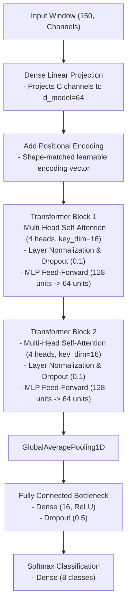

# Implementation Plan: Self-Attention Temporal Transformer

This document details the architectural design, layer specifications, preprocessing pipelines, mathematical formulations, and engineering justifications for the **Self-Attention Temporal Transformer** gesture classification candidate. It incorporates all empirical insights gained from our playground experiments (`late_fusion_cnn_test`) documented in [late_fusion_multi_branch_1d_cnn_test_model.md](file:///Users/jantischner/Library/CloudStorage/OneDrive-Personal/TH_OHM_B.Sc.Inf/Th-Ohm_B.Sc.Inf_Sem6/DatFus_Sem6_Axenie/DataFusionProject/documentation/model_architectures/late_fusion_multi_branch_1d_cnn_test_model.md).

---

## 1. Network Architecture Diagram

The Temporal Transformer projects concatenated input features into a latent representation space, appends positional encodings to preserve sequence order, processes temporal relationships via stacked multi-head self-attention blocks, and passes the pooled representation through a bottlenecked classification head.



---

## 2. Detailed Layer Specifications

To prevent the model from memorizing coordinates and overfitting on small datasets, we restrict the model dimension ($d_{model} = 64$) and constrain the classification head to a 16-unit bottleneck.

| Layer # | Layer Type | Specifications | Output Shape | Parameters / Activation |
| :--- | :--- | :--- | :--- | :--- |
| **0** | **Input** | Dynamic channel count `(150, C)` | `(None, 150, C)` | Input sequence |
| **1** | **Dense (Projection)** | Linear mapping to `d_model=64` | `(None, 150, 64)` | Linear (no activation) |
| **2** | **Positional Add** | Adds learnable vector of shape `(150, 64)` | `(None, 150, 64)` | Learnable temporal offsets |
| **3** | **MultiHeadAttention**| 4 heads, `key_dim=16`, attention dropout=0.1 | `(None, 150, 64)` | Query, Key, Value extraction |
| **4** | **Layer Normalization**| Applied along the `d_model` dimension | `(None, 150, 64)` | Residual stabilization |
| **5** | **Feed-Forward Block** | Dense (128, ReLU) -> Dense (64, Linear) | `(None, 150, 64)` | Sub-layer MLP expansion |
| **6** | **Layer Normalization**| Applied along the `d_model` dimension | `(None, 150, 64)` | Residual stabilization |
| **7** | **GlobalAveragePooling1D**| Average pooling along the time axis | `(None, 64)` | Sequence summary representation |
| **8** | **Dense (FC)** | **16 hidden units** (bottlenecked from 32) | `(None, 16)` | ReLU activation |
| **9** | **Dropout** | **Dropout rate = 50%** (increased from 30%) | `(None, 16)` | Overfitting mitigation |
| **10** | **Dense (Softmax)** | 8 outputs (one per gesture class) | `(None, 8)` | Softmax activation |

*Note: Developers should stack two Transformer blocks (repeating layers 3 through 6) to allow multi-layer temporal feature abstraction.*

---

## 3. Design Justifications & Baseline Learnings

### A. Temporal Self-Attention vs. 1D Convolutions
* **Justification:** Convolutions are constrained to extracting local, shift-invariant patterns within their kernel window. Self-attention calculates pairwise relationships between **any two temporal steps in the window** directly:
  $$\text{Attention}(Q, K, V) = \text{softmax}\left(\frac{Q K^T}{\sqrt{d_k}}\right) V$$
  This allows the model to learn global temporal dependencies and handle significant variations in gesture speed (tempo) without using recurrent states.

### B. Learnable Positional Encodings
* **Justification:** The basic self-attention mechanism is permutation-invariant. To preserve time ordering, we add positional embeddings to the projected inputs.
* **Logic:** While sinusoidal encodings are standard, learnable positional vectors of shape `(150, 64)` adapt directly to our fixed-size window (1.5 seconds) and the specific acceleration/deceleration phases of our gestures.

### C. Low-Pass Pre-filtering Dependency (Crucial Requirement)
* **Justification:** Self-attention dot-products scale exponentially under softmax:
  $$\text{softmax}(x_i) = \frac{e^{x_i}}{\sum e^{x_j}}$$
  A high-frequency noise spike or physical impact shock can generate an extreme outlier in the input stream. This spike dominates the dot-product similarity matrix, causing **attention collapse** (where the attention matrix focuses entirely on the noise outlier, zeroing out other time steps).
* **Logic:** To stabilize the attention weights, developers must apply a 2nd-order low-pass Butterworth filter to all raw IMU inputs (8.0 Hz cutoff for accelerometers, 12.0 Hz for gyroscopes).

### D. Signal Envelope Smoothing
* **Justification:** Magnitude features ($acc_{mag}, gyr_{mag}$) are calculated by squaring and rectifying the raw coordinates:
  $$x_{mag} = \sqrt{x^2 + y^2 + z^2}$$
  This operation amplifies noise peaks. To prevent these peaks from corrupting the self-attention projection weights, magnitude features must be low-pass filtered (8.0 Hz Butterworth) directly upon calculation, delivering a smooth dynamic motion envelope to the projection layer.

### E. Classifier Capacity Bottlenecking (Playground Experiment D & 7 Learnings)
* **Justification:** In baseline experiments, high-capacity models (`64` dense units) quickly memorized session-specific coordinate offsets and baseline sensor orientations, causing validation loss to diverge after epoch 8. With a patience of 20 epochs, the early stopping callback terminated training at **epoch 28** (restoring weights from the best epoch, **epoch 8**). By reducing classification dense units to **16** and increasing dropout to **50%**, we introduce a structural bottleneck.
* **Logic:** This bottleneck prevents the dense head from memorizing high-frequency session noise. This design resulted in a **negative generalization gap** (test performance higher than training, with the lowest validation loss achieved at **epoch 42** and training terminating at **epoch 62** due to early stopping patience).
* **Empirical Validation (Experiment 7):** When we evaluated a compact architecture (16 filters, 16 dense units) on the corrected Leave-Session-Out split, it achieved **99.40% test accuracy** and a **99.50% Macro F1-score** with only **2,744 parameters** (an 89.3% parameter reduction). The best validation loss was **0.0217** (achieved at epoch 70, with the model completing all 70 epochs without triggering early stopping). This demonstrates that compact model constraints maintain accuracy while providing excellent generalization.

### F. Explicit 8-Class Modeling (Idle/None Class Inclusion)
* **Justification:** Real-time powerpoint slide control requires a near-zero false-positive rate. Rather than thresholding a 7-class active gesture model, we model the `none`/idle state as an explicit 8th class. This secures the decision boundaries of active gestures against random daily movements (e.g., mouse usage, typing, resting hand positions).

### G. Three-Tier Input Feature Configuration
Based on our Random Forest Gini and Mutual Information feature audits, inputs are structured into three tiers:
1. **Pruned (Dismissed):** We discard 6 derivative features (such as `IMU1_linear_jerkX/Z` and `IMU1/2_angular_accelerationY/Z`) because they satisfy `RF Gini < 0.002` and `Mutual Information < 0.5`, indicating they introduce high-frequency noise without adding any discriminatory information.
2. **Mandatory (Kept):** We permanently bind 11 high-yield features (including `IMU1_accX/Z`, `IMU2_accX/Y/Z`, `IMU2_gyrX`, `diff_accX/Z`, `IMU1_pitch`, and `IMU1_gyr_mag`) because they satisfy `Mutual Information > 0.9` and `RF Gini > 0.02`.
3. **Dynamic Selection (Optuna):** The remaining 21 helper features are selected dynamically during training using a Bayesian Optuna search wrapper. The search wrapper evaluates different candidate feature combinations directly on the Transformer architecture over multiple training trials, selecting the configuration that maximizes the Joint Utility Score. This lets the pipeline automatically optimize inputs specifically for the Transformer.

---

## 4. Preprocessing & Augmentation Pipelines

Developers must implement the following mathematical transformations in the training and inference pipelines:

### A. Static Calibration (Sensor Offset Removal)
At system startup, the user holds their hand still for `6.0` seconds (600 samples). The pipeline computes the mean sensor readings and subtracts these baseline biases from all subsequent samples:
$$\tilde{x}_t = x_t - \bar{x}_{calib}, \quad \text{where } \bar{x}_{calib} = \frac{1}{600}\sum_{i=1}^{600} x_i$$
This active zeroing translates raw values into relative dynamic deltas, neutralizing the coordinate shift caused by arm-strap and finger-strap re-taping.

### B. Dynamic 3D Random Rotation Augmentation
To prevent the model from memorizing absolute sensor coordinates, raw $X, Y, Z$ vectors are rotated on-the-fly during training. For a given vector $v = [v_x, v_y, v_z]^T$:
1. Sample a random unit rotation axis $k = [k_x, k_y, k_z]^T$ uniformly on a sphere.
2. Sample a random rotation angle $\theta$ from the uniform distribution $[-\theta_{max}, \theta_{max}]$, where $\theta_{max}$ is configured by `--augment-rotation` (recommend `25` degrees).
3. Apply **Rodrigues' rotation formula** to compute the rotated vector $v_{rot}$:
   $$v_{rot} = v \cos \theta + (k \times v) \sin \theta + k(k \cdot v)(1 - \cos \theta)$$

### C. Temporal Jittering (Shift)
During batch loading, raw training windows are dynamically shifted along the timeline by a random offset $s \in [-J, J]$, where $J$ is configured by `--jitter-range` (recommend `20` to `25` samples). This prevents the model from relying on absolute gesture alignments.

### D. Input Standardization
Each channel is standardized using the mean $\mu$ and standard deviation $\sigma$ computed from the training split:
$$x_{std} = \frac{x - \mu}{\sigma}$$
Developers must serialize these scaling parameters during training and load them for online real-time normalization.

---

## 5. Training Pipeline & Hyperparameters

Developers must implement the training loop in code using the following configurations:

* **Optimizer:** Adam with an initial learning rate of `0.001`.
* **Loss Function:** `categorical_crossentropy` (with one-hot label encoding).
* **Epoch Budget:** `70` epochs.
* **Batch Size:** `32`.
* **Callbacks:**
  * **Early Stopping (`EarlyStopping`):** Monitor `val_loss`, patience = `20` epochs, `restore_best_weights=True` to retrieve weights from the epoch with the lowest validation loss.
  * **Learning Rate Decay (`ReduceLROnPlateau`):** Monitor `val_loss`, patience = `10` epochs, learning rate reduction `factor=0.5`, minimum learning rate clamped at `min_lr=1e-6`.
* **Bayesian Optimization wrapper (Optuna):** Runs hyperparameter and dynamic feature sweeps over a set number of trials (e.g., 30-50 trials, with a trial-specific epoch limit of 10-15). The search selects optimal features using the **Joint Utility Score**:
  $$\text{Utility} = \text{Validation F1} - (0.001 \times \text{Latency ms}) - (10^{-6} \times \text{Parameter Count})$$
  This utility function penalizes model size and inference latency, directing the search toward simpler, less overfitted models.

---

## 6. Data Splitting & Leakage Prevention

To ensure honest model evaluation, the training pipeline supports index-based splitting methods. Developers must understand and configure splits as follows:

1. **Stratified Split (`stratified`):** Splits indices randomly while maintaining class balance ratios.
   * *Pitfall:* Sliding windows overlap heavily. Randomly splitting overlapping windows between Train, Val, and Test subsets leads to **severe information leakage**, yielding a deceptive 99% accuracy on paper but failing in real life.
2. **Chronological Split (`chronological`):** Splits indices sequentially per class (e.g., 70% Train / 10% Val / 20% Test) to isolate test data in time.
   * *Pitfall:* While it prevents temporal overlap leakage, it still leaks session-specific characteristics (sensor mounting, baseline drift) if Train and Test data come from the same physical session.
3. **Leave-Session-Out (`leave-session-out`):** Groups indices by session, holding out whole sessions for Test/Val.
   * *Pitfall:* Under the initial V3 dataset, sessions only contained recordings of a *single gesture class*. Alphabetically permuting and partitioning sessions (70/10/20) mathematically guaranteed that entire classes were completely excluded from splits (e.g., val set containing only `none` and `fist`). Since `fist` was OOD for train, validation loss spiked at Epoch 1. With a patience of 20 epochs, the early stopping callback terminated training at **Epoch 21**, restoring the random initial weights of **Epoch 1**.
   * *Resolution (Balanced Leave-Session-Out Split):* Developers must run evaluations using a multi-session setup (e.g., V4 dataset) containing validation and test sessions where **all classes are represented**, and where the sensors were physically repositioned between sessions. Under this setup, the baseline model achieved **99.00% test accuracy** and a **99.18% Macro F1-score** (Best Val Loss: **0.0153**, restored at epoch 53 out of 70). This isolates mounting and fatigue variances without introducing class exclusion or validation early stopping failure.
4. **Subject-Dependent Overfitting (Remaining Limitation):**
   * *Analysis:* Because our current dataset is recorded from a **single subject**, the convolutional encoders are highly optimized for that specific user's kinematics. Developers must note that to achieve generalizability to new users, the model must be trained on a multi-subject dataset and evaluated using **Leave-One-Subject-Out (LOSO) cross-validation**.

---

## 7. Real-Time Inference Integration

The real-time sliding window inference script must consume the trained model package under the following constraints:

* **Sliding Window:** Size = `150` samples (1.5 seconds at a constant `100 Hz` sampling rate).
* **Normalization:** Apply the standardized scaling online using the loaded scaler parameters.
* **Calibration:** Subtract the baseline offsets computed during startup.
* **Thresholding & Cooldown:** Gestures are dispatched only if the output Softmax probability exceeds a strict threshold (default `0.95` or `0.85` depending on noise environment). To prevent double execution of slides, a post-trigger cooldown lock (default `1.5` seconds) must be enforced.

---

## 8. Experiment Directory & Saving Structure

Every training session for this model must be saved in accordance with the project's experiment directory structure:

```
models/
└── slef_attention_temporal_transformer/             # Model identifier folder (respecting folder name typo)
    └── training_session_<index>_<timestamp>/        # Sequential session (e.g., training_session_0_20260629_020000)
        ├── model.keras                              # Saved trained Keras model weights and architecture
        ├── model.weights.h5                         # Serialized weights file
        ├── scaler_x.joblib                          # Serialized StandardScaler instance
        ├── model_metadata.json                      # JSON file containing training run audit properties
        ├── confusion_matrix.png                     # Validation split confusion matrix plot
        └── learning_curves.png                      # Training/validation loss and accuracy curves
```

* **Sequential Indexing**: The training script must dynamically query existing directories under `models/slef_attention_temporal_transformer/` to determine the next available sequential integer `<index>` (starting at `0` for the first run).
* **Metadata Logging**: The `model_metadata.json` file must capture system info, hyperparameters, training dataset stats, and per-class precision, recall, and F1-score evaluation metrics.
