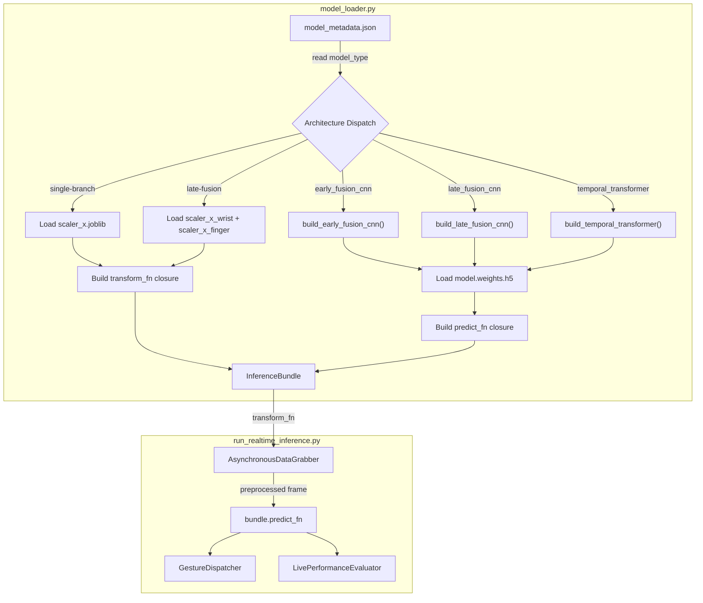
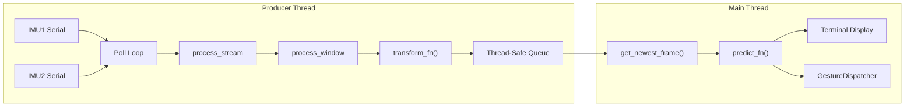

# Real-Time Inference Pipeline

This document provides comprehensive documentation for the **architecture-agnostic real-time inference pipeline** that runs live gesture classification using any trained model from the [unified training pipeline](model_training_pipeline.md). The pipeline dynamically detects the model architecture from `model_metadata.json` and dispatches all architecture-specific logic (model building, scaler loading, input routing) transparently.

Supported architectures:
- [Early Fusion Single-Branch 1D CNN](model_architectures/early_fusion_single_branch_1d_cnn.md) — Single concatenated tensor, single scaler
- [Late Fusion Multi-Branch 1D CNN](model_architectures/late_fusion_multi_branch_1d_cnn.md) — Independent wrist/finger branches, dual scalers
- [Self-Attention Temporal Transformer](model_architectures/self_attention_temporal_transformer.md) — Attention-based, single scaler

## System Workflow

The real-time inference pipeline executes in the following sequence:
1. **Model Loading & Architecture Detection:** Reads `model_metadata.json` from the specified model directory to discover the `model_type`, training configuration, channel lists, and scaler paths. Dispatches to the correct model builder and loads weights. See [§ Architecture Dispatch Table](#2-architecture-dispatch-table) for details.
2. **Sensor Ingestion:** Connects to dual-IMU serial ports (specified in `config/devices.yml`). Alternatively, starts high-frequency simulated streams when `--simulate` is enabled.
3. **Static Calibration:** Prompts the user to hold still for 6.0 seconds. Computes the baseline offset and aligns sensor timestamps. Calibration parameters are defined in [PipelineConfig](data_processing_pipeline.md).
4. **Asynchronous Slicing:** Asynchronously collects data, extracts sliding windows, and resamples/interpolates sensor signals via the `AsynchronousDataGrabber`. See [§ Asynchronous Data Grabber](#7-asynchronous-data-grabber) for the producer-consumer threading architecture.
5. **ZUPT Background Calibration:** Continuously monitors signal standard deviations in the background. If stillness is detected, it recalibrates the gyroscope bias registers on-the-fly via Exponential Moving Average (EMA).
6. **Preprocessing & Pre-Prediction Transform:** Passes the calibrated sliding windows through the architecture-specific model transform callback (channel selection, scaling, and input routing).
7. **Architecture-Agnostic Forward Pass:** Executes `predict_fn(frame)` which wraps `model.predict()` with the correct input format for the detected architecture.
8. **Live Performance Evaluation (Optional):** If `--evaluate` is enabled, the pipeline detects gesture triggers and listens for user objections (corrective hotkeys) to record True Positives (TP), False Positives (FP), and False Negatives (FN).
9. **Action Dispatcher:** Translates classified gestures into keyboard shortcuts using [powerpoint_control.yml](../config/powerpoint_control.yml) and fires key events to control the active PowerPoint window. See [PowerPoint Control Interface](powerpoint_control_interface.md) for action mapping details.

---

### Usage Commands

* **Live Mode (Physical Rigs) — Early Fusion CNN:**
  ```bash
  python scripts/run_realtime_inference.py --model-dir models/early_fusion_single_branch_1d_cnn --threshold 0.95
  ```

* **Live Mode — Late Fusion CNN:**
  ```bash
  python scripts/run_realtime_inference.py --model-dir models/late_fusion_multi_branch_1d_cnn --threshold 0.95
  ```

* **Live Mode — Temporal Transformer:**
  ```bash
  python scripts/run_realtime_inference.py --model-dir models/slef_attention_temporal_transformer --threshold 0.95
  ```

* **Simulated Dry-Run (No Hardware Needed):**
  Useful for quick offline verification and pipeline logic checks:
  ```bash
  python scripts/run_realtime_inference.py --model-dir models/early_fusion_single_branch_1d_cnn --threshold 0.95 --no-control --simulate --timeout 20
  ```

* **Disable Background ZUPT Recalibration:**
  Disable the dynamic background stillness recalibration via:
  ```bash
  python scripts/run_realtime_inference.py --model-dir models/early_fusion_single_branch_1d_cnn --threshold 0.95 --no-zupt
  ```

* **Custom ZUPT Stillness Duration:**
  Set the duration in seconds that the hand must remain completely still before recalibrating (default: 2.0s):
  ```bash
  python scripts/run_realtime_inference.py --model-dir models/early_fusion_single_branch_1d_cnn --threshold 0.95 --zupt-duration 3.5
  ```

* **Objection-Based Live Evaluation:**
  Run live inference while evaluating gesture classification accuracy in real-time:
  ```bash
  python scripts/run_realtime_inference.py --model-dir models/early_fusion_single_branch_1d_cnn --threshold 0.90 --evaluate --objection-window 1.8 --eval-out reports/
  ```

* **Optimum Config for Real-Time Testing:**
  ```bash
  python scripts/run_realtime_inference.py --model-dir models/early_fusion_single_branch_1d_cnn --threshold 0.95 --evaluate --objection-window 1.8 --eval-out reports/ --zupt-duration 3.5 --cooldown 2.0
  ```

---

# Architecture-Agnostic Model Loader — Technical Documentation

This section documents the design, architecture, and implementation details of the **Model Loader** (`InferenceBundle` and `load_inference_model()`) implemented in `src/data_fusion_project/inference/model_loader.py`.

---

## 1. Motivation: Why Is It Needed?

Each model architecture requires a different model builder, different scaler artifact(s), and a different `model.predict()` input format. The model loader encapsulates **all architecture-specific dispatch** behind a clean `InferenceBundle` interface, so that the inference script and all downstream consumers (the `AsynchronousDataGrabber`, the `GestureDispatcher`, the `LivePerformanceEvaluator`) remain completely architecture-agnostic.

Without the model loader, every inference consumer would need to implement its own `if model_type == ...` branching — violating the single responsibility principle and making it impossible to add new architectures without modifying every consumer.

---

## 2. Architecture Dispatch Table

The model loader uses the `model_type` field from `model_metadata.json` (serialized by the [unified training pipeline](model_training_pipeline.md)) to dynamically dispatch to the correct builder, load the appropriate scalers, and construct the correct tensor routing and prediction closures.

| `model_type` | Builder Function | Source Module | Scaler Artifacts | `transform_fn` Behavior | `predict_fn` Input Format |
|:---|:---|:---|:---|:---|:---|
| `early_fusion_cnn` | `build_early_fusion_cnn()` | [model.py](../src/data_fusion_project/training/early_fusion_single_branch_1d_cnn/model.py) | `scaler_x.joblib` | Select `channels`, batch to `(1, T, C)`, scale via single `TimeSeriesScaler` | Single `np.ndarray` |
| `late_fusion_cnn` | `build_late_fusion_cnn()` | [model.py](../src/data_fusion_project/training/late_fusion_multi_branch_1d_cnn/model.py) | `scaler_x_wrist.joblib` + `scaler_x_finger.joblib` + optional `scaler_feat.joblib` | Split by `wrist_channels` / `finger_channels`, batch, scale independently | Dict `{"wrist_input": ..., "finger_input": ...}` |
| `temporal_transformer` | `build_temporal_transformer()` | [model.py](../src/data_fusion_project/training/self_attention_temporal_transformer/model.py) | `scaler_x.joblib` | Select `channels`, batch to `(1, T, C)`, scale via single `TimeSeriesScaler` | Single `np.ndarray` |

The model builder functions, their parameters, and the architectural details of each model are documented in the respective architecture specification documents:
- [Early Fusion Single-Branch 1D CNN](model_architectures/early_fusion_single_branch_1d_cnn.md)
- [Late Fusion Multi-Branch 1D CNN](model_architectures/late_fusion_multi_branch_1d_cnn.md)
- [Self-Attention Temporal Transformer](model_architectures/self_attention_temporal_transformer.md)

---

## 3. Software Architecture & Component Interaction



---

## 4. Implementation Details

### InferenceBundle Dataclass

The `InferenceBundle` is a `@dataclass` that encapsulates all artifacts required for architecture-agnostic inference:

```python
@dataclass
class InferenceBundle:
    model: keras.Model           # Compiled Keras model with loaded weights
    model_type: str              # Architecture identifier from metadata
    class_names: list[str]       # Ordered softmax output class labels
    pipeline_config: PipelineConfig  # Reconstructed signal processing config
    transform_fn: Callable       # (channels, channel_names) → model-ready tensor(s)
    predict_fn: Callable         # (frame) → softmax probability array (1, N_classes)
    metadata: dict               # Full raw model_metadata.json
    model_dir: Path              # Resolved training session directory
```

### Session Directory Auto-Resolution

When the user passes a top-level model identifier directory (e.g., `models/early_fusion_single_branch_1d_cnn`), the loader automatically scans for `training_session_*` subdirectories and resolves to the one with the highest sequential index. This allows the user to point at the model family folder and always get the latest trained session. The session directory structure is defined in the [model training pipeline](model_training_pipeline.md).

### Scaler Class Path Alignment

Joblib deserializes Python objects by reconstructing the class from its fully qualified import path. During training, scalers are serialized as instances of `data_fusion_project.training.model_training_pipeline.pipeline.TimeSeriesScaler`. The model loader module imports this exact class (even though it's not directly used in the loader logic) to ensure the import path is registered before `joblib.load()` is called:

```python
# This import is required for joblib deserialization — do NOT remove
from data_fusion_project.training.model_training_pipeline.pipeline import TimeSeriesScaler  # noqa: F401
```

### Transformer Custom Layer Registration

The [Temporal Transformer architecture](model_architectures/self_attention_temporal_transformer.md) uses custom Keras `Layer` subclasses (`TransformerEncoderBlock`, `LearnablePositionalEncoding`). For `model.load_weights()` to correctly match weight names to layers, these custom classes must be importable in the current Python session. The model loader handles this by importing them explicitly when `model_type == "temporal_transformer"`.

### PipelineConfig Reconstruction

The `load_pipeline_config()` function reconstructs a `PipelineConfig` instance from the nested dictionary stored in `model_metadata.json["pipeline_config"]`. This includes deserializing enum types (`FilterType`, `OrientationMethod`) and reconstructing the four sub-config dataclasses (`CalibrationConfig`, `FilterConfig`, `OrientationConfig`, `FeatureConfig`). The `PipelineConfig` schema is defined in the [data processing pipeline documentation](data_processing_pipeline.md).

### Transform Function Closures

#### Single-Branch (Early Fusion CNN, Temporal Transformer)
```python
def transform_fn(channels: np.ndarray, channel_names: list[str]) -> np.ndarray:
    # 1. Select only the channels listed in metadata["channels"]
    idx = [channel_names.index(ch) for ch in expected_channels]
    # 2. Add batch dimension: (T, C) → (1, T, C)
    X = channels[:, idx][np.newaxis, :, :]
    # 3. Apply TimeSeriesScaler normalization
    return scaler_x.transform(X)
```

#### Late Fusion Multi-Branch CNN
```python
def transform_fn(channels: np.ndarray, channel_names: list[str]) -> tuple:
    # 1. Split channels by wrist_channels and finger_channels from metadata
    wrist_idx = [channel_names.index(ch) for ch in wrist_channels]
    finger_idx = [channel_names.index(ch) for ch in finger_channels]
    # 2. Batch and scale independently
    X_wrist = scaler_wrist.transform(channels[:, wrist_idx][np.newaxis, :, :])
    X_finger = scaler_finger.transform(channels[:, finger_idx][np.newaxis, :, :])
    return (X_wrist, X_finger)
```

### Predict Function Closures

#### Single-Branch
```python
def predict_fn(frame: np.ndarray) -> np.ndarray:
    return model.predict(frame, verbose=0)
```

#### Late Fusion Multi-Branch
```python
def predict_fn(frame: tuple) -> np.ndarray:
    input_dict = {name: frame[i] for i, name in enumerate(input_names)}
    return model.predict(input_dict, verbose=0)
```

The named input dict keys (`"wrist_input"`, `"finger_input"`, `"feat_input"`) are read dynamically from `model.inputs`, not hardcoded, maintaining full forward compatibility with model builder changes.

---

## 5. Design Decisions & Rationale

| Decision | Rationale | Evidence Source |
|:---|:---|:---|
| `--model-dir` is a required argument (no default) | Production models span 3 architectures × 2 presets. Explicit model selection prevents accidentally running the wrong model | [Model Training Strategies](model_training_strategies.md) |
| `transform_fn` and `predict_fn` are closures, not methods | Closures capture the loaded scaler references and channel lists at construction time, avoiding repeated metadata lookups per frame | Performance: 10–30 Hz inference loop cannot tolerate per-frame dict accesses |
| `TimeSeriesScaler` is imported even though not directly used | Joblib deserialization requires the class to be importable from the same module path used during training-time serialization | Python pickle module specification |
| `predict_fn` reads `model.inputs` for named keys | Avoids hardcoding `"wrist_input"` / `"finger_input"` — future model builder changes (e.g., adding a third branch) are automatically supported | Separation of concerns: builder owns layer names, loader reads them |
| Session auto-resolution picks highest index | Users typically want the latest training run. `training_session_2_*` is prioritized over `training_session_1_*` | [Model Training Pipeline](model_training_pipeline.md) session indexing convention |
| Custom Keras layers imported for transformer | `model.load_weights()` requires matching layer classes; without the import, weight loading raises `ValueError: Unknown layer` | Keras serialization documentation |

---

## 6. CLI Reference

```
python scripts/run_realtime_inference.py [options]
```

### Required

| Flag | Type | Description |
|:---|:---|:---|
| `--model-dir` | str | Path to the model directory. Accepts either a model identifier folder (e.g., `models/early_fusion_single_branch_1d_cnn`) or a specific training session. |

### Inference Control

| Flag | Type | Default | Description |
|:---|:---|:---|:---|
| `--threshold` | float | `0.80` | Confidence threshold to trigger a gesture (0.0 to 1.0). |
| `--cooldown` | float | `1.0` | Minimum seconds between two fired actions (de-bounce cool-down). |
| `--config` | str | `config/powerpoint_control.yml` | Path to a [PowerPoint control config](powerpoint_control_interface.md) file. |
| `--dry-run` | flag | `False` | Do not send real key presses; only log shortcuts. |
| `--no-control` | flag | `False` | Disable PowerPoint control (predictions are only displayed). |

### Simulation & Timeout

| Flag | Type | Default | Description |
|:---|:---|:---|:---|
| `--simulate` | flag | `False` | Simulate IMU data streaming instead of connecting to real serial hardware. |
| `--timeout` | float | `None` | Automated exit timeout in seconds (useful for headless verification). |

### ZUPT Calibration

| Flag | Type | Default | Description |
|:---|:---|:---|:---|
| `--no-zupt` | flag | `False` | Disable background Zero-Velocity Updates (ZUPT) recalibration. |
| `--zupt-duration` | float | `2.0` | Sustained stillness duration (seconds) required for ZUPT recalibration. |

### Live Evaluation

| Flag | Type | Default | Description |
|:---|:---|:---|:---|
| `--evaluate` | flag | `False` | Enable the objection-based live-performance evaluator. |
| `--objection-window` | float | `1.5` | Seconds to wait for a correcting keypress before committing a fire as TP. |
| `--eval-out` | str | Model session dir | Directory for the evaluation report output. |

---

## 7. Asynchronous Data Grabber

The `AsynchronousDataGrabber` (`src/data_fusion_project/inference/data_grabber.py`) is the core component that decouples serial sensor ingestion from the model execution thread using a producer-consumer architecture.

### Threading Model



### Key Design Properties

1. **Non-Blocking Producer:** The producer thread continuously polls both IMU serial streams at `poll_interval_s` (default 10 ms), synchronizes them via `process_stream`, runs the calibration/filtering/feature pipeline via `process_window`, and then applies the model's `transform_fn`. The processed frame is placed on a bounded queue.
2. **Newest-Frame Semantics:** `get_newest_frame(block=True, timeout=0.1)` drains the queue and returns only the most recent frame, discarding stale frames. This prevents the prediction loop from falling behind the sensor stream.
3. **ZUPT Integration:** The producer thread monitors the standard deviation of gyroscope channels. When sustained stillness is detected (duration exceeds `zupt_stillness_s`), the gyroscope bias registers are updated via EMA recalibration.
4. **Architecture Agnosticism:** The grabber receives `transform_fn` as a constructor parameter and applies it blindly. It has no knowledge of the model architecture, scaler types, or input tensor format.

---

## 8. API Reference

### `load_inference_model()`
```python
def load_inference_model(
    model_dir: str | Path,
) -> InferenceBundle:
```
Loads a trained gesture classification model and returns an `InferenceBundle`. Auto-resolves to the latest training session if a top-level model directory is provided.

### `InferenceBundle`
```python
@dataclass
class InferenceBundle:
    model: keras.Model
    model_type: str
    class_names: list[str]
    pipeline_config: PipelineConfig
    transform_fn: Callable[[np.ndarray, list[str]], Any]
    predict_fn: Callable[[Any], np.ndarray]
    metadata: dict
    model_dir: Path
```

### `load_pipeline_config()`
```python
def load_pipeline_config(
    metadata: dict,
) -> PipelineConfig:
```
Reconstructs a `PipelineConfig` instance from the `"pipeline_config"` nested dictionary in `model_metadata.json`. See the [data processing pipeline](data_processing_pipeline.md) documentation for the `PipelineConfig` schema.

---

## 9. Directory Structure

```
src/data_fusion_project/inference/
├── __init__.py              # Exports AsynchronousDataGrabber, LivePerformanceEvaluator,
│                            # TriggerDetector, InferenceBundle, load_inference_model
├── data_grabber.py          # AsynchronousDataGrabber (producer-consumer threading)
├── live_evaluation.py       # LivePerformanceEvaluator, TriggerDetector
└── model_loader.py          # InferenceBundle, load_inference_model, load_pipeline_config

scripts/
└── run_realtime_inference.py  # Production inference entry point (architecture-agnostic)
b```
