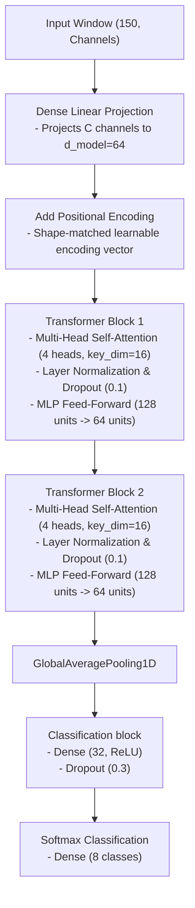

# Implementation Plan: Self-Attention Temporal Transformer

This document details the architecture design, layers, and engineering justifications for the **Self-Attention Temporal Transformer** candidate.

## 1. Network Architecture Diagram

---

## 2. Detailed Layer Specifications

| Layer # | Layer Type | Specifications | Output Shape | Parameters / Activation |
|---|---|---|---|---|
| **0** | **Input** | Dynamic channel count `(150, C)` | `(None, 150, C)` | Input sequence |
| **1** | **Dense (Projection)** | Linear mapping to `d_model=64` | `(None, 150, 64)` | Linear (no activation) |
| **2** | **Positional Add** | Adds learnable vector of shape `(150, 64)` | `(None, 150, 64)` | Temporal ordering |
| **3** | **MultiHeadAttention** | 4 heads, `key_dim=16` | `(None, 150, 64)` | Query, Key, Value extraction |
| **4** | **Layer Normalization** | Applied along `d_model` dimension | `(None, 150, 64)` | Normalization |
| **5** | **Feed-Forward Block** | Dense (128, ReLU) -> Dense (64, Linear) | `(None, 150, 64)` | Dense layer expansions |
| **6** | **Layer Normalization** | Applied along `d_model` dimension | `(None, 150, 64)` | Normalization |
| **7** | **GlobalAveragePooling1D** | Average pooling along time axis | `(None, 64)` | Sequence summary |
| **8** | **Dense (FC)** | 32 hidden units | `(None, 32)` | ReLU activation |
| **9** | **Dropout** | Dropout rate = 30% | `(None, 32)` | Regularization |
| **10** | **Dense (Softmax)** | 8 outputs (one per gesture class) | `(None, 8)` | Softmax activation |

---

## 3. Design Justifications & Precedents

### A. Temporal Attention vs. Convolutions
* **Justification:** Convolutions extract shift-invariant *local* features (using kernel sizes like 3 or 5). In contrast, self-attention calculates pairwise relationships between **any two time steps in the entire window** directly, capturing global temporal flow and tempo changes (e.g. slowing down or speeding up the middle sweep) without relying on recurrent LSTM states.

### B. Positional Encoding
* **Justification:** The self-attention operation is permutation-invariant: it calculates relationships based purely on the values at each step, regardless of their chronological order. A gesture performed backward would yield the same attention map. To preserve time ordering, we add a **learnable Positional Encoding vector** to the projected input, embedding temporal index coordinates directly.

### C. Multi-Head Attention Configuration
* **Justification:** Using `4 heads` with a key dimension of `16` keeps the parameters small. Each head can learn to focus on different temporal stages of a gesture (e.g., Head 1 focuses on the initial acceleration trigger, Head 2 on the stationary stillness boundaries, and Head 3 on the deceleration landing phase).

### D. Low-Pass Pre-filtering Dependency
* **Justification:** Attention mechanisms are highly sensitive to noise outliers because the dot-product exponentials in the softmax calculation scale exponentially with magnitudes. A single noise spike can dominate the entire attention matrix. Thus, **low-pass filtering accelerometer (8.0 Hz) and gyroscope (12.0 Hz) inputs is critical** for Transformer convergence.
