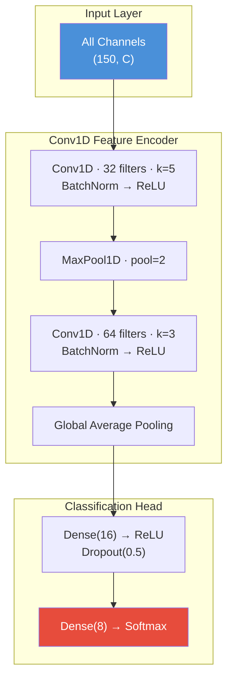
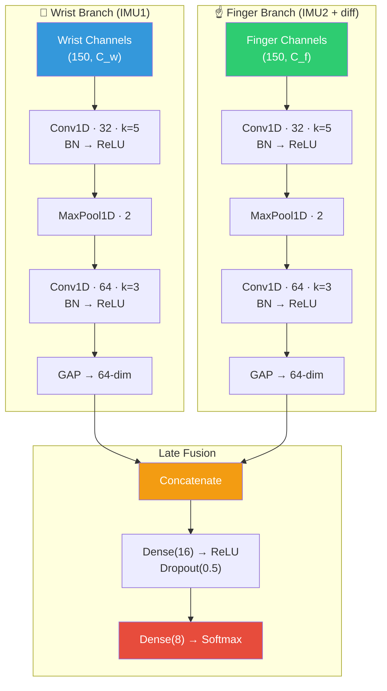
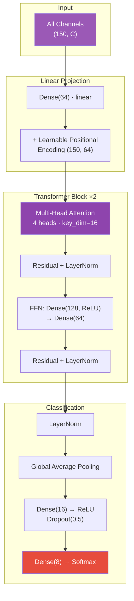

# Presentation Narrative — Data Fusion Project

## Stage 1: Data Collection Pipeline

**Story**: "We built a dual-IMU gesture glove with two ESP32 microcontrollers running on independent clocks. Each records at 100 Hz — but they're not synchronized."

**What to show:**
- Photo/diagram of the glove hardware (wrist IMU + finger IMU)
- The 8 gesture classes (icons or names)
- **One key technical detail**: Temporal alignment — two independent clocks → `align_timestamps()` → resampled onto a strict 100 Hz grid. This is the first fusion: merging two asynchronous sensor streams into one synchronized time series.

**Talking point**: "Each recording session produces ~174 samples (1.74s) per gesture. We built a centroid-based algorithm that finds the peak motion energy and centers a 150-sample window around it."

---

## Stage 2: Data Analysis — "Is this even learnable?"

**Story**: "Before building any models, we needed to know: can gestures be separated at all?"

**What to show: PCA vs. t-SNE plots** from [data_quality_audit.ipynb](../data_analysis/data_analysis_data_v2/data_quality_audit.ipynb)

**Key talking points:**
1. **Linear Projection (PCA)**: "When we apply Principal Component Analysis (PCA) to project the flattened 2100-dimensional gesture windows to 2D, we see **no clusters at all** — just a single overlapping cloud. This proves the relationships in raw gesture dynamics are highly non-linear."
2. **Non-Linear Manifold (t-SNE)**: "In contrast, when we project the exact same data using t-SNE (a non-linear manifold mapping), **visible clusters emerge**. The gesture classes separate from each other and the idle `none` class."
3. **The Lesson**: "The information is there, but a simple linear classifier cannot draw boundaries. We verified this with a KNN/SVM baseline: achieving only **39.6% accuracy** under Leave-Session-Out cross-validation."
4. **Conclusion**: "Because linear projections fail to cluster and shallow baselines cannot generalize across sessions, we are mathematically forced to use deep learning (CNNs and Transformers) to extract the non-linear spatio-temporal features needed for real-time control."

---

## Stage 3: Feature Engineering — The 3-Tier Audit

**Story**: "We have 37 candidate feature channels. Which ones actually help?"

**What to show**: Results from [feature_filter_analysis.ipynb](../data_analysis/data_analysis_data_v2/feature_filter_analysis.ipynb)

**Two metrics per feature:**
- **Mutual Information (MI)** — how much information does this channel carry about the gesture label?
- **Random Forest Gini Importance (RF)** — how much does this channel contribute to decision boundary splits?

**The 3-tier categorization:**

| Category | Rule | Count | Decision |
|:---|:---|:---:|:---|
| 🔴 **Pruned** | RF < 0.002 AND MI < 0.50 | 6 | Always excluded — pure noise |
| 🟢 **Mandatory** | MI > 0.90 AND RF > 0.02 | 11 | Always included — high information density |
| 🟡 **Dynamic** | Everything else | 21 | **Let the model decide** |

**Examples to mention on the slide:**
- 🔴 Pruned: `IMU1_linear_jerkX` (RF=0.0004, MI=0.44) — jerk on the wrist X-axis is pure noise
- 🟢 Mandatory: `IMU2_accY` (RF=0.20, MI=0.96) — finger Y-acceleration is the single most important feature
- 🟡 Dynamic: `diff_gyrZ` (RF=0.003, MI=0.99) — high MI but low RF. Useful? Depends on the architecture.

**Transition to models**: "For the 21 dynamic features, we don't guess — we use **Bayesian optimization (Optuna)** to let each model architecture discover its own optimal feature subset. 50 trials, each training a model for 15 epochs, selecting the combination that maximizes F1-score."

---

## Stage 4: Model Architectures

**Story**: "We trained three architectures to compare fusion strategies."

---

### Model 1: Early Fusion CNN — 98.80% accuracy, 10,840 parameters

"All sensor channels concatenated at input. One Conv1D pipeline processes everything together."

**Talking point**: "Simple and lightweight. The convolution kernels must jointly learn patterns across wrist AND finger channels — there's no spatial specialization."

---

### Model 2: Late Fusion CNN — 99.20% accuracy, 18,968 parameters ⭐ Winner

"Independent convolutional encoders per sensor location. Features are fused *late* — only at the classification head."

**Talking point**: "Each branch specializes its Conv1D kernels: the wrist branch learns low-frequency arm sweeps, the finger branch learns high-frequency rotational dynamics. The fusion happens *after* each sensor's features are independently extracted — this mirrors the physical independence of the two sensors and prevents feature dilution. This is why it wins."

---

### Model 3: Temporal Transformer — 98.40% accuracy, 79,256 parameters

"Self-attention along the time axis. Every timestep attends to every other timestep."

**Talking point**: "The transformer captures long-range temporal dependencies via global attention — every sample in the window can influence every other sample. But with 79K parameters (7× the early fusion CNN), it's data-hungry and slightly overfits on our small dataset. The inductive bias of Conv1D (local, translation-invariant) generalizes better here."

---

## Summary Table (for final talking point before demo)

| Architecture | Fusion Strategy | Parameters | Test Accuracy | F1-Score |
|:---|:---|---:|:---:|:---:|
| Early Fusion CNN | All channels concatenated at input | 10,840 | 98.80% | 0.990 |
| **Late Fusion CNN** ⭐ | **Independent branches per sensor** | **18,968** | **99.20%** | **0.993** |
| Temporal Transformer | Self-attention over time | 79,256 | 98.40% | 0.987 |

> "The Late Fusion CNN wins because its architecture *respects the physical independence* of the two sensor locations. This is the key insight: in multi-sensor fusion, preserving spatial independence before combining learned representations outperforms naive concatenation."
